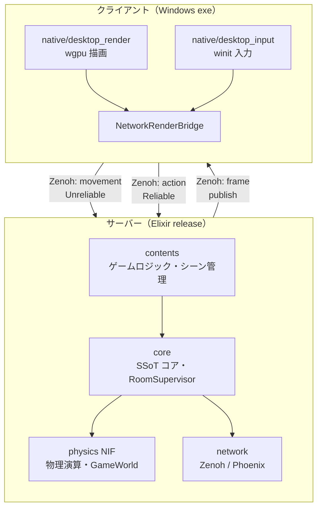
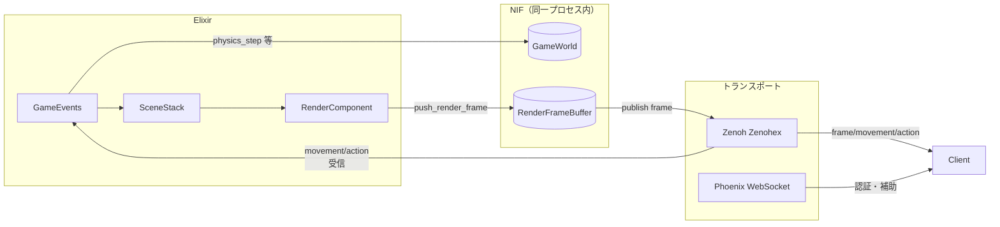
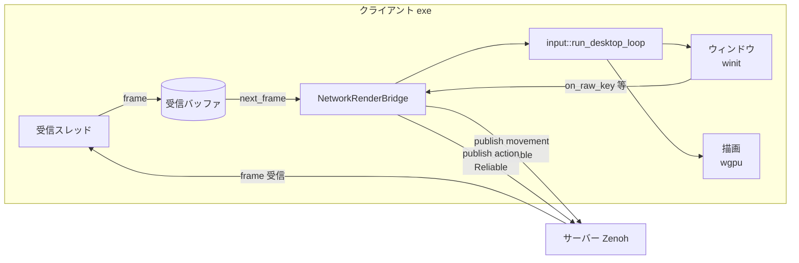

# クライアント・サーバー分離 手順書

> 作成日: 2026-03-07  
> 目的: render + input を別プロセス・別 exe として分離し、サーバー（Elixir）とネットワークで接続する構成を実現する。あわせて Elixir と Rust の状態・定義の切り分けを明確にする。

---

## 要約

| フェーズ | 内容 | 工数目安 |
|:---|:---|:---|
| 0 | 定義の SSoT 化・既存プロトコル確認 | 1〜2 週間 |
| 1 | プロトコル設計（フレーム・入力の仕様） | 1〜2 週間 |
| 2 | クライアント exe 土台（NetworkRenderBridge） | 2〜3 週間 |
| 3 | サーバー側フレーム配信経路 | 2〜3 週間 |
| 4 | ビルド・配布 | 1 週間 |
| 5 | ヘッドレスモード・オプション化 | 1〜2 週間（任意） |

---

## 1. 目標アーキテクチャ

### 1.1 全体構成



### 1.2 サーバー内部構造



### 1.3 クライアント内部構造



### 1.4 トランスポート方針（UDP 低レイテンシ）

60Hz のフレーム配信・入力送信は **低レイテンシを優先** し、UDP ベースのプロトコルを用いる。

#### 採用: Zenoh + Zenohex

| 役割 | ライブラリ | 用途 |
|:---|:---|:---|
| **サーバー（Elixir）** | [Zenohex](https://github.com/biyooon-ex/zenohex) | フレーム publish、movement/action subscribe |
| **クライアント（Rust）** | `zenoh` クレート | フレーム subscribe、movement/action publish |

- Zenoh は UDP（QUIC）をサポートし、低オーバーヘッドの Pub/Sub を提供
- Zenohex は Elixir から Zenoh を呼び出す NIF ラッパー
- サーバー・クライアント双方が Zenoh を話すことでプロトコルが統一される

#### 役割分担

| トラフィック種別 | プロトコル | 例 |
|:---|:---|:---|
| **高頻度・低レイテンシ** | Zenoh（UDP/QUIC） | フレーム配信、input、action |
| **低頻度・信頼性重視** | Phoenix WebSocket / TCP | ルーム参加、認証、チャット、エラー通知 |

**input / action も Zenoh 経由**とする。フレーム配信と同様に UDP ベースで低レイテンシを確保する。

#### 信頼性の使い分け（Zenoh）

| データ | 頻度 | 欠損時の影響 | Zenoh 設定 |
|:---|:---|:---|:---|
| **input (dx, dy)** | 60Hz | 1 フレーム分ずれ、次で補正可 | Unreliable / Sequenced |
| **action** | イベント駆動 | 届かないと致命的（攻撃が発火しない等） | Reliable |

#### Zenoh キー設計（例）

```
game/room/{room_id}/frame           # サーバー → クライアント（フレーム配信）
game/room/{room_id}/input/movement  # クライアント → サーバー（dx, dy・Unreliable）
game/room/{room_id}/input/action    # クライアント → サーバー（select_weapon 等・Reliable）
```

---

## 2. 現状の結合点（クリアすべき課題）

### 2.1 プロセス・スレッド

| 観点 | 現状 | 分離後の目標 |
|:---|:---|:---|
| プロセス | libnif.dll が BEAM にロード、同一プロセス | サーバー＝BEAM、クライアント＝別 exe |
| render/input | 専用スレッドで BEAM と独立 | 別プロセスとして完全分離 |
| 通信 | `OwnedEnv::send_and_clear`（同一プロセス内） | WebSocket / UDP |

### 2.2 状態の二重管理・混在

| 対象 | 現状 | 課題 |
|:---|:---|:---|
| **GameWorld** | Rust に保持、Elixir が NIF で注入 | クライアント分離後はサーバー側のみが保持。クライアントは描画用スナップショットのみ受信 |
| **RenderFrameBuffer** | NIF 内、Elixir が `push_render_frame` で書き込み | サーバーがシリアライズしてネットワーク送信、クライアントが受信して描画 |
| **プレイヤー補間** | RenderBridge が GameWorld を read lock で参照 | クライアントはサーバーから補間用データ（prev/curr tick, pos）を受信してローカルで補間 |
| **入力** | input → `env.send_and_clear(&elixir_pid, ...)` | クライアント → サーバーへネットワーク送信 |

### 2.3 定義の重複

| 定義 | Elixir | Rust | 課題 |
|:---|:---|:---|:---|
| 敵種別 ID・EXP | `Content.EntityParams` | `entity_params.rs` | 二重管理。Elixir を SSoT にし、Rust は注入パラメータのみ受け取る |
| ボス ID・HP・EXP | `Content.EntityParams` | `boss.rs` | 同上 |
| 画面解像度 | なし | `physics/constants.rs` | クライアント側で可変にする場合はプロトコルで渡す |
| DrawCommand スキーマ | `Core.NifBridge` types | `decode/draw_command.rs` | すでに Elixir 定義・Rust 実行の形。プロトコル仕様として文書化 |
| 武器パラメータ | `WeaponFormulas` 等 | `WeaponParams` 注入 | Elixir が計算→注入。維持可能 |

---

## 3. フェーズ別手順

### フェーズ 0: 事前整理（1〜2 週間）

#### 0.1 constants 分類一覧（参照用）

| 分類 | 対象定数 | 備考 |
|:---|:---|:---|
| エンジン固定 | SCREEN_WIDTH/HEIGHT, FRAME_BUDGET_MS, CELL_SIZE, PARTICLE_RNG_SEED, INVINCIBLE_DURATION, PLAYER_RADIUS, BULLET_RADIUS, CAMERA_LERP_SPEED, SPRITE_SIZE | そのまま維持 |
| コンテンツ可変 | MAP_*, PLAYER_SPEED, BULLET_*, WEAPON_*, ENEMY_DAMAGE_PER_SEC, WAVES | set_world_params / set_entity_params で注入 |
| 未整理 | ENEMY_RADIUS, ENEMY_SEPARATION_* | 敵ごとに entity_params で上書き可能。現状はデフォルト値 |

---

### フェーズ 1: プロトコル設計（1〜2 週間）

#### 1.1 Zenoh キー設計

| キー | 方向 | 信頼性 | 説明 |
|:---|:---|:---|:---|
| `game/room/{room_id}/frame` | サーバー → クライアント | — | フレーム配信 |
| `game/room/{room_id}/input/movement` | クライアント → サーバー | Unreliable | 移動入力（dx, dy） |
| `game/room/{room_id}/input/action` | クライアント → サーバー | Reliable | UI アクション（select_weapon 等） |

#### 1.2 フレームペイロード（`game/room/{room_id}/frame`）

| 項目 | 形式 | 説明 |
|:---|:---|:---|
| commands | MessagePack | Elixir の RenderComponent が生成する DrawCommand リスト。トップレベル構造は [messagepack-schema.md](../architecture/messagepack-schema.md) を参照 |
| camera | MessagePack | Camera2D / Camera3D のパラメータ。同上 |
| ui | MessagePack | UI キャンバス。同上 |
| mesh_definitions | MessagePack | メッシュ定義リスト。同上 |
| player_interp | optional | prev/curr tick_ms, prev/curr pos（クライアント側補間用） |
| frame_id | u32 | フレーム識別 |

#### 1.3 入力ペイロード

**movement**（`game/room/{room_id}/input/movement`）:

| 項目 | 形式 | 説明 |
|:---|:---|:---|
| dx | float | 移動 X |
| dy | float | 移動 Y |

**action**（`game/room/{room_id}/input/action`）:

| 項目 | 形式 | 説明 |
|:---|:---|:---|
| name | string | アクション名（select_weapon 等） |
| payload | map | 追加パラメータ（任意） |

---

### フェーズ 2: クライアント exe の土台（2〜3 週間）

#### 2.0 構成方針（desktop_ プレフィックス）

クライアント側クレートは `desktop_` プレフィックスで命名。フェーズ 2 では `client_desktop` のみを追加。将来的に `desktop_audio`, `desktop_input`, `desktop_render` 等へリネームする際の一貫性を確保。

#### 2.2 RenderBridge のネットワーク版（参照用）

現状の `NativeRenderBridge` は以下を持つ:

- `next_frame()`: RenderFrameBuffer から取得（同一プロセス）
- `on_ui_action`, `on_raw_key`, `on_raw_mouse_motion`, `on_focus_lost`: Elixir に送信

クライアント用 `NetworkRenderBridge` の責務:

- `next_frame()`: ネットワーク受信バッファから最新フレームを取得（デシリアライズ）
- `on_*`: ネットワーク経由でサーバーに送信

---

### フェーズ 3: サーバー側の送信経路（2〜3 週間）

#### 3.1 フレーム配信の二経路化

現状: `push_render_frame` → RenderFrameBuffer → RenderBridge (同一プロセス)

分離後:

- **ルーム :main かつ ローカル描画あり**: 従来どおり RenderFrameBuffer + start_render_thread
- **リモートクライアント接続時**: `push_render_frame` の内容を WebSocket / UDP でブロードキャスト

---

### フェーズ 4: ビルド・配布（1 週間）

#### 4.1 クライアント exe ビルド

- [ ] `cargo build --release -p client_desktop` で Windows exe を生成
- [ ] CI にクライアントビルドを追加

#### 4.2 アセット・設定

- [ ] クライアント exe と同梱するアセット（atlas.png, shaders）の配置方針
- [ ] Zenoh / サーバー接続先のデフォルト（例: `tcp/localhost:7447` 等、Zenoh の接続形式に準拠）

---

### フェーズ 5: ローカル描画のオプション化（任意・1〜2 週間）

- [ ] サーバーをヘッドレスで起動するモード（`start_render_thread` を呼ばない）

---

## 4. 依存関係・並行作業

| フェーズ | 依存 | 並行可能 |
|:---|:---|:---|
| 0 | なし | P5（転送効率化）の一部と並行可能 |
| 1 | 0 | - |
| 2 | 1 | 3 と並行可能 |
| 3 | 1 | 2 と並行可能 |
| 4 | 2, 3 | - |
| 5 | 4 | - |

---

## 5. リスク・注意点

| リスク | 対策 |
|:---|:---|
| ネットワーク遅延で描画がカクつく | クライアント側で補間・予測を強化。既存のプレイヤー補間ロジックをクライアントに移植 |
| プロトコル変更の破壌 | バージョン番号をプロトコルに含め、互換性チェック |
| アセット配布 | クライアント exe に同梱するか、サーバーから配信するか方針決定 |

---

## 6. ローカルホスト（listen server）運用

1 台の PC がサーバーをホストし、他プレイヤーがそこに接続する運用が可能。

- **ホスト**: サーバー（Elixir）＋クライアント exe を同一マシンで起動。クライアントは `localhost` に接続
- **他プレイヤー**: クライアント exe のみ起動し、ホストの IP に接続
- **必要な対応**: Phoenix / Zenoh を `0.0.0.0` にバインドして LAN 接続を許可
- **発見**: 相手の IP を手動入力、または LAN ブロードキャスト検出（将来検討）

---

## 7. 将来課題

### zenohd トレイインジケーター

**課題**: client_desktop 終了後も zenohd は残り続ける。ユーザーが気づかず PC リソースを消費する。

**対応**: → [improvement-plan.md I-G](./improvement-plan.md#i-g-ランチャーlauncherの課題) に統合。Discord 風トレイランチャーで zenohd / HL-Server / Client を一括管理。

---

## 8. 関連ドキュメント

- [zenoh-protocol-spec.md](../architecture/zenoh-protocol-spec.md) — Zenoh プロトコル仕様（フェーズ 1）
- [Zenohex](https://github.com/biyooon-ex/zenohex) — Elixir API for Zenoh
- [contents-defines-rust-executes.md](./contents-defines-rust-executes.md) — 定義 vs 実行の分離方針
- [draw-command-spec.md](../architecture/draw-command-spec.md) — DrawCommand スキーマ
- [messagepack-schema.md](../architecture/messagepack-schema.md) — バイナリ形式
- [contents-to-physics-bottlenecks.md](../architecture/contents-to-physics-bottlenecks.md) — データフロー・ボトルネック
- [implementation.mdc](../../.cursor/rules/implementation.mdc) — 層間インターフェース設計
