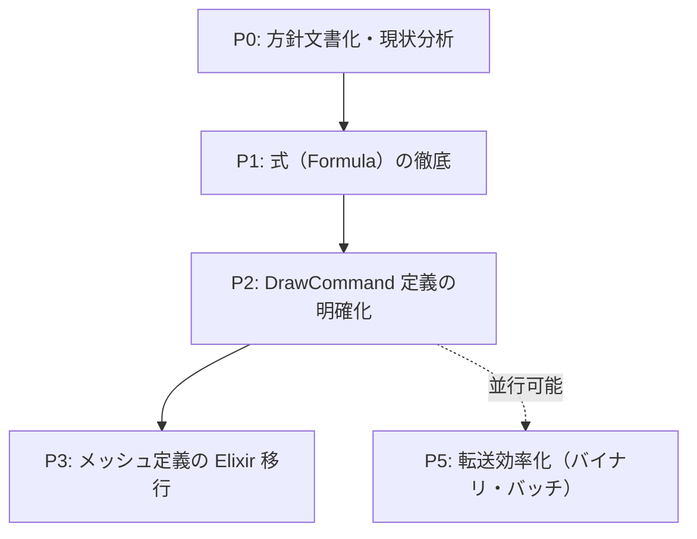

# Contents 定義 / Rust 実行 — 方針とリファクタリング計画

> 作成日: 2026-03-07  
> 出典: NIF 層の関数型/データ指向混在の議論、[contents-to-physics-bottlenecks.md](../architecture/contents-to-physics-bottlenecks.md)  
> 参照: [implementation.mdc](../../.cursor/rules/implementation.mdc)、[improvement-plan.md](./improvement-plan.md)

---

## 1. 方針（保証の原則）

### 1.1 レイヤー別の責務

| レイヤー                              | 保障するもの          | 保障しないもの       |
| --------------------------------- | --------------- | ------------- |
| **Elixir (contents)**             | **定義**          | 処理の実装・結果の保証   |
| **Rust (render / physics / nif)** | **定義に基づく処理と結果** | 定義の作成・ゲームロジック |

### 1.2 定義の内訳

| 定義の種類     | 内容                           | 現状                                                      |
| --------- | ---------------------------- | ------------------------------------------------------- |
| **メッシュ**  | 頂点・インデックス・UV・法線等のジオメトリ       | `unit_box` / `skybox_quad` は Elixir 定義 ✓。`grid_lines`（GridPlane）は Rust 側で生成 |
| **シェーダー** | WGSL ソース・uniform 定義・パイプライン設定 | Elixir 定義（assets 配下）or `include_str!` フォールバック ✓        |
| **式**     | 数式・パラメータ計算（FormulaGraph）     | Elixir が定義、Rust VM が実行 ✓                                |

### 1.3 Rust の責務（実行層）

- **定義を受け取り、それに従って処理する**
- 定義の妥当性検証・エラーハンドリング
- 処理結果の出力（描画、物理イベント、オーディオ等）
- **定義にない知識を Rust 内に持たない**

---

## 2. 実施優先度とフェーズ

---

## 3. フェーズ別タスク詳細

### P0: 方針文書化・現状分析 【優先度: 最優先・即時】

| タスク  | 内容                                                  | 成果物                                   |
| ---- | --------------------------------------------------- | ------------------------------------- |
| P0-1 | 本ドキュメントを `implementation.mdc` の「保証の原則」セクションに参照として追加 | `.cursor/rules/implementation.mdc` 更新 |
| P0-2 | 現状の「定義」所在を一覧化（メッシュ/シェーダー/式ごと）                       | 本ドキュメント内セクション                         |
| P0-3 | 層間インターフェース設計の問いに対し、「定義 vs 実行」の観点を追加                 | `implementation.mdc` 更新               |

**工数目安**: 0.5〜1 日

---

### P1: 式（Formula）の徹底 【完了】

Formula は既に「Elixir 定義 → Rust 実行」が実現済み。P1-1〜P1-3 の成果物は作成済み。

- [formula-hardcode-inventory.md](../architecture/formula-hardcode-inventory.md)
- [formula-migration-evaluation.md](../architecture/formula-migration-evaluation.md)
- [formula-vm-bytecode.md](../architecture/formula-vm-bytecode.md)

---

### P2: DrawCommand 定義の明確化 【完了】

DrawCommand は Elixir が組み立て、Rust が decode して描画。P2-1〜P2-3 は完了。

- [draw-command-spec.md](../architecture/draw-command-spec.md) — SSoT
- `decode/draw_command.rs` — 「定義の受け手」コメント
- [contents-to-physics-bottlenecks.md](../architecture/contents-to-physics-bottlenecks.md) セクション 7 — 案 B 不採用

---

### P3: メッシュ定義の Elixir 移行 【一部完了・残課題あり】

P3-1〜P3-5 の基盤は実装済み（`Content.MeshDef`、`mesh_def_cache`、NIF 経由の登録、コンテンツ別 mesh_def.ex）。
`unit_box` / `skybox_quad` は Elixir 定義で置き換え済み。`grid_lines`（GridPlane）は Rust 側でまだ生成。

#### P3 フォローアップ: mesh_def_cache の動的削除

現状の `mesh_def_cache` は追加のみで、メッシュ定義の削除ができない。コンテンツ切替時（例: SimpleBox3D → VampireSurvivor）に、前コンテンツのメッシュ定義が残り続ける。以下の対応を検討する。

| タスク                  | 内容                                                                                               |
| -------------------- | ------------------------------------------------------------------------------------------------ |
| mesh_def_cache の動的削除 | Elixir から「削除対象のメッシュ名リスト」を渡す API を追加し、Pipeline3D が該当エントリをキャッシュから削除する                              |
| 呼び出しタイミング            | コンテンツ切替時（シーンスタックの pop 等）に `push_render_frame` の mesh_definitions と併せて「削除する名前」を渡す、または専用 NIF を用意する |
| 代替案                  | コンテンツ切替時に mesh_def_cache をクリアしてから新コンテンツの定義で再登録する方式も検討可能                                          |

---

### P4: シェーダー定義の Elixir 移行 【完了】

P4-1〜P4-5 は完了。詳細は [shader-elixir-interface.md](../architecture/shader-elixir-interface.md)。

#### 今後の課題（Phase 1〜2）

| Phase | 内容 | 備考 |
|:---|:---|:---|
| **Phase 1** | 既存アーキタイプ（SpriteShader, MeshShader）の body 差し替え | フラグメントシェーダー等の部分カスタマイズ |
| **Phase 2** | 新アーキタイプを Elixir で定義可能にする | uniform 数・型はテンプレートで固定、コンテンツが WGSL を渡す |
| Phase 3 | 完全フレックス（任意 layout） | 検討のみ。実装範囲は Phase 2 までとする |

#### P4 フォローアップ: シェーダー読み込みの Path Traversal 脆弱性

`load_shaders_from_atlas_path`（`native/nif/src/render_bridge.rs`）が Path Traversal（CWE-22）の指摘を受けている。
`atlas_path` に `..` 等を含むと、想定外のディレクトリのファイルを読み込む可能性がある。

| タスク  | 内容                                                                 | 影響ファイル                 |
| ---- | ------------------------------------------------------------------ | ---------------------- |
| P4-S | シェーダー読み込み時の Path Traversal 対策の方針を検討し、設計ドキュメントを作成する | `render_bridge.rs`     |
| 検討事項 | パス正規化・検証、`shader_dir` / `shared_shader_dir` の導出ロジック整理、将来のサンドボックス化との関係 | `docs/architecture` 等 |

**参照**: CWE-22 (Path Traversal)、[shader-elixir-interface.md](../architecture/shader-elixir-interface.md)

---

### P5: 転送効率化（バイナリ・バッチ） 【優先度: 中・中期】

contents-to-physics-bottlenecks の改善案と連携。P5-1（`set_frame_injection` バッチ API）は実装済み。

| タスク  | 内容                                             | 影響ファイル                        |
| ---- | ---------------------------------------------- | ----------------------------- |
| P5-2 | DrawCommand・メッシュ定義のバイナリ形式（MessagePack / 自前）を検討 | `decode/`, `nif`              |
| P5-3 | `push_render_frame` の decode オーバーヘッド低減         | `render_frame_nif`, `decode/` |
| P5-4 | `get_render_entities` の O(n) コピー削減（差分更新・プール等）  | `read_nif`, `physics`         |

**工数目安**: 5〜12 日  
**参照**: [contents-to-physics-bottlenecks.md](../architecture/contents-to-physics-bottlenecks.md) セクション 6、[p5-transfer-optimization-design.md](../architecture/p5-transfer-optimization-design.md)

---

## 4. 実施優先度一覧（サマリ）

| 優先度 | フェーズ | 概要                       | 状態   |
| --- | ---- | ---------------------- | ---- |
| 1   | P0   | 方針文書化・現状分析               | 残   |
| —   | P1   | 式（Formula）の徹底            | 完了   |
| —   | P2   | DrawCommand 定義の明確化         | 完了   |
| 2   | P3   | メッシュ定義の Elixir 移行（残課題）    | 一部完了 |
| —   | P4   | シェーダー定義の Elixir 移行        | 完了（P4-S 方針検討残） |
| 3   | P5   | 転送効率化（P5-1 完了、P5-2〜4 残）   | 一部完了 |

---

## 5. 課題

### 5.1 シェーダー

| 課題 | 内容 |
|:---|:---|
| **リアルタイム編集 → プレビュー** | コンテンツ内エディタで WGSL 編集 → Apply → コンパイル結果を即確認する UX |
| **アセット化・他コンテンツでの再利用** | ShaderAsset スキーマ設計、名前での参照・ロード機構 |
| **Phase 1〜2 の実装** | 既存アーキタイプの body 差し替え → 新アーキタイプ定義可能にする |
| **Path Traversal 対策（P4-S）** | `load_shaders_from_atlas_path` のパス検証・正規化方針の検討 |

### 5.2 メッシュ

| 課題 | 内容 |
|:---|:---|
| mesh_def_cache の動的削除 | コンテンツ切替時に前コンテンツのメッシュを解放する API |
| grid_lines の Elixir 定義移行 | DrawCommand::GridPlane の頂点生成を Elixir 側に移す（unit_box / skybox_quad は完了） |

### 5.3 その他

| 課題 | 内容 |
|:---|:---|
| 転送効率化 | P5-2〜4: バイナリ形式、decode オーバーヘッド低減、get_render_entities 最適化 |
| セキュリティ | P4-S: シェーダーファイル読み込みの Path Traversal 対策。将来: 不信頼コンテンツ利用時のサンドボックス化 |

---

## 6. 採用しない方針

| 方針                                      | 理由                                                               |
| --------------------------------------- | ---------------------------------------------------------------- |
| **案 B: Rust 側で SoA から DrawCommand を生成** | Rust に描画判断（メッシュ選択・UV 等）を持たせることになり、「Elixir が定義」の原則に反する            |
| **Rust 側でのゲーム固有概念のハードコード**              | `implementation.mdc` の層間インターフェース設計に違反。既存の `spawn_boss` 等の廃止方針と一致 |
| **Phase 3（完全フレックス）の実装** | 検討のみ。実装範囲は Phase 2（新アーキタイプ定義可能）までとする |

---

## 7. 関連ドキュメント

- [implementation.mdc](../../.cursor/rules/implementation.mdc) — 保証の原則・層間インターフェース
- [contents-to-physics-bottlenecks.md](../architecture/contents-to-physics-bottlenecks.md) — ボトルネック・改善案
- [improvement-plan.md](./improvement-plan.md) — 全体改善計画
- [Rust: render](../architecture/rust/render.md) — 描画パイプライン現状
- [Rust: nif](../architecture/rust/nif.md) — NIF インターフェース
- [formula-hardcode-inventory.md](../architecture/formula-hardcode-inventory.md) — P1-1 ハードコード一覧
- [formula-migration-evaluation.md](../architecture/formula-migration-evaluation.md) — P1-2 武器式 Formula 移行評価
- [formula-vm-bytecode.md](../architecture/formula-vm-bytecode.md) — P1-3 Formula VM バイトコード仕様
- [draw-command-spec.md](../architecture/draw-command-spec.md) — P2-1 DrawCommand タグ・フィールド仕様（SSoT）
- [shader-elixir-interface.md](../architecture/shader-elixir-interface.md) — P4-2〜5 シェーダー Elixir インターフェース・アセット構成

