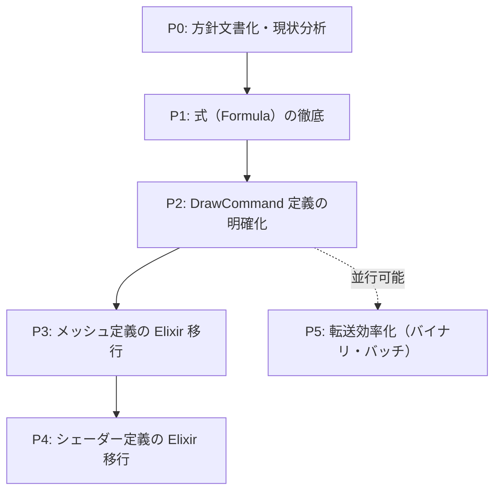

# Contents 定義 / Rust 実行 — 方針とリファクタリング計画

> 作成日: 2026-03-07  
> 出典: NIF 層の関数型/データ指向混在の議論、[contents-to-physics-bottlenecks.md](../architecture/contents-to-physics-bottlenecks.md)  
> 参照: [implementation.mdc](../../.cursor/rules/implementation.mdc)、[improvement-plan.md](./improvement-plan.md)

---

## 1. 方針（保証の原則）

### 1.1 レイヤー別の責務

| レイヤー | 保障するもの | 保障しないもの |
|:---|:---|:---|
| **Elixir (contents)** | **定義** | 処理の実装・結果の保証 |
| **Rust (render / physics / nif)** | **定義に基づく処理と結果** | 定義の作成・ゲームロジック |

### 1.2 定義の内訳

| 定義の種類 | 内容 | 現状 |
|:---|:---|:---|
| **メッシュ** | 頂点・インデックス・UV・法線等のジオメトリ | Rust 側にハードコード（`box_mesh`, `grid_lines`, `skybox_verts`） |
| **シェーダー** | WGSL ソース・uniform 定義・パイプライン設定 | Rust 側に `include_str!` で埋め込み |
| **式** | 数式・パラメータ計算（FormulaGraph） | Elixir が定義、Rust VM が実行 ✓ |

### 1.3 Rust の責務（実行層）

- **定義を受け取り、それに従って処理する**
- 定義の妥当性検証・エラーハンドリング
- 処理結果の出力（描画、物理イベント、オーディオ等）
- **定義にない知識を Rust 内に持たない**

---

## 2. 実施優先度とフェーズ

---

## 3. フェーズ別タスク詳細

### P0: 方針文書化・現状分析 【優先度: 最優先・即時】

| タスク | 内容 | 成果物 |
|:---|:---|:---|
| P0-1 | 本ドキュメントを `implementation.mdc` の「保証の原則」セクションに参照として追加 | `.cursor/rules/implementation.mdc` 更新 |
| P0-2 | 現状の「定義」所在を一覧化（メッシュ/シェーダー/式ごと） | 本ドキュメント内セクション |
| P0-3 | 層間インターフェース設計の問いに対し、「定義 vs 実行」の観点を追加 | `implementation.mdc` 更新 |

**工数目安**: 0.5〜1 日

---

### P1: 式（Formula）の徹底 【優先度: 高・短期】

Formula は既に「Elixir 定義 → Rust 実行」が実現済み。徹底・拡張を図る。

| タスク | 内容 | 影響ファイル | 成果物 |
|:---|:---|:---|:---|
| P1-1 | Formula 以外のパラメータ計算で Rust 側に残るハードコードを洗い出し | `physics/entity_params`, `weapon` | [formula-hardcode-inventory.md](../architecture/formula-hardcode-inventory.md) |
| P1-2 | 武器ダメージ・クールダウン等の式を Formula に移行する余地を評価 | `WeaponFormulas`, `formula_graph` | [formula-migration-evaluation.md](../architecture/formula-migration-evaluation.md) |
| P1-3 | Formula VM のバイトコード形式を仕様として文書化（Elixir が生成する定義の形式） | `docs/architecture` | [formula-vm-bytecode.md](../architecture/formula-vm-bytecode.md) |

**工数目安**: 2〜4 日

---

### P2: DrawCommand 定義の明確化 【優先度: 高・短期】

DrawCommand は現状 Elixir が組み立て、Rust が decode して描画。**「Elixir が定義、Rust が実行」に沿っている**が、以下を明確化する。

| タスク | 内容 | 影響ファイル | 成果物 |
|:---|:---|:---|:---|
| P2-1 | DrawCommand のタグ・フィールド仕様を Elixir 側に SSoT として文書化 | `nif_bridge.ex` コメント、`docs/architecture` | [draw-command-spec.md](../architecture/draw-command-spec.md) |
| P2-2 | `decode/draw_command.rs` が「定義の受け手」であることをコメントで明示 | `decode/draw_command.rs` | 同ファイル内コメント |
| P2-3 | 案 B（Rust 側で SoA から DrawCommand を生成）を **採用しない** 旨を bottlenecks  doc に追記 | `contents-to-physics-bottlenecks.md` | 同ドキュメント セクション 7 |

**工数目安**: 0.5〜1 日

---

### P3: メッシュ定義の Elixir 移行 【優先度: 中・中期】

| タスク | 内容 | 影響ファイル |
|:---|:---|:---|
| P3-1 | 現行メッシュ（Box3D, GridPlane, Skybox）の頂点・インデックス定義を列挙 | `pipeline_3d.rs` |
| P3-2 | Elixir でメッシュ定義を表現する形式を設計（頂点リスト・インデックス・属性名） | 新規: `content/mesh_def.ex` 等 |
| P3-3 | NIF 経由でメッシュ定義を Rust に渡し、`create_buffer` 等で登録する API を追加 | `nif`, `render` |
| P3-4 | `box_mesh` / `grid_lines` / `skybox_verts` を Elixir 定義からの生成に置き換え | `pipeline_3d.rs` |
| P3-5 | コンテンツごとのメッシュ定義を contents に配置（VampireSurvivor, BulletHell3D 等） | `contents/*/mesh_def.ex` |

**工数目安**: 5〜10 日  
**依存**: P2 完了後。P5（転送効率化）と並行可能。

#### P3 フォローアップ: mesh_def_cache の動的削除

現状の `mesh_def_cache` は追加のみで、メッシュ定義の削除ができない。コンテンツ切替時（例: SimpleBox3D → VampireSurvivor）に、前コンテンツのメッシュ定義が残り続ける。以下の対応を検討する。

| タスク | 内容 |
|:---|:---|
| mesh_def_cache の動的削除 | Elixir から「削除対象のメッシュ名リスト」を渡す API を追加し、Pipeline3D が該当エントリをキャッシュから削除する |
| 呼び出しタイミング | コンテンツ切替時（シーンスタックの pop 等）に `push_render_frame` の mesh_definitions と併せて「削除する名前」を渡す、または専用 NIF を用意する |
| 代替案 | コンテンツ切替時に mesh_def_cache をクリアしてから新コンテンツの定義で再登録する方式も検討可能 |

---

### P4: シェーダー定義の Elixir 移行 【優先度: 中〜低・中期〜長期】

| タスク | 内容 | 影響ファイル |
|:---|:---|:---|
| P4-1 | 現行シェーダー（sprite.wgsl, mesh.wgsl）の依存関係・uniform を文書化 | `docs/architecture/rust/render.md` |
| P4-2 | Elixir からシェーダー WGSL ソースを渡すインターフェースを設計 | アセットパス or 文字列注入 |
| P4-3 | コンテンツがアセットとして WGSL を保持する構成を検討（`content.assets_path()` 配下） | `contents`, `render_bridge` |
| P4-4 | NIF または起動時ロードでシェーダーを Elixir 定義から取得するパスを実装 | `nif`, `render` |
| P4-5 | `include_str!` をフォールバックとして残すか、完全移行するか決定 | 設計判断 |

**工数目安**: 8〜15 日  
**依存**: P3 完了を推奨。セキュリティ・サンドボックス化の検討が必要（シェーダー注入はリスク要因）。

---

### P5: 転送効率化（バイナリ・バッチ） 【優先度: 中・中期】

contents-to-physics-bottlenecks の改善案と連携。**定義の所在**とは独立だが、定義を渡す際の効率化に寄与。

| タスク | 内容 | 影響ファイル |
|:---|:---|:---|
| P5-1 | `set_frame_injection` 等のバッチ注入 API を設計・実装 | `world_nif`, `action_nif` |
| P5-2 | DrawCommand・メッシュ定義のバイナリ形式（MessagePack / 自前）を検討 | `decode/`, `nif` |
| P5-3 | `push_render_frame` の decode オーバーヘッド低減 | `render_frame_nif`, `decode/` |
| P5-4 | `get_render_entities` の O(n) コピー削減（差分更新・プール等） | `read_nif`, `physics` |

**工数目安**: 5〜12 日  
**参照**: [contents-to-physics-bottlenecks.md](../architecture/contents-to-physics-bottlenecks.md) セクション 6

---

## 4. 実施優先度一覧（サマリ）

| 優先度 | フェーズ | 概要 | 目安工数 |
|:---:|:---|:---|:---:|
| 1 | P0 | 方針文書化・現状分析 | 0.5〜1 日 |
| 2 | P1 | 式（Formula）の徹底 | 2〜4 日 |
| 3 | P2 | DrawCommand 定義の明確化 | 0.5〜1 日 |
| 4 | P3 | メッシュ定義の Elixir 移行 | 5〜10 日 |
| 5 | P5 | 転送効率化（並行可能） | 5〜12 日 |
| 6 | P4 | シェーダー定義の Elixir 移行 | 8〜15 日 |

---

## 5. 採用しない方針

| 方針 | 理由 |
|:---|:---|
| **案 B: Rust 側で SoA から DrawCommand を生成** | Rust に描画判断（メッシュ選択・UV 等）を持たせることになり、「Elixir が定義」の原則に反する |
| **Rust 側でのゲーム固有概念のハードコード** | `implementation.mdc` の層間インターフェース設計に違反。既存の `spawn_boss` 等の廃止方針と一致 |

---

## 6. 関連ドキュメント

- [implementation.mdc](../../.cursor/rules/implementation.mdc) — 保証の原則・層間インターフェース
- [contents-to-physics-bottlenecks.md](../architecture/contents-to-physics-bottlenecks.md) — ボトルネック・改善案
- [improvement-plan.md](./improvement-plan.md) — 全体改善計画
- [Rust: render](../architecture/rust/render.md) — 描画パイプライン現状
- [Rust: nif](../architecture/rust/nif.md) — NIF インターフェース
- [formula-hardcode-inventory.md](../architecture/formula-hardcode-inventory.md) — P1-1 ハードコード一覧
- [formula-migration-evaluation.md](../architecture/formula-migration-evaluation.md) — P1-2 武器式 Formula 移行評価
- [formula-vm-bytecode.md](../architecture/formula-vm-bytecode.md) — P1-3 Formula VM バイトコード仕様
- [draw-command-spec.md](../architecture/draw-command-spec.md) — P2-1 DrawCommand タグ・フィールド仕様（SSoT）
