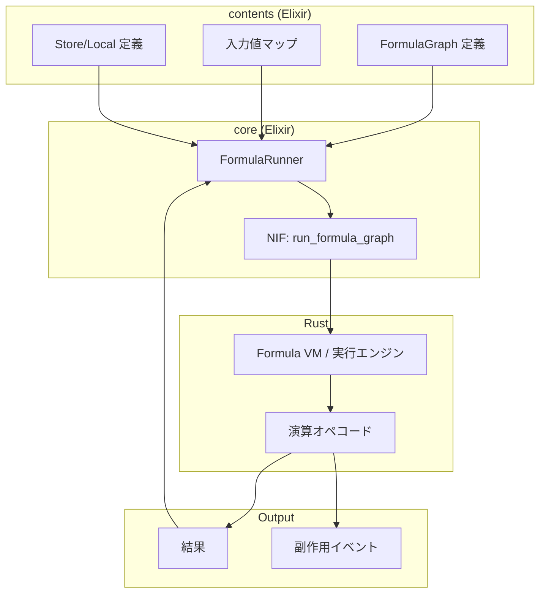

# コンテンツ数式エンジン設計 — ProtoFlux/Logix 風の計算グラフ

> 作成日: 2026-03-05  
> 目的: NeosVR の Logix、Resonite の ProtoFlux を参考に、コンテンツ内で数式を組み上げて Rust で実行する仕組みを設計する。  
> 関連: 課題19（計算式・アルゴリズムの Rust 実行）、[game-world-inner-flow.md](./game-world-inner-flow.md)

---

## 1. 背景と参考

### 1.1 参考プロジェクト

| プロジェクト | 概要 | 参考になる点 |
|:---|:---|:---|
| **Resonite ProtoFlux** | 3D 空間内のノードベース視覚的プログラミング言語 | 変数（Store / Local / DataModelStore）、ノード接続、演算ノード（Add 等） |
| **NeosVR Logix** | NeosVR 内の論理・数式ノードシステム | コンテンツ内で論理・計算を組み立てる発想 |
| **課題19** | Contents が計算式を定義し Rust が実行 | 命令列・バイトコード境界の方向性 |

参考: [ProtoFlux - Resonite Wiki](https://wiki.resonite.com/ProtoFlux)、[ProtoFlux:Store](https://wiki.resonite.com/ProtoFlux:Store)、[ProtoFlux:Local](https://wiki.resonite.com/ProtoFlux:Local)、[ProtoFlux:DataModelStore](https://wiki.resonite.com/ProtoFlux:DataModelStore)、[ProtoFlux:Add](https://wiki.resonite.com/ProtoFlux:Add)

### 1.2 目標

- コンテンツ（Elixir）が**数式・計算ロジックを定義**する
- Rust が**定義された計算を実行**する
- NIF 境界では「計算グラフ + 入力」「結果」のみ受け渡す
- 変数のスコープ（Store / Local / DataModelStore）を ProtoFlux 風に取り入れる

---

## 2. 変数・ストレージの概念（ProtoFlux 風）

ProtoFlux の 3 種の変数を AlchemyEngine のコンテンツ層にマッピングする。

| ProtoFlux | スコープ | 同期 | AlchemyEngine での対応案 |
|:---|:---|:---|:---|
| **DataModelStore** | グローバル | ネットワーク同期 | `FormulaStore.synced/3` — マルチプレイ時に全クライアントへ同期 |
| **Store** | ユーザーグローバル | 非同期 | `FormulaStore.local/3` — そのクライアント内でのみ永続、ネットワーク非同期 |
| **Local** | 実行コンテキスト | 非同期、実行終了で破棄 | `FormulaStore.context/3` — 1 回の評価コンテキスト内でのみ有効 |

### 2.1 スコープの定義

```elixir
# 将来的な API イメージ（現時点では設計のみ）

# DataModelStore 相当: セッション全体で共有、ネットワーク同期
FormulaStore.synced(room_id, key, default)

# Store 相当: クライアント内グローバル、非同期
FormulaStore.local(key, default)

# Local 相当: 評価コンテキスト内でのみ有効
FormulaStore.context(key, default)  # 評価終了で破棄
```

### 2.2 責務分離

| レイヤー | 責務 |
|:---|:---|
| **contents (Elixir)** | Store / Local の定義、計算グラフの構築、グラフの SSoT |
| **core (Elixir)** | `FormulaStore` behaviour、コンテキスト管理 |
| **Rust** | グラフの実行、演算、結果の返却。変数の永続化は関与しない |

---

## 3. ノード・演算の概念（ProtoFlux:Add 風）

ProtoFlux のノードは入力・出力を持つ。接続によって計算グラフを構成する。

### 3.1 ノードの種類

| 種別 | 例 | 説明 |
|:---|:---|:---|
| **演算** | Add, Mul, Sub, Div | 入力 A, B から結果を計算 |
| **比較** | Lt, Gt, Eq | 真偽値を返す |
| **分岐** | If, Switch | 条件に応じた分岐 |
| **定数** | Int, Float, Bool | 値を固定 |
| **ストレージ参照** | Read(Store), Write(Store) | Store / Local の読み書き |
| **入力** | Input(f32, "player_x") | 外部から注入する値 |

### 3.2 グラフの表現（命令列）

課題19 と同様、Elixir は「何を計算するか」を**命令列（バイトコード）**として持つ。

```
# 例: player_x + player_y を計算
[input] f32 player_x
[input] f32 player_y
[math] add
[output] f32
```

```
# 例: Store から読んで 1 足して Store に書き戻す
[storage_read] local "score"
[int] 1
[math] add
[storage_write] local "score"
```

### 3.3 ノード接続のデータ構造

視覚的にはノードをワイヤで繋ぐが、実行時は**有向グラフ（DAG）**として表現する。

```elixir
# 設計案: ノード ID と接続のリスト

%FormulaGraph{
  nodes: [
    %{id: :n1, op: :input, params: %{name: "player_x", type: :f32}},
    %{id: :n2, op: :input, params: %{name: "player_y", type: :f32}},
    %{id: :n3, op: :add, params: %{}},
    %{id: :n4, op: :output, params: %{type: :f32}}
  ],
  edges: [
    {:n1, :n3, :a},   # n1 の出力 → n3 の入力 A
    {:n2, :n3, :b},   # n2 の出力 → n3 の入力 B
    {:n3, :n4, :value}
  ],
  outputs: [:n4]
}
```

---

## 4. レイヤー間のデータフロー



### 4.1 NIF 境界

**エラーハンドリング方針**

- ドメインエラー（input_not_found, division_by_zero, type_mismatch 等）は NIF としては成功とし、`Ok({:error, reason_atom, detail})` を返す。呼び出し側で分岐して扱う。
- 他 NIF の `NifResult::Err` は NIF 層の異常（ロック失敗、不正な入力形式等）用。Formula NIF では、入力形式不正（map でない、型が合わない等）のみ `Err` とする。
- エラー形式は常に 3 要素タプル `{:error, reason_atom, detail}` に統一。detail が不要な場合は nil。

```
Elixir → Rust:
  - グラフ ID または グラフのバイトコード
  - 入力値マップ { "player_x" => 1.0, "player_y" => 2.0 }
  - （オプション）Store の初期値

Rust → Elixir:
  - 出力値（単一または複数）
  - （オプション）Store の更新後状態
  - （オプション）発行したイベント
```

---

## 5. 実装フェーズ案

### Phase 1: 最小実行エンジン（Rust）

- バイトコード形式の定義
- スタックマシンまたはレジスタマシン
- 演算: `add`, `sub`, `mul`, `div`, `lt`, `gt`, `eq`
- 入出力: `push_input`, `pop_output`
- NIF: `run_formula_bytecode(bytecode, inputs) -> outputs`

### Phase 2: Store / Local の表現

- バイトコードに `read_store`, `write_store` を追加
- Elixir 側で Store のキー・初期値を管理
- Rust は「キー + 値」の受け渡しのみ。永続化は Elixir が担当

### Phase 3: グラフビルダー（Elixir）

- `FormulaGraph` を Elixir で組み立て
- コンパイルしてバイトコードに変換
- コンテンツが `def formula_graph/0` のように定義

### Phase 4: DataModelStore（ネットワーク同期）

- マルチプレイ時に Store の変更を他クライアントへ同期
- 既存のネットワーク基盤と統合

### Phase 5: ビジュアルエディタ（将来）

- ProtoFlux のような 3D/2D ノードエディタ
- グラフを視覚的に編集し、バイトコードを出力

---

## 6. 既存アーキテクチャとの整合

| 原則 | 本設計での対応 |
|:---|:---|
| **Elixir = SSoT** | 計算グラフ・Store 定義は Elixir が保持 |
| **Rust = 演算層** | バイトコード実行のみ Rust が担当 |
| **NIF 境界** | グラフ（バイトコード）+ 入力 ↔ 結果 のみ。ゲームロジックの知識は持たない |
| **コンテンツの独立性** | 各コンテンツが自身の `FormulaGraph` を定義。エンジンは汎用 VM のみ提供 |

---

## 7. ProtoFlux との対応表

| ProtoFlux | 本設計 |
|:---|:---|
| ノードブラウザでノード選択 | `FormulaGraph` のノード定義（Elixir または将来的に UI） |
| ワイヤで接続 | `edges` リストで接続関係を表現 |
| ProtoFlux:Add | `op: :add` ノード |
| ProtoFlux:Store | `FormulaStore.local/3` |
| ProtoFlux:Local | `FormulaStore.context/3` |
| ProtoFlux:DataModelStore | `FormulaStore.synced/3` |
| Impulse（イベント駆動） | 既存の `on_frame_event` / `on_physics_process` と連携 |

---

## 8. オープンな検討事項

| 項目 | 内容 |
|:---|:---|
| バイトコード形式 | スタック vs レジスタ、OpCode の詳細 |
| Store の永続化 | Elixir の ETS / Agent と Rust 側の境界 |
| 型システム | f32, i32, bool, vec2 等のサポート範囲 |
| physics_step との統合 | 毎フレームの計算をグラフで表現するか、既存 NIF のままか |
| デバッグ | グラフのトレース、途中値の可視化 |

---

## 9. 参考リンク

- [ProtoFlux - Resonite Wiki](https://wiki.resonite.com/ProtoFlux)
- [ProtoFlux:Store](https://wiki.resonite.com/ProtoFlux:Store)
- [ProtoFlux:Local](https://wiki.resonite.com/ProtoFlux:Local)
- [ProtoFlux:DataModelStore](https://wiki.resonite.com/ProtoFlux:DataModelStore)
- [ProtoFlux:Add](https://wiki.resonite.com/ProtoFlux:Add)
- [game-world-inner-flow.md](./game-world-inner-flow.md)
- [pending-issues.md](./pending-issues.md) 課題19
