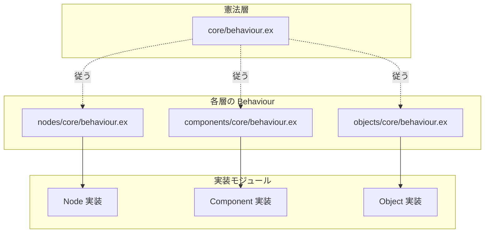

# fix_contents アーキテクチャ 実施手順書

> 作成日: 2026-03-10  
> 参照: [docs/architecture/fix_contents.md](../architecture/fix_contents.md)  
> 目的: コンテンツを最小単位まで分解し、VR 空間で直感的な論理構築を可能にする統一ディレクトリ・アーキテクチャを構築する。
>
> **注記**: 現行コードの移行作業は本手順書の対象外。別途実施する。

---

## 1. 概要

### 1.1 設計の背景


| 項目                      | 内容                                                                        |
| ----------------------- | ------------------------------------------------------------------------- |
| **存在の階層（Five Pillars）** | Contents → Objects → Components → Nodes → Structs                         |
| **依存の方向**               | structs を基盤として、nodes → components → objects へ一方向に積み上げ                     |
| **三要素**                 | Node（計算の原子）、Port（入出力端子）、Link（接続）。Action/Logic の二種類の Port で実行フローとデータフローを分離 |
| **プロセスモデル**             | Object / Component は GenServer。Node はプロセスにせず、Executor が関数として呼び出す          |


### 1.2 実装の積み上げ順

依存関係に従い、下位層から順に構築する。

```
structs → core/behaviour → nodes → components → objects
```

---

## 2. 目標構成（apps/contents）

### 2.1 lib/ のディレクトリ構成と方針

`apps/contents/lib/` 直下には、**core / structs / nodes / components / objects / world** を同階層で配置する。

- **core, structs, nodes, components, objects** … アーキテクチャの骨格（仕組み・型・定義）
- **world** … 実際のコンテンツ（沢山入る）

world はコンテンツで埋め尽くされるため、骨格と同階層に分けておく。これにより、骨格とコンテンツを明確に区別する。

**注記:** `lib/contents/` は既存コードのため、本手順書では触らない。

### 2.2 ディレクトリツリー

```
apps/contents/
├── lib/
│   ├── contents/            # 既存 Contents（移行対象、本手順書外・触らない）
│   ├── core/                # behaviour 等
│   ├── structs/             # データの形。defstruct / @type による型定義
│   │   └── category/
│   │       ├── value/       # スカラー・ベクトル・行列・色など
│   │       ├── text/        # 文字列・文字
│   │       ├── time/        # 日時・時間幅
│   │       ├── space/       # 空間に関わる型（Transform など）
│   │       └── users/
│   ├── nodes/               # 論理のピア（Logic Processors）
│   │   ├── ports/           # Action / Logic ポート定義（Link が接続する）
│   │   ├── core/
│   │   └── category/
│   │       ├── core/input/  # call, value, display
│   │       ├── actions/
│   │       ├── operators/   # add, sub, mul, div, equals, boolean, bool_vectors
│   │       └── math/        # sign, cos, tan 等
│   ├── components/
│   │   ├── core/
│   │   └── category/
│   ├── objects/
│   │   └── core/
│   └── world/               # 実際のコンテンツ（沢山入る）
```

---

## 3. 実施手順

### Phase 1: structs の土台構築

structs は全層の基盤。最初に配置を定義し、カテゴリ別に型を追加する。各 Struct は `defstruct` と `@type` で定義する（複合型）。プリミティブ・タプルは `@type` のみ。

#### Step 1-1: ディレクトリ作成

```bash
mkdir -p apps/contents/lib/structs/category/value
mkdir -p apps/contents/lib/structs/category/text
mkdir -p apps/contents/lib/structs/category/time
mkdir -p apps/contents/lib/structs/category/space
mkdir -p apps/contents/lib/structs/category/users
```

#### Step 1-2: value カテゴリの作成

スカラー・ベクトル・行列・色など。float3 / quaternion もここに含む（space で多用するが、包括的な型定義として value に配置する）。

**規約: 型ファミリごとに 1 ファイルにまとめる。** 1 ファイル内に複数の `@type` を定義する。負荷は気にする必要はなく、関連型を一箇所にまとめることで保守性が上がる。

例:

- `value/bool.ex` → `@type t`, `@type t2`, `@type t3`, `@type t4`
- `value/float.ex` → `@type t`, `@type t2`, `@type t3`, `@type t4`, `@type t2x2`, `@type t3x3`, `@type t4x4`, `@type quaternion`


| ファイル               | モジュール                            | 定義する型                                       |
| ------------------ | -------------------------------- | ------------------------------------------- |
| `value/bool.ex`    | `Structs.Category.Value.Bool`    | t, t2, t3, t4                               |
| `value/byte.ex`    | `Structs.Category.Value.Byte`    | t, t2, t3, t4                               |
| `value/ushort.ex`  | `Structs.Category.Value.UShort`  | t, t2, t3, t4                               |
| `value/uint.ex`    | `Structs.Category.Value.UInt`    | t, t2, t3, t4                               |
| `value/ulong.ex`   | `Structs.Category.Value.ULong`   | t, t2, t3, t4                               |
| `value/sbyte.ex`   | `Structs.Category.Value.SByte`   | t, t2, t3, t4                               |
| `value/short.ex`   | `Structs.Category.Value.Short`   | t, t2, t3, t4                               |
| `value/int.ex`     | `Structs.Category.Value.Int`     | t, t2, t3, t4                               |
| `value/long.ex`    | `Structs.Category.Value.Long`    | t, t2, t3, t4                               |
| `value/float.ex`   | `Structs.Category.Value.Float`   | t, t2, t3, t4, t2x2, t3x3, t4x4, quaternion |
| `value/decimal.ex` | `Structs.Category.Value.Decimal` | t                                           |
| `value/color.ex`   | `Structs.Category.Value.Color`   | t, t32                                      |


**注記:**

- 整数型: `integer()` は bignum で unbounded。常設サーバーでは意味のある範囲（例: UInt, ULong の範囲型）を用いること。
- Float: Double は統合済み。Elixir の `float()` は 64 ビット。Resonite 等の 32 ビット空間との境界で cast する想定。
- Decimal: `Decimal.t()` を参照。`{:decimal, "~> 2.0"}` を contents の deps に追加すること。

各ファイルは `@type` と `@moduledoc` を定義する。

#### Step 1-3: text カテゴリの作成


| ファイル                              | モジュール                          | 役割   |
| --------------------------------- | ------------------------------ | ---- |
| `structs/category/text/string.ex` | `Structs.Category.Text.String` | 文字列型 |
| `structs/category/text/char.ex`   | `Structs.Category.Text.Char`   | 文字型  |


#### Step 1-4: time カテゴリの作成


| ファイル                                 | モジュール                            | 役割                       |
| ------------------------------------ | -------------------------------- | ------------------------ |
| `structs/category/time/date_time.ex` | `Structs.Category.Time.DateTime` | 日時                       |
| `structs/category/time/time_span.ex` | `Structs.Category.Time.TimeSpan` | 時間幅（マイクロ秒、ULong.t() の範囲） |


#### Step 1-5: space カテゴリの作成


| ファイル                                  | モジュール                              | 役割                            |
| ------------------------------------- | ---------------------------------- | ----------------------------- |
| `structs/category/space/transform.ex` | `Structs.Category.Space.Transform` | 変換（position, rotation, scale） |


- `position`: Value.Float.t3、`rotation`: Value.Float.quaternion、`scale`: Value.Float.t3
- 3 次元ベクトルは value の `Float.t3` を利用する。Resonite の Components に合わせた配置。

#### Step 1-6: users カテゴリの作成


| ファイル                                   | モジュール                              | 役割             |
| -------------------------------------- | ---------------------------------- | -------------- |
| `structs/category/users/local_user.ex` | `Structs.Category.Users.LocalUser` | 操作者というコンテキストの型 |


---

### Phase 2: core/behaviour（憲法）

全層が従う共通の土台を定義する。

#### Step 2-1: ディレクトリ作成

```bash
mkdir -p apps/contents/lib/core
```

#### Step 2-2: 憲法の実装

**ファイル:** `apps/contents/lib/core/behaviour.ex`

モジュール: `Contents.Core.Behaviour`


| 責務            | 内容                                                        |
| ------------- | --------------------------------------------------------- |
| GenServer の基盤 | `init` / `terminate` の雛形（Object / Component 向け。Node は適用外） |
| プロセス識別子       | 共通の識別規則                                                   |
| 共通型・コールバック    | 各層が継承または参照する雛形                                            |


**設計上の注意**: `@behaviour` による直接指定はせず、設計上の制約（従うべき原則）として扱う選択も可。

---

### Phase 3: nodes 層

論理の原子。Node / Port / Link の三要素に基づく。Action / Logic ports による処理を行う。

#### Step 3-1: ディレクトリ作成

```bash
mkdir -p apps/contents/lib/nodes/ports
mkdir -p apps/contents/lib/nodes/core
mkdir -p apps/contents/lib/nodes/category/core/input
mkdir -p apps/contents/lib/nodes/category/actions
mkdir -p apps/contents/lib/nodes/category/operators/bool_vectors
mkdir -p apps/contents/lib/nodes/category/operators/boolean
mkdir -p apps/contents/lib/nodes/category/operators
mkdir -p apps/contents/lib/nodes/category/math
```

#### Step 3-2: nodes/ports（Action / Logic ポート定義）

ノード間の Link（接続）のルールを定義する。Port は Link によって接続され、データ/制御を受け渡す。

**ファイル:** `apps/contents/lib/nodes/ports/action.ex`

- ポート: `action in` / `action out`
- 役割: 「いつ（When）」を司る。パルスによる実行権限の委譲
- 機能: 順次処理、並列処理、Sync（同期）
- `@callback` または `@spec` でパルス受信・送信のインターフェースを定義

**ファイル:** `apps/contents/lib/nodes/ports/logic.ex`

- ポート: `logic in` / `logic out`
- 役割: 「何を（What）」を司る。情報の参照と変換
- 機能: ストリーム、または要求に応じた Value の返却
- `@callback` または `@spec` で Sample / Value のインターフェースを定義

#### Step 3-3: Node Behaviour の作成

**ファイル:** `apps/contents/lib/nodes/core/behaviour.ex`

モジュール: `Contents.Nodes.Core.Behaviour`


| 責務                 | 内容                                                                    |
| ------------------ | --------------------------------------------------------------------- |
| Action/Logic ports | action in/out, logic in/out の宣言。Link による接続先の参照                        |
| コールバック             | `handle_pulse`、`handle_sample` など                                     |
| プロセス               | Node は GenServer 化しない。Component 内の Executor がグラフをトラバースし、コールバックを直接呼び出す |


#### Step 3-4: ノード実装例（core/input）

まずはデータ型から検証していく方針で、以下のノードを実装する。


| ファイル                    | 役割                                |
| ----------------------- | --------------------------------- |
| `core/input/call.ex`    | 同期/非同期のアクション。Target の ref にパルスを送る |
| `core/input/value.ex`   | 定数値の入力                            |
| `core/input/display.ex` | 入力された value をそのまま表示する出力            |


#### Step 3-5: ノード実装例（actions/write）

**ファイル:** `apps/contents/lib/nodes/category/actions/write.ex`

- action in port に Link でパルスを受け取ったとき動作
- logic in port から Link 経由でデータ（Sample）を吸い上げ、対象を書き換え
- 終了後、action out port へ Link でパルスを返す

#### Step 3-6: ノード実装例（operators）

算術・比較演算子。純粋なロジック演算。logic ports のみ（action 非依存）で動作。


| ファイル                  | 役割                  |
| --------------------- | ------------------- |
| `operators/add.ex`    | 加算                  |
| `operators/sub.ex`    | 減算                  |
| `operators/mul.ex`    | 乗算                  |
| `operators/div.ex`    | 除算                  |
| `operators/equals.ex` | 比較（greater, less 等） |


#### Step 3-7: ノード実装例（operators/boolean）

論理演算子。


| ファイル                          | 役割                 |
| ----------------------------- | ------------------ |
| `operators/boolean/and.ex`    | 論理積                |
| `operators/boolean/or.ex`     | 論理和                |
| `operators/boolean/xor.ex`    | 排他的論理和             |
| `operators/boolean/nand.ex`   | 論理積の否定             |
| `operators/boolean/nor.ex`    | 論理和の否定             |
| `operators/boolean/xnor.ex`   | 排他的論理和の否定          |
| `operators/boolean/shift.ex`  | シフト（left, right）   |
| `operators/boolean/rotate.ex` | ローテート（left, right） |


#### Step 3-8: ノード実装例（operators/bool_vectors）

bool ベクトルに対する集約演算。


| ファイル                                     | 役割              |
| ---------------------------------------- | --------------- |
| `operators/bool_vectors/all.ex`          | 全要素が true か     |
| `operators/bool_vectors/any.ex`          | いずれかの要素が true か |
| `operators/bool_vectors/none.ex`         | 全要素が false か    |
| `operators/bool_vectors/xor_elements.ex` | 要素間の XOR 集約     |


#### Step 3-9: ノード実装例（math）

数学関数。sign, cos, tan 等を配置予定。本 Phase ではディレクトリのみ作成し、実装は後続とする。

---

### Phase 4: components 層

状態のピア。ノードを束ねて特定の機能を提供する。

#### Step 4-1: ディレクトリ作成

```bash
mkdir -p apps/contents/lib/components/core
mkdir -p apps/contents/lib/components/category/uncategorized
mkdir -p apps/contents/lib/components/category/ui/graphics
mkdir -p apps/contents/lib/components/category/ui/interaction
mkdir -p apps/contents/lib/components/category/ui/layout
```

#### Step 4-2: Component Behaviour の作成

**ファイル:** `apps/contents/lib/components/core/behaviour.ex`

モジュール: `Contents.Components.Core.Behaviour`


| 責務           | 内容                               |
| ------------ | -------------------------------- |
| 状態保持         | コンポーネント固有の状態                     |
| ノード束ね        | 複数ノードを束ねるインターフェース                |
| ライフサイクル      | `on_ready`、`on_process` など       |
| GenServer 規約 | `Contents.Core.Behaviour` の制約に従う |


#### Step 4-3: コンポーネント実装例（uncategorized/comment）

**ファイル:** `apps/contents/lib/components/category/uncategorized/comment.ex`

- VR 空間内のドキュメント化（付箋）用コンポーネント

#### Step 4-4: コンポーネント実装例（ui）

UI 関連コンポーネント。


| ファイル                                      | 役割                   |
| ----------------------------------------- | -------------------- |
| `components/category/ui/canvas.ex`         | キャンバス               |
| `components/category/ui/rect_transform.ex` | 矩形変換                |
| `components/category/ui/graphics/text.ex`  | テキスト描画             |
| `components/category/ui/interaction/button.ex` | ボタン操作             |
| `components/category/ui/layout/contents_size_fitter.ex` | コンテンツサイズフィッター |
| `components/category/ui/layout/grid_layout.ex` | グリッドレイアウト         |
| `components/category/ui/layout/horizontal_layout.ex` | 水平レイアウト      |
| `components/category/ui/layout/layout_element.ex` | レイアウト要素       |
| `components/category/ui/layout/vertical_layout.ex` | 垂直レイアウト      |


---

### Phase 5: objects 層

空間のピア（Entities）。ECS の Entity 相当。

#### Step 5-1: ディレクトリ作成

```bash
mkdir -p apps/contents/lib/objects/core
```

#### Step 5-2: Object Behaviour の作成

**ファイル:** `apps/contents/lib/objects/core/behaviour.ex`

モジュール: `Contents.Objects.Core.Behaviour`


| 責務            | 内容                               |
| ------------- | -------------------------------- |
| 空間上の実体        | init、空間イベント対応                    |
| `handle_cast` | 空間イベントの処理                        |
| 子の管理          | コンポーネント・子 Object の管理             |
| GenServer 規約  | `Contents.Core.Behaviour` の制約に従う |


#### Step 5-3: オブジェクト core の実装

オブジェクトの共通構造と操作を提供する。


| ファイル                                    | 役割                                                                 |
| --------------------------------------- | ------------------------------------------------------------------ |
| `objects/core/struct.ex`                | オブジェクトの構造体（name, parent, tag, active, persistent, transform） |
| `objects/core/duplicate.ex`             | オブジェクトの複製                                                    |
| `objects/core/destroy.ex`               | オブジェクトの破棄                                                    |
| `objects/core/create_empty_child.ex`    | 空の子オブジェクトの作成                                                |
| `objects/core/create_empty_parent.ex`   | 空の親オブジェクトの作成                                                |


---

## 4. 依存関係の検証

実装後、以下の依存方向が守られていることを確認する。

```
structs
structs |> nodes
structs |> components
structs |> objects
structs |> nodes |> objects
structs |> components |> objects
structs |> nodes |> components |> objects
```

- nodes は structs にのみ依存
- components は structs、nodes に依存
- objects は structs、nodes、components に依存
- 逆方向の依存（上位 → 下位以外）がないこと

---

## 5. Behaviour の流れ（設計確認用）




---

## 6. 変更・新規作成ファイル一覧（チェックリスト）

### Phase 1: structs

- `apps/contents/lib/structs/category/value/bool.ex`
- `apps/contents/lib/structs/category/value/byte.ex`
- `apps/contents/lib/structs/category/value/ushort.ex`
- `apps/contents/lib/structs/category/value/uint.ex`
- `apps/contents/lib/structs/category/value/ulong.ex`
- `apps/contents/lib/structs/category/value/sbyte.ex`
- `apps/contents/lib/structs/category/value/short.ex`
- `apps/contents/lib/structs/category/value/int.ex`
- `apps/contents/lib/structs/category/value/long.ex`
- `apps/contents/lib/structs/category/value/float.ex`
- `apps/contents/lib/structs/category/value/decimal.ex`
- `apps/contents/lib/structs/category/value/color.ex`
- `apps/contents/lib/structs/category/text/string.ex`
- `apps/contents/lib/structs/category/text/char.ex`
- `apps/contents/lib/structs/category/time/date_time.ex`
- `apps/contents/lib/structs/category/time/time_span.ex`
- `apps/contents/lib/structs/category/space/transform.ex`
- `apps/contents/lib/structs/category/users/local_user.ex`
- `apps/contents/lib/structs/category/utility/guid.ex`

### Phase 2: core

- `apps/contents/lib/core/behaviour.ex`

### Phase 3: nodes

- `apps/contents/lib/nodes/ports/action.ex`
- `apps/contents/lib/nodes/ports/logic.ex`
- `apps/contents/lib/nodes/core/behaviour.ex`
- `apps/contents/lib/nodes/category/core/link.ex`
- `apps/contents/lib/nodes/category/core/port.ex`
- `apps/contents/lib/nodes/category/core/input/call.ex`
- `apps/contents/lib/nodes/category/core/input/value.ex`
- `apps/contents/lib/nodes/category/core/input/display.ex`
- `apps/contents/lib/nodes/category/actions/write.ex`
- `apps/contents/lib/nodes/category/flow/if.ex`
- `apps/contents/lib/nodes/category/time/now.ex` # utc, local
- `apps/contents/lib/nodes/category/time/stopwatch.ex` 
- `apps/contents/lib/nodes/category/utility/multiplex.ex` #impulse,value
- `apps/contents/lib/nodes/category/operators/bool_vectors/all.ex`
- `apps/contents/lib/nodes/category/operators/bool_vectors/any.ex`
- `apps/contents/lib/nodes/category/operators/bool_vectors/none.ex`
- `apps/contents/lib/nodes/category/operators/bool_vectors/xor_elements.ex`
- `apps/contents/lib/nodes/category/operators/boolean/and.ex`
- `apps/contents/lib/nodes/category/operators/boolean/nand.ex`
- `apps/contents/lib/nodes/category/operators/boolean/nor.ex`
- `apps/contents/lib/nodes/category/operators/boolean/or.ex`
- `apps/contents/lib/nodes/category/operators/boolean/xnor.ex`
- `apps/contents/lib/nodes/category/operators/boolean/xor.ex`
- `apps/contents/lib/nodes/category/operators/boolean/shift.ex`
- `apps/contents/lib/nodes/category/operators/boolean/rotate.ex`
- `apps/contents/lib/nodes/category/operators/add.ex`
- `apps/contents/lib/nodes/category/operators/sub.ex`
- `apps/contents/lib/nodes/category/operators/mul.ex`
- `apps/contents/lib/nodes/category/operators/div.ex`
- `apps/contents/lib/nodes/category/operators/equals.ex`

### Phase 4: components

- `apps/contents/lib/components/core/behaviour.ex`
- `apps/contents/lib/components/category/uncategorized/comment.ex`
- `apps/contents/lib/components/category/ui/canvas.ex`
- `apps/contents/lib/components/category/ui/rect_transform.ex`
- `apps/contents/lib/components/category/ui/graphics/text.ex`
- `apps/contents/lib/components/category/ui/interaction/button.ex`
- `apps/contents/lib/components/category/ui/layout/contents_size_fitter.ex`
- `apps/contents/lib/components/category/ui/layout/grid_layout.ex`
- `apps/contents/lib/components/category/ui/layout/horizontal_layout.ex`
- `apps/contents/lib/components/category/ui/layout/layout_element.ex`
- `apps/contents/lib/components/category/ui/layout/vertical_layout.ex`

### Phase 5: objects

- `apps/contents/lib/objects/core/behaviour.ex`
- `apps/contents/lib/objects/core/struct.ex` # name, parent, tag, active, persistent, transform
- `apps/contents/lib/objects/core/duplicate.ex`
- `apps/contents/lib/objects/core/destroy.ex`
- `apps/contents/lib/objects/core/create_empty_child.ex`
- `apps/contents/lib/objects/core/create_empty_parent.ex`

---

## 7. 検証手順

1. **コンパイル**
  ```bash
   mix compile --warnings-as-errors
  ```
2. **型・依存の整合性**
  - `mix xref graph` 等で循環依存がないことを確認
3. **動作確認**
  - 既存 Contents（lib/contents/）が引き続き動作することを確認
  - （移行後）新アーキテクチャで構築したノード・コンポーネント・オブジェクトの単体動作確認

---

## 8. 現行コード移行について（別タスク）

本手順書では **新規ディレクトリ・モジュールの構築** に限定する。

以下は別途「現行コード移行手順」として実施する想定:

- `lib/contents/` 内の既存 Contents の参照先変更
- `apps/core` 配下の `ContentBehaviour` / `Component` との関係整理
- `Contents.SceneBehaviour` の Object 層との統合
- 既存 LocalUserComponent 等の components 層への移行（[contents-components-reorganization-procedure.md](./contents-components-reorganization-procedure.md) と整合を取る）

---

## 9. 参考: VR 体験における開発指針（fix_contents.md より）

- **直感的な線**: Action ports は「光る脈動」、Logic ports は「静かな導管」として視覚化。Link はそれらを繋ぐ線
- **対称性の保持**: 層が違ってもインターフェースが同じなら、一度覚えたルールで全体を構築可能
- **型の厳格さ**: structs のカテゴリー化により、VR 空間で「何を触っているか」を型レベルで意識可能に

