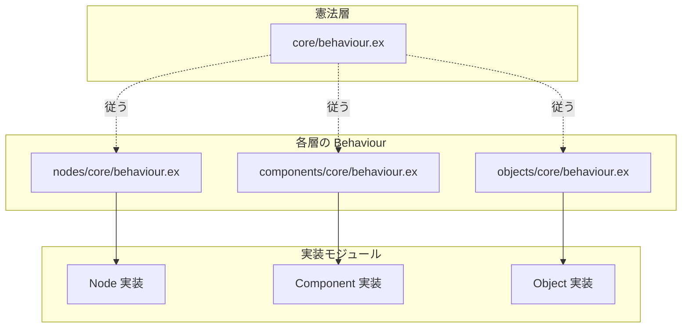

# fix_contents アーキテクチャ 実施手順書

> 作成日: 2026-03-10  
> 参照: [docs/architecture/fix_contents.md](../architecture/fix_contents.md)  
> 目的: コンテンツを最小単位まで分解し、VR 空間で直感的な論理構築を可能にする統一ディレクトリ・アーキテクチャを構築する。
>
> **注記**: 現行コードの移行作業は本手順書の対象外。別途実施する。

---

## 1. 概要

### 1.1 設計の背景

| 項目 | 内容 |
|:---|:---|
| **存在の階層（Five Pillars）** | Contents → Objects → Components → Nodes → Schemas |
| **依存の方向** | schemas を基盤として、nodes → components → objects へ一方向に積み上げ |
| **二種類のピン** | Action pins（実行フロー / 時間の制御）、Logic pins（データフロー / 情報の参照） |
| **プロセスモデル** | Object / Component は GenServer。Node はプロセスにせず、Executor が関数として呼び出す |

### 1.2 実装の積み上げ順

依存関係に従い、下位層から順に構築する。

```
schemas → core/behaviour → nodes → components → objects
```

---

## 2. 目標構成（apps/contents）

```
apps/contents/
├── lib/
│   ├── schemas/             # 設計図。データ型定義
│   │   └── category/
│   │       ├── primitives/  # スカラー・ベクトル・行列・色など
│   │       ├── text/        # 文字列・文字
│   │       ├── temporal/    # 日時・時間幅
│   │       ├── spatial/     # 空間に関わる型（Transform など）
│   │       └── users/
│   └── contents/            # 既存 Contents（移行対象、本手順書外）
├── core/
│   └── behaviour.ex
├── objects/
│   └── core/
│       └── behaviour.ex
├── components/
│   ├── core/
│   │   └── behaviour.ex
│   └── category/
│       └── uncategorized/
├── nodes/                   # 論理のピア（Logic Processors）
│   ├── pins/                # Action / Logic ピン定義
│   │   ├── action.ex
│   │   └── logic.ex
│   ├── core/
│   │   └── behaviour.ex
│   └── category/
│       ├── actions/
│       └── math/
```

---

## 3. 実施手順

### Phase 1: schemas の土台構築

schemas は全層の基盤。最初に配置を定義し、カテゴリ別に型を追加する。

#### Step 1-1: ディレクトリ作成

```bash
mkdir -p apps/contents/lib/schemas/category/primitives
mkdir -p apps/contents/lib/schemas/category/text
mkdir -p apps/contents/lib/schemas/category/temporal
mkdir -p apps/contents/lib/schemas/category/spatial
mkdir -p apps/contents/lib/schemas/category/users
```

#### Step 1-2: primitives カテゴリの作成

スカラー・ベクトル・行列・色など。float3 / quaternion もここに含む（spatial で多用するが、包括的な型定義として primitives に配置する）。

**規約: 型ファミリごとに 1 ファイルにまとめる。** 1 ファイル内に複数の `@type` を定義する。負荷は気にする必要はなく、関連型を一箇所にまとめることで保守性が上がる。

例:
- `primitives/bool.ex` → `@type t`, `@type t2`, `@type t3`, `@type t4`
- `primitives/float.ex` → `@type t`, `@type t2`, `@type t3`, `@type t4`, `@type t2x2`, `@type t3x3`, `@type t4x4`, `@type quaternion`

| ファイル | モジュール | 定義する型 |
|:---|:---|:---|
| `primitives/bool.ex` | `Schemas.Category.Primitives.Bool` | t, t2, t3, t4 |
| `primitives/byte.ex` | `Schemas.Category.Primitives.Byte` | t, t2, t3, t4 |
| `primitives/ushort.ex` | `Schemas.Category.Primitives.UShort` | t, t2, t3, t4 |
| `primitives/uint.ex` | `Schemas.Category.Primitives.UInt` | t, t2, t3, t4 |
| `primitives/ulong.ex` | `Schemas.Category.Primitives.ULong` | t, t2, t3, t4 |
| `primitives/sbyte.ex` | `Schemas.Category.Primitives.SByte` | t, t2, t3, t4 |
| `primitives/short.ex` | `Schemas.Category.Primitives.Short` | t, t2, t3, t4 |
| `primitives/int.ex` | `Schemas.Category.Primitives.Int` | t, t2, t3, t4 |
| `primitives/long.ex` | `Schemas.Category.Primitives.Long` | t, t2, t3, t4 |
| `primitives/float.ex` | `Schemas.Category.Primitives.Float` | t, t2, t3, t4, t2x2, t3x3, t4x4, quaternion |
| `primitives/double.ex` | `Schemas.Category.Primitives.Double` | t, t2, t3, t4, t2x2, t3x3, t4x4, quaternion |
| `primitives/decimal.ex` | `Schemas.Category.Primitives.Decimal` | t |
| `primitives/color.ex` | `Schemas.Category.Primitives.Color` | t, t32 |

各ファイルは `@type` と `@moduledoc` を定義する。

#### Step 1-3: text カテゴリの作成

| ファイル | モジュール | 役割 |
|:---|:---|:---|
| `schemas/category/text/string.ex` | `Schemas.Category.Text.String` | 文字列型 |
| `schemas/category/text/char.ex` | `Schemas.Category.Text.Char` | 文字型 |

#### Step 1-4: temporal カテゴリの作成

| ファイル | モジュール | 役割 |
|:---|:---|:---|
| `schemas/category/temporal/date_time.ex` | `Schemas.Category.Temporal.DateTime` | 日時 |
| `schemas/category/temporal/time_span.ex` | `Schemas.Category.Temporal.TimeSpan` | 時間幅 |

#### Step 1-5: spatial カテゴリの作成

| ファイル | モジュール | 役割 |
|:---|:---|:---|
| `schemas/category/spatial/transform.ex` | `Schemas.Category.Spatial.Transform` | 変換行列・位置・回転・スケール |

3 次元ベクトルは primitives の `Float.t3` を利用する。Resonite の Components に合わせた配置。

#### Step 1-6: users カテゴリの作成

| ファイル | モジュール | 役割 |
|:---|:---|:---|
| `schemas/category/users/local_user.ex` | `Schemas.Category.Users.LocalUser` | 操作者というコンテキストの型 |

---

### Phase 2: core/behaviour（憲法）

全層が従う共通の土台を定義する。

#### Step 2-1: ディレクトリ作成

```bash
mkdir -p apps/contents/lib/contents/core
```

#### Step 2-2: 憲法の実装

**ファイル:** `apps/contents/lib/contents/core/behaviour.ex`

モジュール: `Contents.Core.Behaviour`

| 責務 | 内容 |
|:---|:---|
| GenServer の基盤 | `init` / `terminate` の雛形（Object / Component 向け。Node は適用外） |
| プロセス識別子 | 共通の識別規則 |
| 共通型・コールバック | 各層が継承または参照する雛形 |

**設計上の注意**: `@behaviour` による直接指定はせず、設計上の制約（従うべき原則）として扱う選択も可。

---

### Phase 3: nodes 層

論理の原子。Action / Logic pins に基づく処理を行う。

#### Step 3-1: ディレクトリ作成

```bash
mkdir -p apps/contents/lib/contents/nodes/pins
mkdir -p apps/contents/lib/contents/nodes/core
mkdir -p apps/contents/lib/contents/nodes/category/actions
mkdir -p apps/contents/lib/contents/nodes/category/math
```

#### Step 3-2: nodes/pins（Action / Logic ピン定義）

ノード間の通信ルールを定義する。

**ファイル:** `apps/contents/lib/contents/nodes/pins/action.ex`

- ピン: `action in` / `action out`
- 役割: 「いつ（When）」を司る。パルスによる実行権限の委譲
- 機能: 順次処理、並列処理、Sync（同期）
- `@callback` または `@spec` でパルス受信・送信のインターフェースを定義

**ファイル:** `apps/contents/lib/contents/nodes/pins/logic.ex`

- ピン: `logic in` / `logic out`
- 役割: 「何を（What）」を司る。情報の参照と変換
- 機能: ストリーム、または要求に応じた Value の返却
- `@callback` または `@spec` で Sample / Value のインターフェースを定義

#### Step 3-3: Node Behaviour の作成

**ファイル:** `apps/contents/lib/contents/nodes/core/behaviour.ex`

モジュール: `Contents.Nodes.Core.Behaviour`

| 責務 | 内容 |
|:---|:---|
| Action/Logic pins | action in/out, logic in/out の宣言 |
| コールバック | `handle_pulse`、`handle_sample` など |
| プロセス | Node は GenServer 化しない。Component 内の Executor がグラフをトラバースし、コールバックを直接呼び出す |

#### Step 3-4: ノード実装例（actions/write）

**ファイル:** `apps/contents/lib/contents/nodes/category/actions/write.ex`

- action in pin でパルスを受け取ったとき動作
- logic in pin からデータ（Sample）を吸い上げ、対象を書き換え
- 終了後、action out pin へパルスを返す

#### Step 3-5: ノード実装例（math/add）

**ファイル:** `apps/contents/lib/contents/nodes/category/math/add.ex`

- 純粋なロジック演算
- logic pins のみ（または action 非依存）で動作

---

### Phase 4: components 層

状態のピア。ノードを束ねて特定の機能を提供する。

#### Step 4-1: ディレクトリ作成

```bash
mkdir -p apps/contents/lib/contents/components/core
mkdir -p apps/contents/lib/contents/components/category/uncategorized
```

#### Step 4-2: Component Behaviour の作成

**ファイル:** `apps/contents/lib/contents/components/core/behaviour.ex`

モジュール: `Contents.Components.Core.Behaviour`

| 責務 | 内容 |
|:---|:---|
| 状態保持 | コンポーネント固有の状態 |
| ノード束ね | 複数ノードを束ねるインターフェース |
| ライフサイクル | `on_ready`、`on_process` など |
| GenServer 規約 | `Contents.Core.Behaviour` の制約に従う |

#### Step 4-3: コンポーネント実装例（uncategorized/comment）

**ファイル:** `apps/contents/lib/contents/components/category/uncategorized/comment.ex`

- VR 空間内のドキュメント化（付箋）用コンポーネント

---

### Phase 5: objects 層

空間のピア（Entities）。ECS の Entity 相当。

#### Step 5-1: ディレクトリ作成

```bash
mkdir -p apps/contents/lib/contents/objects/core
```

#### Step 5-2: Object Behaviour の作成

**ファイル:** `apps/contents/lib/contents/objects/core/behaviour.ex`

モジュール: `Contents.Objects.Core.Behaviour`

| 責務 | 内容 |
|:---|:---|
| 空間上の実体 | init、空間イベント対応 |
| `handle_cast` | 空間イベントの処理 |
| 子の管理 | コンポーネント・子 Object の管理 |
| GenServer 規約 | `Contents.Core.Behaviour` の制約に従う |

---

## 4. 依存関係の検証

実装後、以下の依存方向が守られていることを確認する。

```
schemas
schemas |> nodes
schemas |> components
schemas |> objects
schemas |> nodes |> objects
schemas |> components |> objects
schemas |> nodes |> components |> objects
```

- nodes は schemas にのみ依存
- components は schemas、nodes に依存
- objects は schemas、nodes、components に依存
- 逆方向の依存（上位 → 下位以外）がないこと

---

## 5. Behaviour の流れ（設計確認用）



---

## 6. 変更・新規作成ファイル一覧（チェックリスト）

### Phase 1: schemas

- [ ] `apps/contents/lib/schemas/category/primitives/bool.ex`
- [ ] `apps/contents/lib/schemas/category/primitives/byte.ex`
- [ ] `apps/contents/lib/schemas/category/primitives/ushort.ex`
- [ ] `apps/contents/lib/schemas/category/primitives/uint.ex`
- [ ] `apps/contents/lib/schemas/category/primitives/ulong.ex`
- [ ] `apps/contents/lib/schemas/category/primitives/sbyte.ex`
- [ ] `apps/contents/lib/schemas/category/primitives/short.ex`
- [ ] `apps/contents/lib/schemas/category/primitives/int.ex`
- [ ] `apps/contents/lib/schemas/category/primitives/long.ex`
- [ ] `apps/contents/lib/schemas/category/primitives/float.ex`
- [ ] `apps/contents/lib/schemas/category/primitives/double.ex`
- [ ] `apps/contents/lib/schemas/category/primitives/decimal.ex`
- [ ] `apps/contents/lib/schemas/category/primitives/color.ex`
- [ ] `apps/contents/lib/schemas/category/text/string.ex`
- [ ] `apps/contents/lib/schemas/category/text/char.ex`
- [ ] `apps/contents/lib/schemas/category/temporal/date_time.ex`
- [ ] `apps/contents/lib/schemas/category/temporal/time_span.ex`
- [ ] `apps/contents/lib/schemas/category/spatial/transform.ex`
- [ ] `apps/contents/lib/schemas/category/users/local_user.ex`

### Phase 2: core

- [ ] `apps/contents/lib/contents/core/behaviour.ex`

### Phase 3: nodes

- [ ] `apps/contents/lib/contents/nodes/pins/action.ex`
- [ ] `apps/contents/lib/contents/nodes/pins/logic.ex`
- [ ] `apps/contents/lib/contents/nodes/core/behaviour.ex`
- [ ] `apps/contents/lib/contents/nodes/category/actions/write.ex`
- [ ] `apps/contents/lib/contents/nodes/category/math/add.ex`

### Phase 4: components

- [ ] `apps/contents/lib/contents/components/core/behaviour.ex`
- [ ] `apps/contents/lib/contents/components/category/uncategorized/comment.ex`

### Phase 5: objects

- [ ] `apps/contents/lib/contents/objects/core/behaviour.ex`

---

## 7. 検証手順

1. **コンパイル**
   ```bash
   mix compile --warnings-as-errors
   ```

2. **型・依存の整合性**
   - `mix xref graph` 等で循環依存がないことを確認

3. **動作確認**
   - 既存 Contents（lib/contents/）が引き続き動作することを確認
   - （移行後）新アーキテクチャで構築したノード・コンポーネント・オブジェクトの単体動作確認

---

## 8. 現行コード移行について（別タスク）

本手順書では **新規ディレクトリ・モジュールの構築** に限定する。

以下は別途「現行コード移行手順」として実施する想定:

- `lib/contents/` 内の既存 Contents の参照先変更
- `apps/core` 配下の `ContentBehaviour` / `Component` との関係整理
- `Contents.SceneBehaviour` の Object 層との統合
- 既存 LocalUserComponent 等の components 層への移行（[contents-components-reorganization-procedure.md](./contents-components-reorganization-procedure.md) と整合を取る）

---

## 9. 参考: VR 体験における開発指針（fix_contents.md より）

- **直感的な線**: Action は「光る脈動」、Logic は「静かな導管」として視覚化
- **対称性の保持**: 層が違ってもインターフェースが同じなら、一度覚えたルールで全体を構築可能
- **型の厳格さ**: schemas のカテゴリー化により、VR 空間で「何を触っているか」を型レベルで意識可能に
