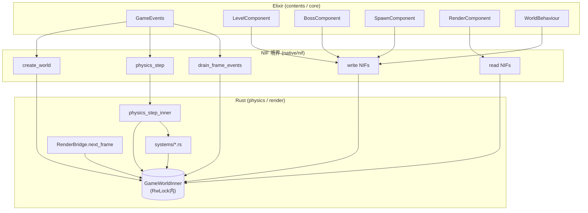
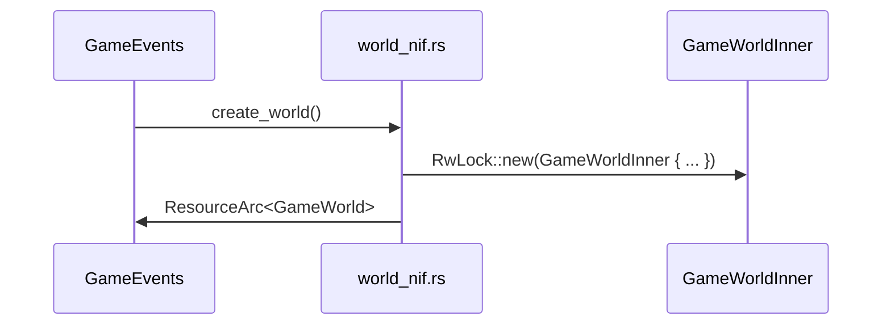
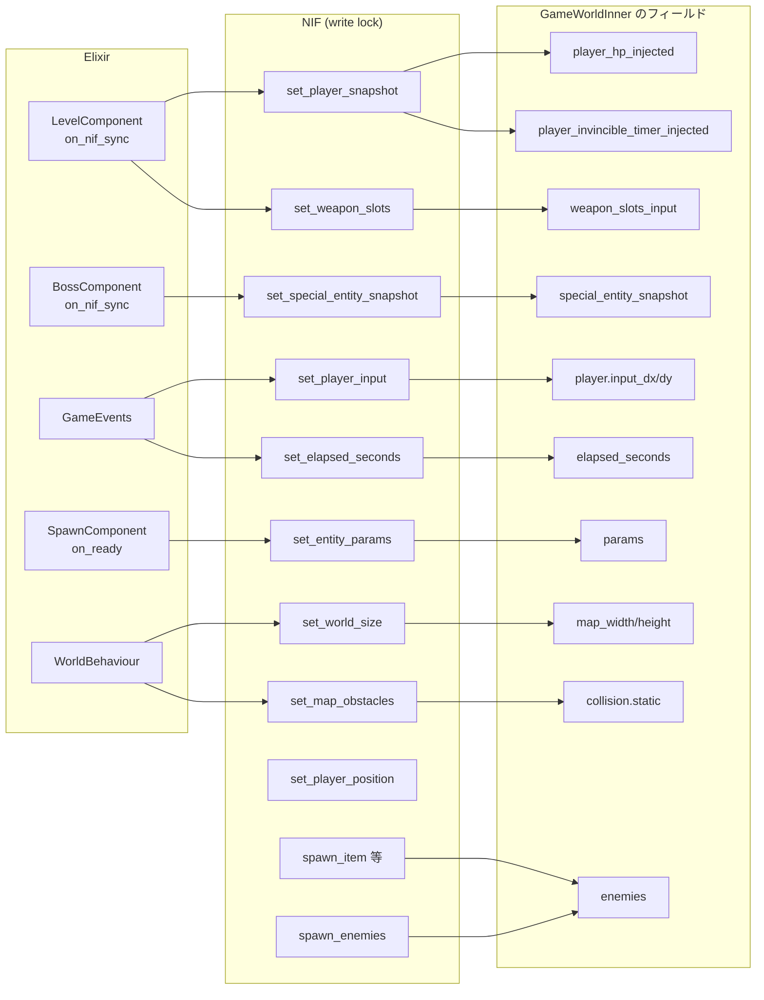
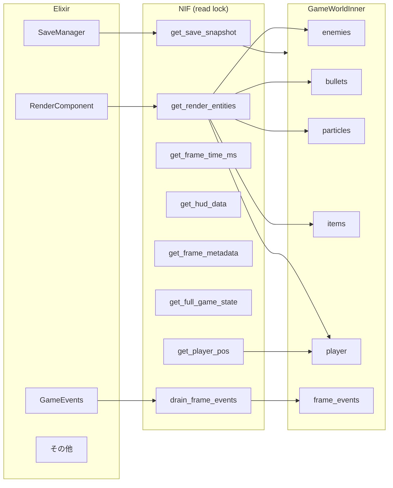
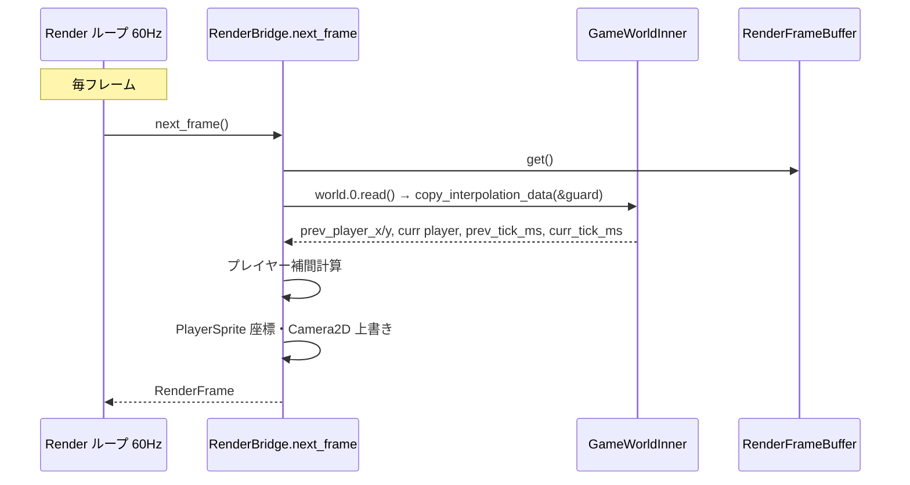
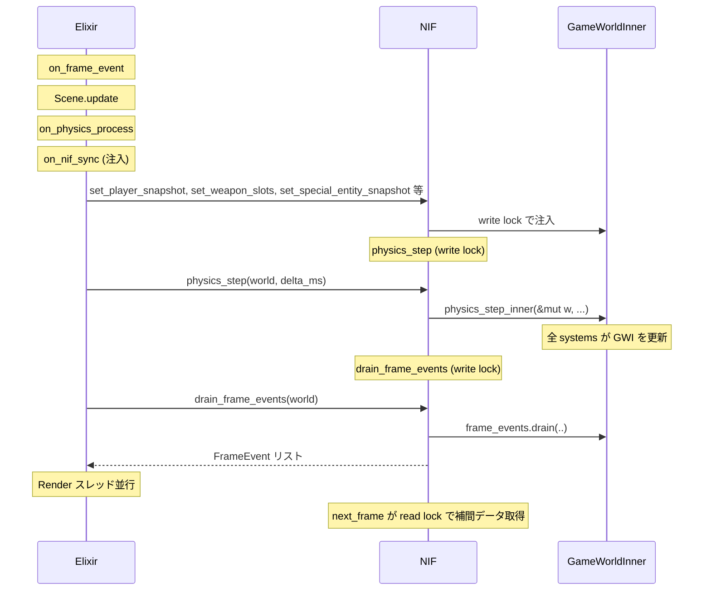

# GameWorldInner ソースフロー

> 作成日: 2026-03-05  
> 目的: 課題19（GameWorldInner → ContentsInner と計算式・アルゴリズムの Rust 実行）に着手する前に、`GameWorldInner` が関わるソースの流れを把握するため。

---

## 概要

`GameWorldInner` は Rust 側のゲームワールド内部状態であり、`GameWorld(RwLock<GameWorldInner>)` として `ResourceArc` 経由で Elixir が保持する。  
Elixir → Rust への注入、Rust 内部での演算、Rust → Elixir への出力、描画スレッドでの参照が混在する。

---

## 1. 全体構成（レイヤー間の関係）

---

## 2. GameWorldInner の作成・初期化

**ソース**: `native/nif/src/nif/world_nif.rs` の `create_world/0`

---

## 3. Elixir → Rust 書き込み（NIF で GameWorldInner を更新）

**主な NIF とソース**:

| NIF | ソース | 更新するフィールド |
|:---|:---|:---|
| `set_player_snapshot` | world_nif.rs | `player_hp_injected`, `player_invincible_timer_injected` |
| `set_weapon_slots` | action_nif.rs | `weapon_slots_input` |
| `set_special_entity_snapshot` | action_nif.rs | `special_entity_snapshot` |
| `set_player_input` | world_nif.rs | `player.input_dx`, `player.input_dy` |
| `set_elapsed_seconds` | world_nif.rs | `elapsed_seconds` |
| `set_entity_params` | world_nif.rs | `params` (EntityParamTables) |
| `set_world_size` | world_nif.rs | `map_width`, `map_height` |
| `set_map_obstacles` | world_nif.rs | `collision.rebuild_static` |
| `spawn_enemies` / `spawn_enemies_at` | world_nif.rs | `enemies` |
| `spawn_item` 等 | action_nif.rs | `items`, `special_entity_snapshot` 等 |

---

## 4. Rust 内部: physics_step と GameWorldInner

```mermaid
flowchart TD
    subgraph NIF
        phys_nif[game_loop_nif.physics_step]
    end

    subgraph physics_step["physics_step_inner (game_logic/physics_step.rs)"]
        direction TB
        update_score_popups[update_score_popups]
        elapsed[elapsed_seconds += dt]
        player_move[プレイヤー移動]
        obstacle_player[障害物 vs プレイヤー]
        chase_ai[Chase AI]
        separation[敵分離]
        resolve_obstacles[resolve_obstacles_enemy]
        rebuild[rebuild_collision]
        player_hit[プレイヤー vs 敵衝突]
        weapons[update_weapon_attacks]
        particles[update_particles]
        items[update_items]
        projectiles[update_projectiles_and_enemy_hits]
        special[collide_special_entity_snapshot]
    end

    subgraph systems["systems/*.rs が GameWorldInner を参照"]
        effects[effects.rs]
        collision[collision.rs]
        weapons_sys[weapons.rs]
        items_sys[items.rs]
        projectiles_sys[projectiles.rs]
        special_coll[special_entity_collision.rs]
        spawn_sys[spawn.rs]
    end

    phys_nif --> physics_step_inner
    physics_step_inner --> update_score_popups
    physics_step_inner --> elapsed
    physics_step_inner --> player_move
    physics_step_inner --> obstacle_player
    physics_step_inner --> chase_ai
    physics_step_inner --> separation
    physics_step_inner --> resolve_obstacles
    physics_step_inner --> rebuild
    physics_step_inner --> player_hit
    physics_step_inner --> weapons
    physics_step_inner --> particles
    physics_step_inner --> items
    physics_step_inner --> projectiles
    physics_step_inner --> special

    update_score_popups --> effects
    resolve_obstacles --> collision
    weapons --> weapons_sys
    items --> items_sys
    projectiles --> projectiles_sys
    special --> special_coll
```

**physics_step が GameWorldInner を参照する systems**:

| モジュール | パス | 役割 |
|:---|:---|:---|
| `effects` | physics/src/game_logic/systems/effects.rs | `update_score_popups`, `update_particles` |
| `collision` | physics/src/game_logic/systems/collision.rs | `resolve_obstacles_enemy` |
| `weapons` | physics/src/game_logic/systems/weapons.rs | `update_weapon_attacks` (`weapon_slots_input`, `params` 参照) |
| `items` | physics/src/game_logic/systems/items.rs | `update_items` |
| `projectiles` | physics/src/game_logic/systems/projectiles.rs | `update_projectiles_and_enemy_hits` |
| `special_entity_collision` | physics/src/game_logic/systems/special_entity_collision.rs | `collide_special_entity_snapshot` |
| `spawn` | physics/src/game_logic/systems/spawn.rs | `get_spawn_positions_around_player` (spawn_enemies 等から呼ばれる) |

---

## 5. Rust → Elixir 読み出し（NIF で GameWorldInner を読む）

**read NIF とソース**:

| NIF | ソース | 参照するフィールド |
|:---|:---|:---|
| `get_render_entities` | read_nif.rs | enemies, bullets, particles, items, player, params, score_popups |
| `get_player_pos` | read_nif.rs | player.x, player.y |
| `get_player_hp` | read_nif.rs | player_hp_injected |
| `get_frame_time_ms` | read_nif.rs | last_frame_time_ms |
| `get_hud_data` | read_nif.rs | score, kill_count, hud_level 等（Phase R-3 以降デッドフィールド） |
| `get_frame_metadata` | read_nif.rs | frame_id, player, elapsed_seconds 等 |
| `get_full_game_state` | read_nif.rs | frame_id, player, kill_count 等 |
| `get_save_snapshot` | save_nif.rs | ほぼ全体 |
| `get_magnet_timer` | read_nif.rs | magnet_timer |
| `is_player_dead` | read_nif.rs | player_hp_injected |
| `drain_frame_events` | game_loop_nif.rs → events.rs | frame_events (write lock で drain) |

---

## 6. 描画スレッド: RenderBridge と GameWorldInner

**ソース**: `native/nif/src/render_bridge.rs`

- `copy_interpolation_data(w: &GameWorldInner)` が以下を読む:
  - `prev_player_x`, `prev_player_y`
  - `player.x`, `player.y`
  - `prev_tick_ms`, `curr_tick_ms`
- Phase R-2 以降、描画実体は `RenderFrameBuffer` 経由で `push_render_frame` の結果を使用。プレイヤー補間のみ `GameWorld` から取得。

---

## 7. フレーム単位の処理順序（毎フレーム）

---

## 8. GameWorldInner を参照する Rust ソース一覧

| パス | 用途 |
|:---|:---|
| `native/physics/src/world/game_world.rs` | 定義・`rebuild_collision` |
| `native/physics/src/game_logic/physics_step.rs` | `physics_step_inner(&mut GameWorldInner)` |
| `native/physics/src/game_logic/systems/effects.rs` | `update_score_popups`, `update_particles` |
| `native/physics/src/game_logic/systems/collision.rs` | `resolve_obstacles_enemy` |
| `native/physics/src/game_logic/systems/weapons.rs` | `update_weapon_attacks` |
| `native/physics/src/game_logic/systems/items.rs` | `update_items` |
| `native/physics/src/game_logic/systems/projectiles.rs` | `update_projectiles_and_enemy_hits` |
| `native/physics/src/game_logic/systems/special_entity_collision.rs` | `collide_special_entity_snapshot` |
| `native/physics/src/game_logic/systems/spawn.rs` | `get_spawn_positions_around_player` |
| `native/nif/src/nif/world_nif.rs` | `create_world`, `set_*` 系 |
| `native/nif/src/nif/action_nif.rs` | `set_weapon_slots`, `set_special_entity_snapshot` 等 |
| `native/nif/src/nif/game_loop_nif.rs` | `physics_step`, `drain_frame_events` |
| `native/nif/src/nif/events.rs` | `drain_frame_events_inner` |
| `native/nif/src/nif/read_nif.rs` | `get_*` 系 |
| `native/nif/src/nif/save_nif.rs` | `get_save_snapshot`, `apply_save_snapshot` |
| `native/nif/src/render_bridge.rs` | `copy_interpolation_data` |
| `native/physics/src/entity_params.rs` | `GameWorldInner::params` 参照（`params` の注入先） |
| `native/physics/src/weapon.rs` | `GameWorldInner::params` 参照 |

---

## 9. 課題19 との関係

課題19では以下を目指す:

1. **GameWorldInner → ContentsInner**
   - 現在の `GameWorldInner` の状態の一部を、contents 層が定義する「コンテンツ内部状態」として移行する。
   - 上記のフローを踏まえると、`weapon_slots_input` の `physics_step` 引数化（B案）や、`special_entity_snapshot` の扱いも、この流れの一部となる。

2. **計算式・アルゴリズムの Rust 実行**
   - コンテンツが命令列（バイトコード）で計算ロジックを定義し、Rust が実行する形にし、NIF 境界では「命令列 + 入力」「結果」のみ受け渡す。
   - その際、`physics_step` や各 systems が直接 `GameWorldInner` を触るのではなく、汎用的な「実行エンジン」に命令を渡す形への変更が想定される。

本ドキュメントのフローを前提に、移行対象のフィールド・NIF・systems を切り分けて検討する。
