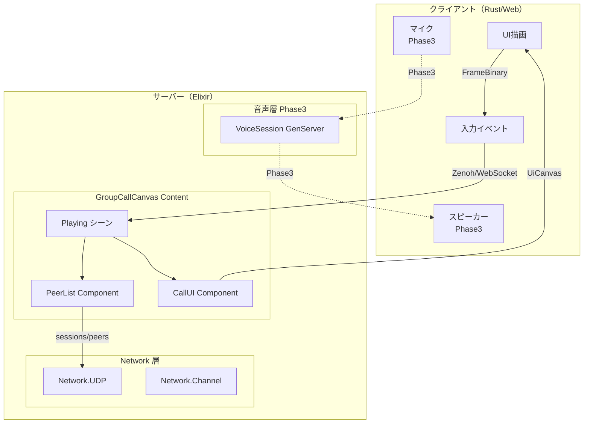
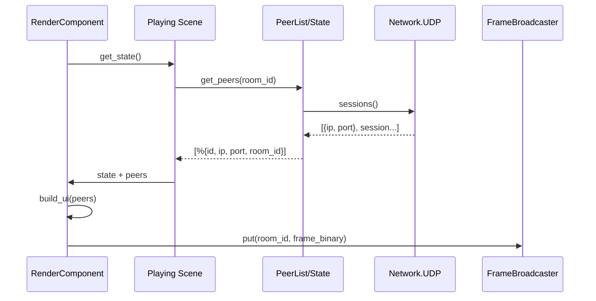
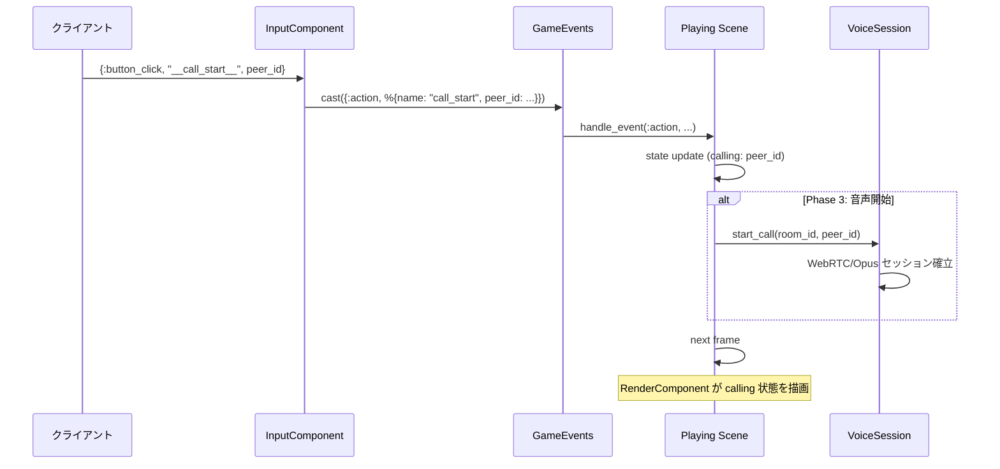
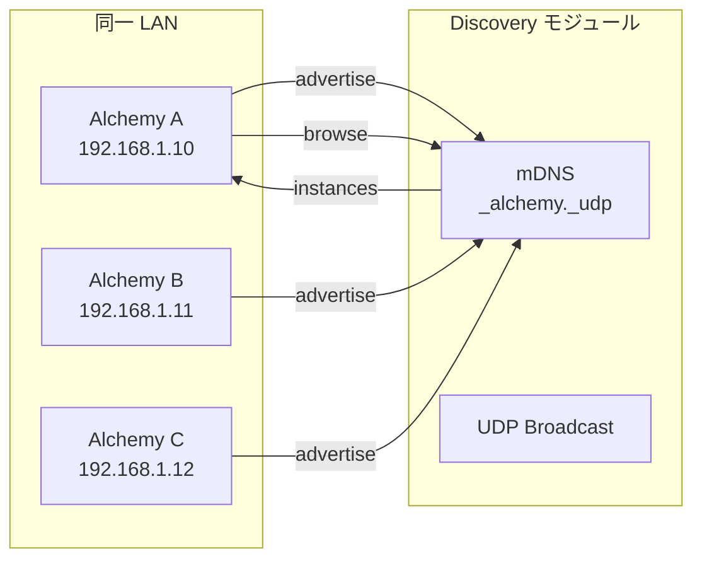
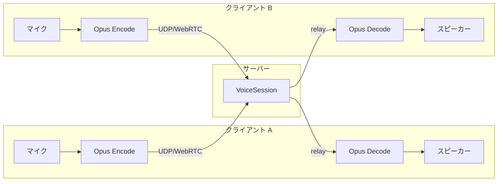

# グループ通話 Canvas プラン

> 作成日: 2026-03-11  
> 目的: 新ビヘイビア（fix_contents 準拠）を用いたグループ通話コンテンツを構築する。同一 LAN 上のユーザーを発見し、通話できる Canvas を提供する。  
> 前提: 現行コードは無視し、新規ディレクトリ・モジュールとして構築する。

---

## 1. 概要

### 1.1 達成したいこと

| 項目 | 内容 |
|:---|:---|
| **ネットワーク上の人一覧表示** | 同一 LAN 上で稼働中の Alchemy インスタンス（または同一ルーム参加者）をリスト表示 |
| **通話ボタン** | ボタン押下で、選択した相手またはルーム参加者との音声通話を開始・終了 |
| **Canvas UI** | HUD またはワールド空間に、参加者リストと通話コントロールを配置 |
| **新ビヘイビア** | fix_contents の schemas / nodes / components / objects 体系に準拠したコンテンツとして構築 |

### 1.2 スコープ

- **Phase 1（MVP）**: 同一ルームに参加済みのクライアントをリスト表示し、通話 UI を提供。音声は未実装（UI のみ）。
- **Phase 2**: LAN 上で他インスタンスを発見し、ルーム参加を促す（またはルーム一覧を表示）。
- **Phase 3**: 実音声通話（WebRTC または Opus over UDP）を統合。

---

## 2. アーキテクチャ

### 2.1 新コンテンツの配置

```
apps/contents/
├── lib/
│   ├── schemas/category/
│   │   └── users/
│   │       └── network_peer.ex      # 追加: ネットワーク上のピア型
│   └── contents/
│       └── group_call_canvas/       # 新規
│           ├── group_call_canvas.ex   # Content エントリポイント（新 ContentBehaviour）
│           ├── objects/
│           │   └── group_call_room.ex # Object: 通話ルーム実体
│           ├── components/
│           │   ├── peer_list.ex       # Component: ピア一覧保持・更新
│           │   ├── voice_session.ex   # Component: 音声セッション管理（Phase 3）
│           │   └── call_ui.ex         # Component: UI ノード組み立て
│           └── nodes/
│               ├── fetch_peers.ex     # Node: ネットワークからピア一覧取得
│               └── call_action.ex     # Node: 通話開始・終了アクション
```

既存の `Content.CanvasTest` は現行 ContentBehaviour に従う。本コンテンツは **新ビヘイビア** 体系に準拠し、将来的に fix_contents の objects/components/nodes へ移行する前提で配置する。

### 2.2 既存インフラとの関係

| 既存 | 用途 |
|:---|:---|
| `Network.UDP` | ルーム参加・フレーム配信。`sessions/0` で参加クライアント一覧取得可能 |
| `Network.Channel` | WebSocket 経由の room join。同一ルーム参加者の取得に利用 |
| `UiCanvas` / `UiNode` | HUD・ワールド Canvas の描画（`Content.CanvasTest` と同様） |
| `FrameBroadcaster` | Zenoh 経由でクライアントへフレーム配信 |
| ` native/audio` | BGM・SE のみ。**音声ストリーミングは未実装** |

---

## 3. 足りない実装の洗い出し

### 3.1 インフラ層（未実装）

| # | 項目 | 説明 | 優先度 |
|:---|:---|:---|:---|
| 1 | **LAN ディスカバリ** | mDNS または UDP ブロードキャストで同一 LAN 上の Alchemy インスタンスを検出。`InstanceDiscovery` 相当のモジュール。`upper-layer-infrastructure-plan.md` に記載あり。 | Phase 2 |
| 2 | **ピア一覧 API** | ルーム参加者一覧をコンテンツから取得する統一 API。`Network.UDP.sessions/0` は Elixir 側で利用可能だが、Content から参照しやすいラッパーが未整備。 | Phase 1 |
| 3 | **音声ストリーミング** | リアルタイム音声送受信。`native/audio` は BGM/SE のみ。WebRTC（ex_webrtc）または Opus over UDP の新規実装が必要。 | Phase 3 |
| 4 | **通話ルーム状態管理** | 誰が通話中か・ミュート状態などを管理する GenServer。`Network.Local` のような「ルーム単位」の管理はあるが、通話専用の状態は未実装。 | Phase 3 |

### 3.2 新ビヘイビア層（fix_contents）

| # | 項目 | 説明 | 優先度 |
|:---|:---|:---|:---|
| 5 | **Contents.Core.Behaviour** | 憲法。`fix-contents-implementation-procedure.md` Phase 2 で未実装。本コンテンツは当面既存 ContentBehaviour を拡張するか、最小限の新規 Behaviour を定義。 | Phase 1 |
| 6 | **Contents.Objects.Core.Behaviour** | Object の規約。未実装。`group_call_room` は当面 GenServer として独立実装し、後から Behaviour に準拠させる。 | Phase 1 |
| 7 | **Contents.Components.Core.Behaviour** | Component の規約。未実装。既存 `Core.Component` と併用するか、新規定義するかを要検討。 | Phase 1 |
| 8 | **Contents.Nodes.Core.Behaviour** | Node の規約。未実装。`fetch_peers` などは純粋関数として実装可能。 | Phase 1 |

### 3.3 UI・描画層

| # | 項目 | 説明 | 優先度 |
|:---|:---|:---|:---|
| 9 | **動的リスト UI** | UiNode で「ピア一覧」を動的生成。現状は固定レイアウト（`vertical_layout` + `text`）。リスト長に応じたレイアウト・スクロールの要否を検討。 | Phase 1 |
| 10 | **ボタン → 通話開始イベント** | 既存 `{:button, label, action, ...}` は `__quit__` 等のアクションをサポート。`__call_start__` 等の新アクションを InputComponent / GameEvents 経由で処理する必要あり。 | Phase 1 |
| 11 | **通話状態表示** | 通話中・ミュート・接続中等の状態を Canvas に表示。`text` または `rect` の色変更で表現。 | Phase 1 |

### 3.4 クライアント（Rust）側

| # | 項目 | 説明 | 優先度 |
|:---|:---|:---|:---|
| 12 | **マイク入力** | クライアントからのマイク音声を取得してサーバーへ送信。Rust 側に `cpal` 等のマイクキャプチャが必要。 | Phase 3 |
| 13 | **スピーカー出力（PCM ストリーム）** | サーバーから受信した音声 PCM を再生。`rodio` でストリーミング再生する拡張が必要。 | Phase 3 |
| 14 | **WebRTC クライアント** | ブラウザクライアントの場合は標準 WebRTC API 利用。ネイティブクライアントの場合は webrtc-rs 等の統合。 | Phase 3 |

---

## 4. 処理フロー（マーメイド図）

### 4.1 全体アーキテクチャ



### 4.2 ピア一覧取得フロー（Phase 1）



### 4.3 通話ボタン押下フロー（Phase 1: UI のみ / Phase 3: 音声）



### 4.4 LAN ディスカバリフロー（Phase 2）



### 4.5 音声通話データフロー（Phase 3）



---

## 5. 実装フェーズ詳細

### Phase 1: UI のみ（MVP）

**目標**: ルーム参加者一覧を Canvas に表示し、通話ボタンを配置。押下時は状態更新のみ（音声なし）。

| タスク | 担当層 | 説明 |
|:---|:---|:---|
| P1-1 | network | `Network.PeerList` または `Network.UDP` に `peers_in_room/1` を追加。`sessions/0` を room_id でフィルタし、`%{id, ip, port, room_id}` 形式で返す。 |
| P1-2 | contents | `Content.GroupCallCanvas` エントリポイント作成。既存 ContentBehaviour を最小限満たす。 |
| P1-3 | contents | `GroupCallCanvas.Scenes.Playing` で `peers` と `calling_peer_id` を state に保持。 |
| P1-4 | contents | `GroupCallCanvas.RenderComponent` でピア一覧 + 通話ボタンを UiCanvas に組み立て。動的リストは `Enum.map(peers, fn p -> {:node, ..., {:button, p.id, "__call_start__", ...}} end)` で生成。 |
| P1-5 | contents | `GroupCallCanvas.InputComponent` で `__call_start__` アクションを受信し、Scene の state を `calling_peer_id` で更新。 |
| P1-6 | core | `Core.Config` に GroupCallCanvas を登録（開発用コンテンツ切り替え）。 |

### Phase 2: LAN ディスカバリ

**目標**: 同一 LAN 上の他インスタンスを検出し、一覧表示。ルーム参加は既存フローを利用。

| タスク | 担当層 | 説明 |
|:---|:---|:---|
| P2-1 | network | mDNS または UDP ブロードキャストによるインスタンス広告・検出モジュール追加。 |
| P2-2 | contents | ディスカバリ結果を Playing state に取り込み、`discovered_instances` を UI に表示。 |
| P2-3 | contents | インスタンス選択 → ルーム参加フロー（既存 UDP/Channel join を利用）。 |

### Phase 3: 音声通話

**目標**: 通話ボタン押下で実音声の送受信を開始。

| タスク | 担当層 | 説明 |
|:---|:---|:---|
| P3-1 | native/audio | マイクキャプチャ（cpal）・Opus エンコード・UDP 送信。または WebRTC クライアント統合。 |
| P3-2 | network | 音声パケットの受信・ルーム内他クライアントへ relay。 |
| P3-3 | native/audio | 受信 PCM のストリーミング再生（rodio 拡張）。 |
| P3-4 | contents | VoiceSession Component でセッション管理。開始・終了・ミュートを state で制御。 |

---

## 6. ファイル作成チェックリスト

### Phase 1

- [ ] `apps/network/lib/network/peer_list.ex` — ルーム参加者取得 API（または既存 UDP に関数追加）
- [ ] `apps/contents/lib/contents/group_call_canvas.ex`
- [ ] `apps/contents/lib/contents/group_call_canvas/scenes/playing.ex`
- [ ] `apps/contents/lib/contents/group_call_canvas/input_component.ex`
- [ ] `apps/contents/lib/contents/group_call_canvas/render_component.ex`
- [ ] `apps/core/lib/core/config.ex` — GroupCallCanvas 登録

### Phase 2

- [ ] `apps/network/lib/network/discovery.ex` — mDNS / UDP broadcast

### Phase 3

- [ ] `apps/contents/lib/contents/group_call_canvas/components/voice_session.ex`
- [ ] `native/audio` 拡張（マイク・ストリーミング再生）
- [ ] 音声プロトコル定義（Opus over UDP 等）

---

## 7. 参照ドキュメント

- [fix-contents-implementation-procedure.md](./fix-contents-implementation-procedure.md) — 新ビヘイビア構築手順
- [fix_contents.md](../architecture/fix_contents.md) — アーキテクチャ設計
- [canvas-test-design.md](../task/canvas-test-design.md) — Canvas UI 設計の参考
- [upper-layer-infrastructure-plan.md](./upper-layer-infrastructure-plan.md) — ディスカバリ設計
- [client-server-separation-procedure.md](./client-server-separation-procedure.md) — ネットワーク構成
