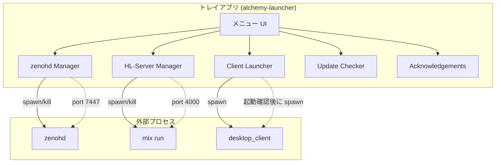

# AlchemyEngine ランチャー設計

> 作成日: 2026-03-07  
> 目的: システムトレイから zenohd / HL-Server / クライアントを管理し、play.bat / play.sh に代わるユーザー体験を提供する。

---

## 1. 背景・課題

### 1.1 現状の問題

| 課題 | 内容 |
|:---|:---|
| 固定待機 | play.bat はポート確認を行うが、起動完了の可視化がない |
| プロセス管理 | zenohd / mix run が残り続け、ユーザーが気づきにくい |
| ログ参照 | コンソール出力を確認しづらい |
| 更新・謝辞 | 専用 UI がなく、手動で確認するしかない |

### 1.2 目標

- **Discord 風トレイインジケーター**: トレイアイコン右クリックでメニューを開き、各サービスを管理
- **起動確認の UX 改善**: ポート確認で待機時間を最小化
- **play.bat / play.sh の廃止**: ランチャー exe に一本化

---

## 2. UI 仕様

### 2.1 メニュー構造（トレイ右クリック）

```
AlchemyEngine
-----------------------
Check for Update...
acknowledgements
-----------------------
zenohd About
zenohd Run
zenohd Command
zenohd Quit
-----------------------
HL-Server About
HL-Server Run
HL-Server Command
HL-Server Quit
-----------------------
Client Run
```

### 2.2 各項目の動作

| 項目 | 動作 |
|:---|:---|
| **AlchemyEngine** | タイトル行（非クリック） |
| **Check for Update...** | アップデート確認ダイアログを開く |
| **acknowledgements** | 謝辞・ライセンス一覧を開く |
| **zenohd About** | zenohd のバージョン・役割説明を表示 |
| **zenohd Run** | zenohd を起動（ポート 7447 で待ち受けを確認） |
| **zenohd Command** | zenohd のコンソール出力ウィンドウを表示 |
| **zenohd Quit** | zenohd を終了 |
| **HL-Server About** | Elixir サーバー（mix run）の説明を表示 |
| **HL-Server Run** | mix run を起動（ポート 4000 で待ち受けを確認） |
| **HL-Server Command** | mix run のコンソール出力ウィンドウを表示 |
| **HL-Server Quit** | mix run を終了 |
| **Client Run** | zenohd と HL-Server の起動を確認してから desktop_client を起動 |

### 2.3 状態表示

- **zenohd Run / zenohd Quit**: 起動中は「zenohd Quit」を有効化し、「zenohd Run」を無効化
- **HL-Server Run / HL-Server Quit**: 同様
- **Client Run**: zenohd と HL-Server が両方起動していない場合は無効化、または押下時に起動を待ってから起動

### 2.4 トレイアイコン

- 通常: AlchemyEngine ロゴ or 既定アイコン
- zenohd 起動中: アイコン変更 or バッジ（任意）
- HL-Server 起動中: 同上（任意）
- 両方起動: 準備完了を表す状態（任意）

---

## 3. アーキテクチャ

### 3.1 全体構成



### 3.2 コンポーネント責務

| コンポーネント | 責務 |
|:---|:---|
| **zenohd Manager** | zenohd の起動・終了・ポート確認（7447）、コンソール出力バッファ |
| **HL-Server Manager** | mix run の起動・終了・ポート確認（4000）、コンソール出力バッファ |
| **Client Launcher** | zenohd と HL-Server のポート確認後、desktop_client を spawn |
| **Update Checker** | リリース一覧の取得・比較、ダイアログ表示 |
| **Acknowledgements** | 謝辞テキストの表示 |

---

## 4. 技術選定

### 4.1 トレイ UI

| 選択肢 | メリット | デメリット |
|:---|:---|:---|
| **tray-icon + tao** | 軽量、クロスプラットフォーム、Rust ネイティブ | メニュー構築は自前 |
| **tray-item** | シンプル | メンテナンス状況要確認 |
| **tao** (単体) | ウィンドウ非表示でトレイのみ可能 | トレイ専用は少し工夫が必要 |

**案**: `tray-icon` クレート（tao ベース）を使用。メニュー項目の追加・有効/無効切り替えに対応。

### 4.2 プロセス管理

- `std::process::Command` で zenohd / mix run / desktop_client を起動
- 子プロセス PID を保持し、Quit 時に `kill` または `TerminateProcess`（Windows）
- コンソール出力: `Command::stdout(Stdio::piped)` でパイプし、バッファに蓄積。Command ウィンドウで表示

### 4.3 ポート確認

- `std::net::TcpStream::connect_timeout` で 127.0.0.1:7447 / 127.0.0.1:4000 に接続試行
- ポーリング間隔 1 秒、最大待機 60 秒程度

### 4.4 配置

- 新規クレート: `native/launcher/` または `native/alchemy-launcher/`
- ワークスペースに追加し、`cargo build -p alchemy-launcher` でビルド
- 出力 exe: `alchemy-launcher.exe`（リリース時）

---

## 5. 実装フェーズ

| フェーズ | 内容 | 工数目安 |
|:---|:---|:---|
| 1 | トレイアプリ骨格、メニュー表示、Quit（アプリ終了） | 1 週間 |
| 2 | zenohd Run / Quit / Command、ポート確認 | 1 週間 |
| 3 | HL-Server Run / Quit / Command、ポート確認 | 1 週間 |
| 4 | Client Run（両方起動確認後に起動） | 数日 |
| 5 | Check for Update、acknowledgements | 1 週間（任意） |
| 6 | play.bat / play.sh 廃止、README 更新 | 数日 |

---

## 6. パス・設定

### 6.1 前提

- ランチャー exe はプロジェクトルート付近に配置、または `--root` で指定
- zenohd: `PATH` 上の `zenohd`（`cargo install eclipse-zenoh`）
- mix run: `ROOT` で `mix run --no-halt`
- desktop_client: `ROOT/native/target/release/desktop_client.exe`（未ビルド時は `cargo run -p desktop_client`）

### 6.2 設定ファイル（任意）

- `config/launcher.toml` などで以下を上書き可能に:
  - zenohd パス
  - mix run の作業ディレクトリ
  - desktop_client パス
  - 接続先（`tcp/127.0.0.1:7447` 等）
  - ルーム ID

---

## 7. play.bat / play.sh の扱い

- ランチャー実装完了後、`play.bat` と `play.sh` を**非推奨**とする
- README の起動手順を「alchemy-launcher を起動し、zenohd Run → HL-Server Run → Client Run」に変更
- 開発者向けに「手動起動」手順（zenohd / mix run / cargo run を別ターミナルで実行）を残す

---

## 8. 関連ドキュメント

- [client-server-separation-procedure.md](./client-server-separation-procedure.md) — クライアント・サーバー分離（将来課題の zenohd トレイを本設計に統合）
- [cross-compile.md](../cross-compile.md) — ビルド・配布手順
- [contents-defines-rust-executes.md](./contents-defines-rust-executes.md) — 定義 vs 実行の分離
