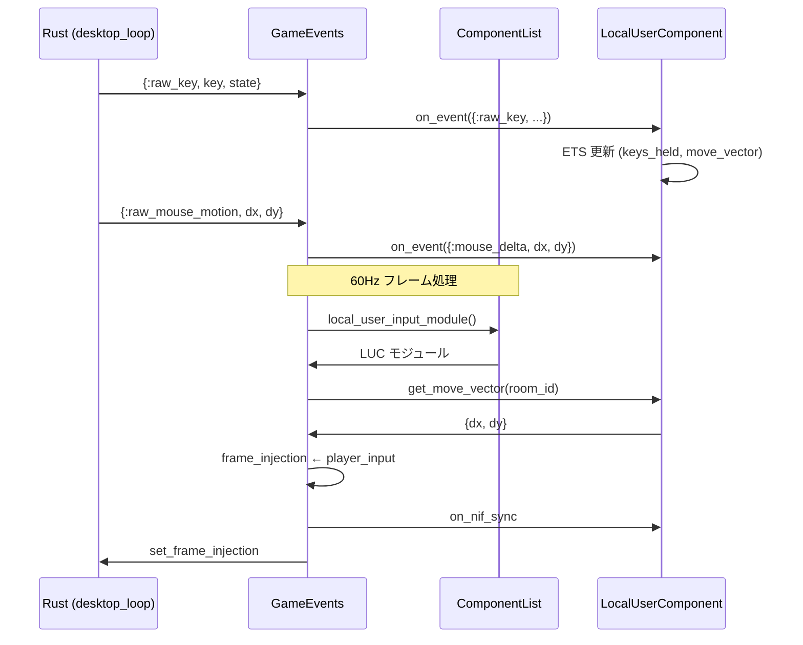

# LocalUserComponent 設計

## 概要

キーボード・マウスの入力は**ローカルユーザー**（このマシンで操作している人）固有のものである。コンテンツ内に複数ユーザーがいる場合（ローカル1人 + リモート多人など）、区別が必要になる。

本設計では、各コンテンツが **LocalUserComponent** を持ち、そこでローカルユーザーの入力を管理し、コンテンツ内で利用することを方針とする。

---

## 背景・課題

### 現状（実装済み）

- **全コンテンツ**が LocalUserComponent 経由でキーボード・マウス入力を取得する
- **GameEvents** は raw_key / focus_lost をコンポーネントに dispatch し、`Contents.ComponentList.local_user_input_module().get_move_vector(room_id)` で player_input を取得して frame_injection に投入
- **Contents.ComponentList** がコンポーネントリストを解決し、local_user_input_module 未実装のコンテンツには `Contents.LocalUserComponent` を自動注入
- **Core.InputHandler** は廃止済み（Application の子プロセスから削除）

### 方針

- ローカルユーザーの入力を**コンテンツ内**で管理する
- 各コンテンツが LocalUserComponent を持ち（自前またはデフォルト）、そこからキーボード・マウス情報をコンテンツ内で利用する
- 将来の複数ユーザー対応（ローカル vs リモート）を見据えた設計とする

---

## 用語定義

| 用語 | 説明 |
|:-----|:-----|
| **ローカルユーザー** | このマシン（ウィンドウ）で直接操作しているユーザー。キーボード・マウスはローカルユーザー固有 |
| **リモートユーザー** | ネットワーク経由で参加しているユーザー。入力はネットワークから届く |
| **LocalUserComponent** | ローカルユーザーの入力をコンテンツ内で管理するコンポーネント |

---

## アーキテクチャ

### 責務の所在

```
Rust (desktop_loop)
  ↓ raw_key / raw_mouse_motion / focus_lost
GameEvents
  ↓ dispatch on_event（Contents.ComponentList.components() の全コンポーネントへ）
LocalUserComponent（コンテンツのコンポーネント、自前 or Contents.LocalUserComponent）
  ↓ キー→意味のマッピング（コンテンツ仕様）
  ↓ 状態保持（move_vector, sprint, keys_held） room_id 単位で ETS
  ↓ get_move_vector(room_id) で GameEvents に返す
GameEvents（maybe_set_input_and_broadcast）
  ↓ frame_injection ← player_input
  ↓ dispatch on_nif_sync
GameWorld (Rust)
```

### 設計原則（implementation.mdc との整合）

- **Elixir = SSoT**: キー→意味のマッピングは Elixir 側（コンテンツ）が持つ
- **Rust = 演算層**: 生イベント取得・転送のみ。意味解釈はしない
- **保証の分離**: 入力の「誰の入力か」はコンテンツが管理する。エンジンはディスパッチのみ

---

## LocalUserComponent の責務

| 責務 | 説明 |
|:-----|:-----|
| 生入力の受信 | `on_event({:raw_key, key, state}, context)` 等で GameEvents から受け取る |
| 意味マッピング | キー→move_vector, sprint, key_pressed 等への変換（コンテンツ仕様で実装） |
| 状態保持 | room_id 単位で ETS に保持。`on_ready` で `:local_user_input` テーブル作成 |
| player_input 提供 | `get_move_vector(room_id)` で GameEvents に返す。GameEvents が frame_injection に投入 |
| 意味論的イベントの dispatch | move_input, sprint, key_pressed を event_handler に send して他コンポーネントへ配信 |

---

## データフロー



---

## Contents.ComponentList

コンポーネントリストと LocalUserComponent モジュールの解決を担う。

- **components()**: content.components() に LocalUserComponent が含まれていなければ先頭に注入
- **local_user_input_module(content)**: content が `local_user_input_module/0` を未実装なら `Contents.LocalUserComponent`、実装ならその戻り値（nil のときもデフォルト使用）

GameEvents は `Core.Config.components()` ではなく `Contents.ComponentList.components()` を参照する。

---

## ContentBehaviour の拡張

### オプショナルコールバック

```elixir
@doc """
ローカルユーザー入力を提供するモジュールを返す。

- 未実装: Contents.ComponentList が Contents.LocalUserComponent を使用
- 実装時: 返した module の get_move_vector/1 を呼んで player_input を取得。
  nil を返した場合もデフォルト（Contents.LocalUserComponent）を使用
"""
@callback local_user_input_module() :: module() | nil
```

- **未実装**: `Contents.LocalUserComponent`（デフォルト）
- **実装時**: 例として `Content.VampireSurvivor` は `Content.VampireSurvivor.LocalUserComponent` を返す

---

## InputHandler（廃止済み）

- **Core.InputHandler** は Application の子プロセスから削除済み
- raw_key / focus_lost は常に GameEvents がコンポーネントに dispatch
- 全コンテンツが LocalUserComponent 経由で入力を取得する

---

## ETS テーブル設計

LocalUserComponent は room_id 単位で入力を保持する。

```
テーブル名: :local_user_input  （LocalUserComponent が on_ready で作成）

キー: {room_id, :move}     → 値: {dx, dy}
キー: {room_id, :sprint}   → 値: boolean()
キー: {room_id, :keys_held} → 値: MapSet.t()
```

- `on_ready` でテーブルが存在しなければ作成。複数ルーム時は同一テーブルを共有
- 現状は 1 room あたり 1 ローカルユーザーの想定
- 将来の split-screen 等では `{room_id, user_id}` に拡張可能

---

## キーマッピングの拡張性

LocalUserComponent はコンテンツごとにキーマッピングを持てる。

### デフォルト: Contents.LocalUserComponent

local_user_input_module 未実装のコンテンツが使用。WASD / 矢印 / Shift / Escape の標準マッピング。

### 例: Content.VampireSurvivor.LocalUserComponent

VampireSurvivor 専用。現状はデフォルトと同じマッピング。将来的にコンテンツ固有のカスタマイズが可能。

### 例: 将来のコンテンツ

- ジャンプキー、攻撃キーなどコンテンツ固有のマッピング
- ContentBehaviour に `key_mapping/0` を追加し、LocalUserComponent がそれを参照する形も可能

---

## 複数ユーザーへの拡張（将来）

| ユーザー種別 | 入力ソース | 管理主体 |
|:-------------|:-----------|:---------|
| ローカル | Rust (desktop_loop) | LocalUserComponent |
| リモート | Network.Channel / UDP | 各ルームの GameEvents |

- ローカルユーザーの入力は LocalUserComponent が room_id と紐付けて保持
- リモートユーザーの入力はネットワークイベントとして別経路で届き、コンテンツが適宜処理する
- 現設計で「ローカル」が明示的に分離されるため、リモートとの区別がしやすくなる

---

## 参照

- [implementation.mdc](../.cursor/rules/implementation.mdc) — レイヤー責務・定義 vs 実行
- [contents-defines-rust-executes.md](contents-defines-rust-executes.md) — Elixir = 定義、Rust = 実行
- [game-world-inner-flow.md](game-world-inner-flow.md) — frame_injection フロー
