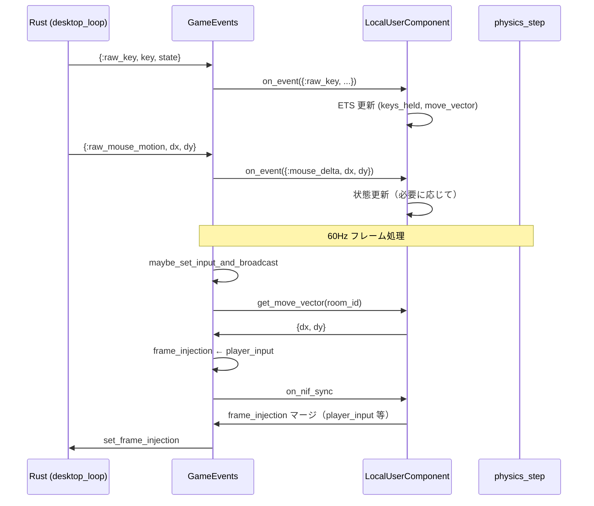

# LocalUserComponent 設計

## 概要

キーボード・マウスの入力は**ローカルユーザー**（このマシンで操作している人）固有のものである。コンテンツ内に複数ユーザーがいる場合（ローカル1人 + リモート多人など）、区別が必要になる。

本設計では、各コンテンツが **LocalUserComponent** を持ち、そこでローカルユーザーの入力を管理し、コンテンツ内で利用することを方針とする。

---

## 背景・課題

### 現状

- **Core.InputHandler** がグローバルに生キー入力（raw_key）を受信し、意味論的イベント（move_input, sprint, key_pressed）に変換して GameEvents に送信している
- **GameEvents** は `InputHandler.get_move_vector()` を直接呼び、`frame_injection` の `player_input` に渡している
- 入力の意味マッピング（WASD → 移動など）は Core 層にハードコードされており、コンテンツごとのカスタマイズが難しい
- 「ローカルユーザー」という概念が明示されておらず、複数ユーザー対応時に区別しづらい

### 方針

- ローカルユーザーの入力を**コンテンツ内**で管理する
- 各コンテンツが LocalUserComponent を持ち、そこからキーボード・マウス情報をコンテンツ内で利用する
- 将来の複数ユーザー対応（ローカル vs リモート）を見据えた設計とする

---

## 用語定義

| 用語 | 説明 |
|:-----|:-----|
| **ローカルユーザー** | このマシン（ウィンドウ）で直接操作しているユーザー。キーボード・マウスはローカルユーザー固有 |
| **リモートユーザー** | ネットワーク経由で参加しているユーザー。入力はネットワークから届く |
| **LocalUserComponent** | ローカルユーザーの入力をコンテンツ内で管理するコンポーネント |

---

## アーキテクチャ

### 責務の所在

```
Rust (desktop_loop)
  ↓ raw_key / raw_mouse_motion / focus_lost
GameEvents
  ↓ dispatch on_event
LocalUserComponent（コンテンツのコンポーネント）
  ↓ キー→意味のマッピング（コンテンツ仕様）
  ↓ 状態保持（move_vector, mouse_delta, sprint, keys_held）
  ↓ on_nif_sync で frame_injection に player_input をマージ
GameWorld (Rust)
```

### 設計原則（implementation.mdc との整合）

- **Elixir = SSoT**: キー→意味のマッピングは Elixir 側（コンテンツ）が持つ
- **Rust = 演算層**: 生イベント取得・転送のみ。意味解釈はしない
- **保証の分離**: 入力の「誰の入力か」はコンテンツが管理する。エンジンはディスパッチのみ

---

## LocalUserComponent の責務

| 責務 | 説明 |
|:-----|:-----|
| 生入力の受信 | `on_event({:raw_key, key, state}, context)` 等で GameEvents から受け取る |
| 意味マッピング | キー→move_vector, sprint, key_pressed 等への変換（コンテンツ仕様で実装） |
| 状態保持 | room_id 単位で ETS 等に保持。フレーム処理時に参照される |
| frame_injection 提供 | `on_nif_sync` で `player_input` を frame_injection にマージ |
| 意味論的イベントの dispatch | move_input, sprint, key_pressed を必要に応じて GameEvents 経由で他コンポーネントに配信 |

---

## データフロー



---

## ContentBehaviour の拡張

### オプショナルコールバック

```elixir
@doc """
ローカルユーザー入力を提供するモジュールを返す。

- `nil`: Core.InputHandler を従来通り使用（後方互換）
- `module`: 指定モジュールの `get_move_vector/1` を呼んで player_input を取得
"""
@callback local_user_input_module() :: module() | nil
```

- デフォルト: `nil`（InputHandler 使用）
- LocalUserComponent 導入時: コンテンツが `local_user_input_module/0` で `Content.VampireSurvivor.LocalUserComponent` を返す

---

## InputHandler の役割変更

### 移行フェーズ

| フェーズ | InputHandler | LocalUserComponent |
|:---------|:-------------|:-------------------|
| 移行前 | raw_key 受信、意味マッピング、ETS 更新、move_input 送信 | なし |
| 移行後（コンテンツが LocalUser 使用） | raw_key は GameEvents がコンポーネントに dispatch。InputHandler は呼ばない | 全責務を担う |
| 移行後（従来コンテンツ） | 従来通り | なし |

### 長期方針

- LocalUserComponent を採用したコンテンツが主になれば、InputHandler は廃止または「生入力のログ・デバッグ用」に縮小する
- 移行期間中は両立可能な形で実装する

---

## ETS テーブル設計

LocalUserComponent は room_id 単位で入力を保持する。

```
テーブル名: :local_user_input  （LocalUserComponent が init で作成）

キー: {room_id, :move}     → 値: {dx, dy}
キー: {room_id, :sprint}   → 値: boolean()
キー: {room_id, :keys_held} → 値: MapSet.t()  （オプション。キーマッピングに必要なら）
```

- 現状は 1 room あたり 1 ローカルユーザーの想定
- 将来の split-screen 等では `{room_id, user_id}` に拡張可能

---

## キーマッピングの拡張性

LocalUserComponent はコンテンツごとにキーマッピングを持てる。

### 例: VampireSurvivor

```elixir
# WASD / 矢印 → move
# Shift → sprint
# Escape → key_pressed
```

### 例: 将来のコンテンツ

- ジャンプキー、攻撃キーなどコンテンツ固有のマッピング
- ContentBehaviour に `key_mapping/0` を追加し、LocalUserComponent がそれを参照する形も可能

---

## 複数ユーザーへの拡張（将来）

| ユーザー種別 | 入力ソース | 管理主体 |
|:-------------|:-----------|:---------|
| ローカル | Rust (desktop_loop) | LocalUserComponent |
| リモート | Network.Channel / UDP | 各ルームの GameEvents |

- ローカルユーザーの入力は LocalUserComponent が room_id と紐付けて保持
- リモートユーザーの入力はネットワークイベントとして別経路で届き、コンテンツが適宜処理する
- 現設計で「ローカル」が明示的に分離されるため、リモートとの区別がしやすくなる

---

## 参照

- [implementation.mdc](../.cursor/rules/implementation.mdc) — レイヤー責務・定義 vs 実行
- [contents-defines-rust-executes.md](contents-defines-rust-executes.md) — Elixir = 定義、Rust = 実行
- [game-world-inner-flow.md](game-world-inner-flow.md) — frame_injection フロー
