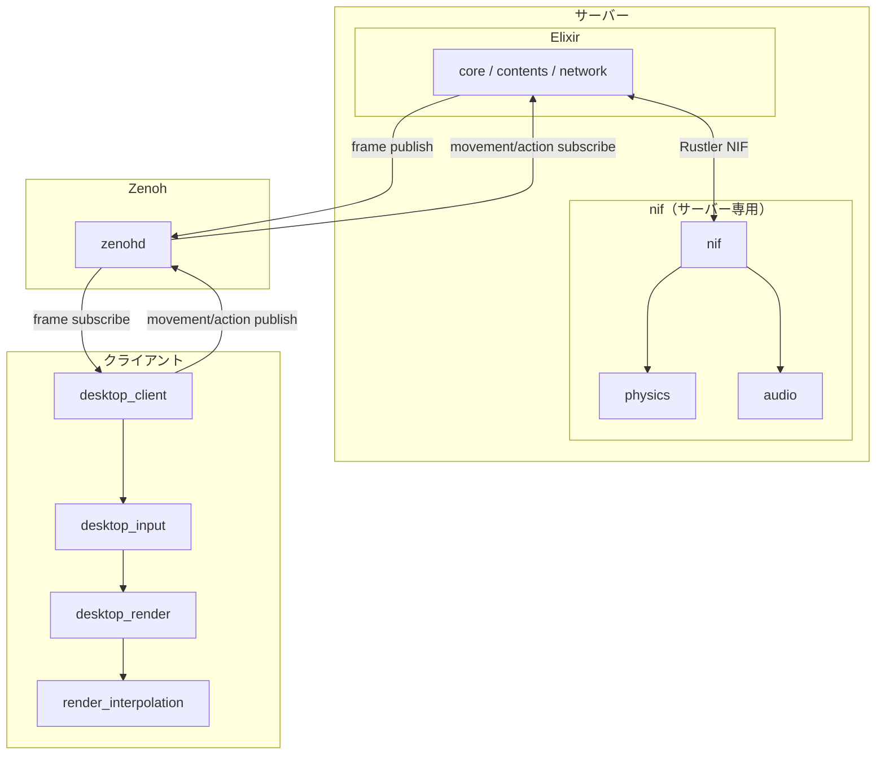

# NIF と desktop の分離 — Zenoh 専用化計画

> 作成日: 2026-03-08  
> 目的: NIF から desktop_render・desktop_input の依存を削除し、サーバー・クライアントを完全に Zenoh 経由で分離する。

---

## 1. 目標

### 1.1 現状の課題

| 観点 | 現状 | 課題 |
|:---|:---|:---|
| **NIF の依存** | nif が desktop_render, desktop_input に依存 | サーバー側クレートがクライアント側に依存しており、責務が混在 |
| **ローカルモード** | `start_render_thread` でサーバー内にレンダースレッドを起動 | 同一プロセスでクライアント相当の処理が動き、分離の障壁 |
| **通信経路** | ローカル: NIF（RenderFrameBuffer） / リモート: Zenoh | 二重経路の維持コスト |

### 1.2 目標アーキテクチャ



- **サーバー（nif）**: physics, audio のみに依存。desktop_render, desktop_input への依存なし。
- **クライアント**: desktop_client が Zenoh 経由で frame 受信・入力送信。desktop_render, desktop_input, render_interpolation はクライアント専用。補間は `render_interpolation` でクライアント側に集約。
- **通信**: すべて Zenoh。ローカル開発時も `zenohd + mix run + desktop_client` の 3 プロセス構成。

---

## 2. 削除・変更対象

### 2.1 nif クレートから削除

| 対象 | 説明 |
|:---|:---|
| `desktop_input` 依存 | Cargo.toml から削除 |
| `desktop_render` 依存 | Cargo.toml から削除 |
| `render_bridge.rs` | NativeRenderBridge 実装。`run_desktop_loop` 呼び出し |
| `render_nif.rs` | `start_render_thread` NIF |
| `render_frame_buffer.rs` | RenderFrameBuffer。ローカル描画用バッファ |
| `push_render_frame` / `push_render_frame_binary` | RenderFrameBuffer への書き込み NIF |

### 2.2 型・デコードの扱い

- **RenderFrame, DrawCommand, CameraParams, UiCanvas**: 現状 `desktop_render` で定義。サーバー側では `push_render_frame` 経由で NIF がデコードして RenderFrameBuffer に格納していた。
- **Zenoh 専用化後**: サーバーは `push_render_frame` を呼ばない。Elixir が `MessagePackEncoder.encode_frame` でバイナリ化し、`FrameBroadcaster.put` → `ZenohBridge.publish_frame` で Zenoh に直接 publish する。
- よって **nif から RenderFrame 関連のデコードは不要**（既に Elixir 側でエンコード済み。クライアントの msgpack_decode がデコードする）。

### 2.3 Elixir 側の変更

| 対象 | 変更内容 |
|:---|:---|
| `Core.NifBridge` | `start_render_thread/5`, `create_render_frame_buffer/0`, `push_render_frame_binary/3` を削除またはスタブ化 |
| `Core.NifBridgeBehaviour` | 上記コールバックを削除 |
| `Contents.GameEvents` | `start_render_thread` 呼び出しを削除。ルーム起動時にレンダースレッドを起動しない |
| `Contents.*.RenderComponent` | `push_render_frame_binary` 呼び出しを削除。`FrameBroadcaster.put` のみ残す |
| `config :network, :zenoh_enabled` | デフォルトを `true` に。Zenoh を常時有効化 |

---

## 3. フェーズ別手順

### フェーズ 1: Elixir 側の Zenoh 常時有効化（1 週間）

- [ ] `config :network, :zenoh_enabled` を `true` に変更
- [ ] RenderComponent から `push_render_frame_binary` 呼び出しを削除（`FrameBroadcaster.put` のみにする）
- [ ] `start_render_thread` の呼び出しを条件分岐でスキップするオプションを追加（`config :core, :local_render, false` 等）
- [ ] 動作確認: `zenohd + mix run + desktop_client` でゲームがプレイ可能であること

### フェーズ 2: nif から render 関連を削除（1〜2 週間）

- [ ] `render_nif.rs` の `start_render_thread` を削除
- [ ] `render_bridge.rs` を削除
- [ ] `render_frame_buffer.rs` を削除
- [ ] `push_render_frame`, `push_render_frame_binary` を削除
- [ ] `create_render_frame_buffer` を削除
- [ ] nif の `Cargo.toml` から `desktop_input`, `desktop_render` 依存を削除
- [ ] `decode/` の DrawCommand 等デコードは、他 NIF で使用していなければ削除。使用していれば `frame_schema` 等の共有クレートに移す
- [ ] ビルド・テスト通過

### フェーズ 3: Elixir 側の NIF 呼び出し削除（1 週間）

- [ ] `Core.NifBridge` から `start_render_thread`, `create_render_frame_buffer`, `push_render_frame_binary` を削除
- [ ] `GameEvents` のルーム起動フローから `create_render_frame_buffer`, `start_render_thread` を削除
- [ ] `world_ref` に紐づく `render_buf_ref` を廃止
- [ ] 各コンテンツの `content_behaviour` 等で `render_buf_ref` を要求している場合は削除

### フェーズ 4: ドキュメント・launcher 更新（数日）

- [ ] `docs/architecture/overview.md` からローカルモードの記述を削除
- [ ] `docs/architecture/rust/nif.md` を更新（render 依存削除後の構成）
- [ ] launcher のデフォルト起動順序を「zenohd → Phoenix → desktop_client」に統一
- [ ] `mix run` 単体ではウィンドウが開かないことを README 等に明記

### フェーズ 5: render_interpolation（3D 補間のクライアント移行）

- [ ] 5a: `render_interpolation` クレート新規作成。3D 位置・姿勢の線形補間 API
- [ ] 5b: フレームペイロードに `player_interp` を追加。Elixir 側でサーバーフレームに含める
- [ ] 5c: `NetworkRenderBridge` または `desktop_render` で `render_interpolation` を呼び出し
- [ ] 5d: physics / nif から補間用フィールドと render_bridge の補間ロジックを削除（フェーズ 2 と統合可）

---

## 4. 依存関係の変化

### 4.1 変更前（nif）

```
nif
├── physics
├── audio
├── desktop_input  ← 削除
└── desktop_render ← 削除
```

### 4.2 変更後（nif）

```
nif
├── physics
└── audio
```

### 4.3 クライアント（変更後）

```
desktop_client
├── desktop_input
├── desktop_render
│   └── render_interpolation  ← 新規
├── physics
└── audio
```

---

## 5. render_interpolation クレート

### 5.1 方針

- **2D 補間**: 廃止（分散型 VRSNS は基本 3D のため不要）
- **3D 補間**: クライアント側で実装。現状 nif/physics にある補間ロジックを `render_interpolation` に移す
- **クレート名**: `render_interpolation`（依存が深くなりすぎないよう `desktop_` を付けない）

### 5.2 現状の補間ロジックの所在

| 所在 | 内容 |
|:---|:---|
| `physics/world/game_world.rs` | `prev_player_x`, `prev_player_y`, `prev_tick_ms`, `curr_tick_ms` |
| `nif/push_tick_nif.rs` | physics_step 前に `prev_player_x/y` を更新 |
| `nif/render_bridge.rs` | `InterpolationData`, `calc_interpolation_alpha`, `interpolate_player_pos`。GameWorld の read lock で取得し、PlayerSprite 座標を補間 |

### 5.3 移行先

| 対象 | 移行先 |
|:---|:---|
| 補間アルゴリズム（alpha 計算・線形補間） | `render_interpolation` |
| 補間用データ（prev/curr pose, tick） | フレームの Zenoh ペイロードに含める。サーバーが生成して publish |
| 補間の適用 | `desktop_render` または `NetworkRenderBridge` が `render_interpolation` を呼び出し |

### 5.4 プロトコル拡張（3D 用）

フレームに補間用データを追加:

| 項目 | 形式 | 説明 |
|:---|:---|:---|
| `player_interp` | optional | 自プレイヤー補間用 |
| `player_interp.prev` | `[x, y, z]` | 前フレーム位置 |
| `player_interp.curr` | `[x, y, z]` | 現在フレーム位置 |
| `player_interp.prev_orientation` | `[x, y, z, w]` | 前フレーム姿勢（クォータニオン） |
| `player_interp.curr_orientation` | `[x, y, z, w]` | 現在フレーム姿勢 |
| `player_interp.prev_tick_ms` | u64 | 前フレーム時刻 |
| `player_interp.curr_tick_ms` | u64 | 現在フレーム時刻 |

他アバター用の `avatars_interp` 配列も将来拡張可能。

### 5.5 render_interpolation の依存関係

```
render_interpolation
└── （標準ライブラリのみ、または log 程度）
```

`desktop_render` が依存。`physics` や `desktop_render` の型に依存しない純粋な補間ロジックとする。

### 5.6 実装フェーズ（render_interpolation）

| フェーズ | 内容 | 工数目安 |
|:---|:---|:---|
| 5a | `render_interpolation` クレート新規作成。3D 位置・姿勢の線形補間 API | 2〜3 日 |
| 5b | フレームペイロードに `player_interp` を追加。Elixir 側でサーバーフレームに含める | 1 週間 |
| 5c | `NetworkRenderBridge` または `desktop_render` で `render_interpolation` を呼び出し、補間後の座標で描画 | 1 週間 |
| 5d | physics / nif から補間用フィールド（prev_player_x/y 等）と render_bridge の補間ロジックを削除 | フェーズ 2 と統合 |

---

## 6. 開発フロー

### 6.1 変更前

- **ローカル**: `mix run` のみでウィンドウが開き、単一プロセスで完結
- **リモート**: `zenohd + mix run + desktop_client`

### 6.2 変更後

- **常に 3 プロセス**: `zenohd` + `mix run`（サーバー） + `desktop_client`（クライアント）
- launcher の「Client Run」で一括起動
- 単体テスト・CI では `mix run` をヘッドレスで実行（描画なし）

---

## 7. リスク・対策

| リスク | 対策 |
|:---|:---|
| 開発時の起動が煩雑 | launcher で 3 プロセスを一括起動。`mix run` 単体は従来どおり可能（ウィンドウなし） |
| 既存の「ローカル単体」運用 | ドキュメントで新しい手順を明記。launcher を標準とする |
| プレイヤー補間 | 2D 補間は廃止。3D 補間は `render_interpolation` クレートでクライアント側に実装。フレームに prev/curr pose を含め、クライアントで補間適用 |
| VR（desktop_input_openxr） | nif の `xr` フィーチャーは `desktop_input_openxr` に依存。VR 入力は将来的にクライアント側で扱うか、別設計とする。本計画では `xr` フィーチャーの扱いを別途検討 |

---

## 8. 関連ドキュメント

- [client-server-separation-procedure.md](./client-server-separation-procedure.md) — クライアント・サーバー分離の既存手順書
- [zenoh-protocol-spec.md](../architecture/zenoh-protocol-spec.md)
- [アーキテクチャ概要](../architecture/overview.md)
- [rust/nif](../architecture/rust/nif.md)
