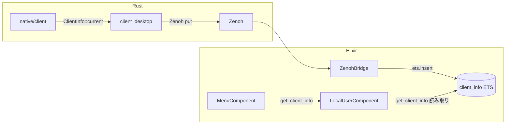

# 実行手順書: client_info 作成〜メニュー表示までの一貫フロー

> 作成日: 2026-03-09  
> 目的: クライアント情報（OS, arch 等）を `native/client` の `info` モジュールで取得し、Zenoh 経由（Erlang term 形式）で Elixir と通信、LocalUserComponent で取得、MenuComponent で全ワールドのメニューに表示する。

---

## 1. 概要


| 項目         | 内容                                                                          |
| ---------- | --------------------------------------------------------------------------- |
| **配置**      | `native/client` クレート内の `info` モジュール（`native/client/src/info.rs`）（[env-and-serialization-migration-plan](./env-and-serialization-migration-plan.md) §5 参照） |
| **通信方式**   | Zenoh + Erlang term 形式（`:erlang.term_to_binary` / `:erlang.binary_to_term`） |
| **トピック**   | `contents/room/{room_id}/client/info`（クライアント → サーバー）                    |
| **取得先**    | `Contents.LocalUserComponent.get_client_info/1`                                |
| **表示先**    | `Contents.MenuComponent.get_menu_ui/2` 内で OS を表示                            |
| **対応 OS**  | Windows, Linux, macOS, Android, iOS ほか `std::env::consts::OS` が返す全環境  |


---

## 2. 全体データフロー




---

## 3. フェーズ 1: native/client 内に info モジュール作成 ✅ 完了

※ `native/client` の作成は [env-and-serialization-migration-plan](./env-and-serialization-migration-plan.md) §5 に従う。

- **実施日**: 2026-03-09

### 3.1 info モジュール作成

`native/client/src/info.rs` を追加:

```rust
//! クライアント情報（OS, arch, family）取得。
//! std::env::consts のみ使用。winit 非依存。
//!
//! Windows, Linux, macOS, Android, iOS ほか、std が対応する全環境で動作。

use serde::Serialize;

#[derive(Debug, Clone, Serialize)]
pub struct ClientInfo {
    /// OS 名。例: "windows", "linux", "macos", "android", "ios"
    pub os: &'static str,
    /// アーキテクチャ。例: "x86_64", "aarch64", "arm"
    pub arch: &'static str,
    /// ファミリ。例: "windows", "unix"
    pub family: &'static str,
}

impl ClientInfo {
    /// 現在のクライアント情報を返す。
    pub fn current() -> Self {
        Self {
            os: std::env::consts::OS,
            arch: std::env::consts::ARCH,
            family: std::env::consts::FAMILY,
        }
    }
}
```

### 3.2 lib.rs でモジュール公開

`native/client/src/lib.rs` に追加:

```rust
pub mod info;
```

### 3.3 動作確認

```bash
cd native
cargo build -p client
```

---

## 4. フェーズ 2: client_desktop から Zenoh で info 送信 ✅ 完了

- **実施日**: 2026-03-09

### 4.1 依存関係追加

`native/client_desktop/Cargo.toml` に追加:

```toml
client = { path = "../client" }
```

※ `native/client` は [env-and-serialization-migration-plan](./env-and-serialization-migration-plan.md) §5 に従い作成。`client_desktop` は `client` に依存する。

Erlang term 形式で送るため、env-and-serialization-migration-plan に従い `bert` クレートを使用。未移行の場合は MessagePack で暫定対応可。

### 4.2 トピック定義


| トピック                                      | 方向            | 内容                                       |
| ----------------------------------------- | ------------- | ---------------------------------------- |
| `contents/room/{room_id}/client/info` | クライアント → サーバー | `ClientInfo` を Erlang term 形式で publish |


### 4.3 NetworkRenderBridge の拡張

`network_render_bridge.rs` に以下を追加:

- `fn client_info_key(room_id: &str) -> String` → `format!("contents/room/{room_id}/client/info")`
- `NetworkRenderBridge::new` 内で、Zenoh セッション確立後に `publish_client_info(room_id)` を呼ぶ

```rust
fn publish_client_info(&self, room_id: &str) {
    let info = client::info::ClientInfo::current();
    // Erlang term 形式: bert::encode または term_to_binary 相当
    // 暫定: rmp_serde::to_vec(&info) で MessagePack
    // 本番: bert で %{os: "...", arch: "...", family: "..."} 相当を encode
    let payload = /* ... */;
    let _ = self.session.declare_publisher(&client_info_key(room_id)).wait()
        .and_then(|p| p.put(payload).wait());
}
```

※ env-and-serialization-migration-plan の Erlang term 移行が完了していない場合は、`rmp_serde::to_vec` で MessagePack を暫定使用し、ZenohBridge 側は `Msgpax.unpack` で受信。移行後は `bert` で encode、ZenohBridge は `:erlang.binary_to_term` で decode。

### 4.4 main.rs での呼び出し

`NetworkRenderBridge::new` の直後に、`bridge.publish_client_info(&room_id)` を呼ぶ。または `NetworkRenderBridge::new` 内で自動 publish する。

---

## 5. フェーズ 3: ZenohBridge で info 受信・保存 ✅ 完了

- **実施日**: 2026-03-09

### 5.1 トピック購読追加

`apps/network/lib/network/zenoh_bridge.ex`:

- `@client_info_selector "contents/room/*/client/info"` を追加
- `init` 内で `Zenohex.Session.declare_subscriber(session_id, @client_info_selector, self())` を追加

### 5.2 handle_info で client_info を処理

`handle_info` の分岐に `{:client_info, room_id}` を追加し、`handle_client_info(room_id, payload)` を呼ぶ。

`parse_input_key` を拡張（既存の `game/room` 分岐に加えて）:

```elixir
case parts do
  ["contents", "room", room_id, "client", "info"] -> {:client_info, room_id}
  ["game", "room", room_id | _rest] -> ...  # 既存
  _ -> :unknown
end
```

※ フレーム／入力は現状 `game/room`。クライアント info は新規トピック `contents/room` を使用。既存トピックの移行は別タスク。

### 5.3 info の保存

Network は Contents に依存しないため、**共有 ETS テーブル** `:client_info` を使用する。

- ZenohBridge の `init` で `:client_info` を自動作成（未作成時のみ）
- 受信した payload をデコードし、`:ets.insert(:client_info, {{room_id, :info}, info})` で保存

デコード:

- **Erlang term 時**: `:erlang.binary_to_term(payload)`
- **MessagePack 暫定時**: `Msgpax.unpack(payload)` → `%{"os" => os, "arch" => arch, "family" => family}`

```elixir
# init 内でテーブル確保
def ensure_client_info_table do
  if :ets.whereis(:client_info) == :undefined do
    :ets.new(:client_info, [:named_table, :public, :set, read_concurrency: true])
  end
end

defp handle_client_info(room_id, payload) do
  room_key = if room_id == "main", do: :main, else: room_id

  case decode_client_info(payload) do
    {:ok, info} when is_map(info) ->
      :ets.insert(:client_info, {{room_key, :info}, normalize_client_info(info)})

    _ ->
      Logger.debug("[ZenohBridge] Invalid client info payload room=#{room_id}")
  end
end

defp normalize_client_info(%{os: o, arch: a, family: f}), do: %{os: to_string(o), arch: to_string(a), family: to_string(f)}
defp normalize_client_info(%{"os" => o, "arch" => a, "family" => f}) when is_binary(o), do: %{os: o, arch: to_string(a), family: to_string(f)}
```

---

## 6. フェーズ 4: LocalUserComponent の拡張 ✅ 完了

- **実施日**: 2026-03-09

クライアント情報は ZenohBridge が `:client_info` ETS に直接書き込む。LocalUserComponent は読み取り専用の `get_client_info/1` を提供する。

### 6.1 get_client_info/1 の追加

`apps/contents/lib/contents/local_user_component.ex`:

```elixir
@doc """
room_id に対応するクライアント情報を返す。
ZenohBridge が contents/room/{id}/client/info を受信すると :client_info ETS に格納される。
未受信時は nil。%{os: "windows", arch: "x86_64", family: "windows"} 等。
"""
def get_client_info(room_id) do
  if :ets.whereis(:client_info) == :undefined do
    nil
  else
    case :ets.lookup(:client_info, {room_id, :info}) do
      [{{^room_id, :info}, info}] -> info
      [] -> nil
    end
  end
end
```

---

## 7. フェーズ 5: MenuComponent で OS 表示 ✅ 完了

- **実施日**: 2026-03-09

### 7.1 get_menu_ui の更新

`apps/contents/lib/contents/menu_component.ex` の `get_menu_ui/2` 内で、`Contents.LocalUserComponent.get_client_info(room_id)` を呼び、テキスト行を追加する。

```elixir
def get_menu_ui(room_id, context) do
  room_id = room_id || :main
  # ... 既存の fps_text, input 等 ...

  info_str =
    case Contents.LocalUserComponent.get_client_info(room_id) do
      nil -> "OS: —"
      %{os: os, arch: arch} -> "OS: #{os} / #{arch}"
      %{"os" => os, "arch" => arch} -> "OS: #{os} / #{arch}"  # MessagePack 暫定
    end

  [
    {:node, {:center, ...}, {:rect, ...},
     [
       # ... 既存の Menu, FPS, separator ...
       {:node, {:top_left, {0.0, 0.0}, :wrap},
        {:text, info_str, @color_value, 14.0, false}, []},
       # ... 既存の keyboard, mouse, separator, Quit ...
     ]}
  ]
end
```

### 7.2 表示例

- 未受信: `OS: —`
- Windows x64: `OS: windows / x86_64`
- macOS Apple Silicon: `OS: macos / aarch64`
- Android: `OS: android / aarch64`
- iOS: `OS: ios / aarch64`

---

## 8. フェーズ 6: NIF モード対応（オプション）

NIF モード（Elixir と同一プロセス、Zenoh 未使用）の場合、client_desktop は起動しない。クライアント情報取得は NIF から行い、同様に `:client_info` に格納する。

### 8.1 NIF で client_info を利用

- `native/nif` の `Cargo.toml` に `client = { path = "../client" }` を追加（未追加の場合）
- 専用 NIF 関数 `get_client_info/0` で `client::info::ClientInfo::current()` を返す（Erlang term 形式でエンコード）

### 8.2 Elixir 側での取得・保存

- 起動時（例: 最初のワールド読み込み時や Application 起動時）に NIF を呼び `get_client_info_nif()` で取得
- `:client_info` テーブルが存在することを保証（ZenohBridge の init で作成、NIF モード時は起動タスク等で作成）し、`:ets.insert(:client_info, {{:main, :info}, info})` で保存

---

## 9. 実行順序サマリ


| 順序  | フェーズ               | 内容                                                                              | 状態 |
| --- | ------------------ | ------------------------------------------------------------------------------- | --- |
| 1   | native/client 作成     | `client` クレート作成、`info` モジュール（`src/info.rs`）追加（[env-and-serialization-migration-plan](./env-and-serialization-migration-plan.md) §5 参照） | ✅ 完了 |
| 2   | client_desktop     | `client` 依存追加、`publish_client_info` 実装、起動時に publish                                              | ✅ 完了 |
| 3   | ZenohBridge        | `contents/room/*/client/info` 購読、`handle_client_info` で `:client_info` ETS に保存 | ✅ 完了 |
| 4   | LocalUserComponent | `get_client_info/1` 追加（`:client_info` から読み取り）                                  | ✅ 完了 |
| 5   | MenuComponent      | `get_menu_ui` に OS 表示行を追加                                                       | ✅ 完了 |
| 6   | （任意）NIF モード        | NIF から `client::info::ClientInfo` を取得し、`:client_info` に保存するパスを追加        | 未実施 |


---

## 10. 関連ドキュメント

- [env-and-serialization-migration-plan](./env-and-serialization-migration-plan.md) — native/client 作成・client_info・client_* 依存整理（§5）
- [zenoh-frame-serialization](../policy-as-code/why_adopted/zenoh-frame-serialization.md) — Erlang term 形式採用
- [zenoh-protocol-spec](../architecture/zenoh-protocol-spec.md) — トピック `contents/room` への移行

---

## 11. 対応環境（std::env::consts）


| 定数       | 例（値）                                                      |
| -------- | --------------------------------------------------------- |
| `OS`     | `"windows"`, `"linux"`, `"macos"`, `"android"`, `"ios"` 等 |
| `ARCH`   | `"x86_64"`, `"aarch64"`, `"arm"` 等                        |
| `FAMILY` | `"windows"`, `"unix"`                                     |


Rust を各ターゲットでビルドすれば、対応環境で同様に取得可能。