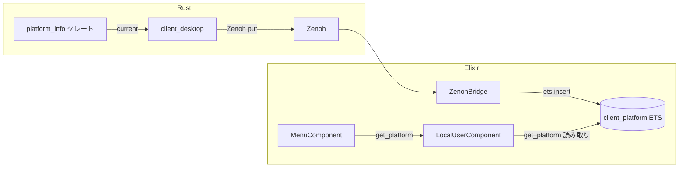

# 実行手順書: platform_info クレート作成〜メニュー表示までの一貫フロー

> 作成日: 2026-03-09  
> 目的: OS 取得用の独立クレートを作成し、Zenoh 経由（Erlang term 形式）で Elixir と通信、LocalUserComponent で取得、MenuComponent で全ワールドのメニューに表示する。

---

## 1. 概要

| 項目 | 内容 |
|:---|:---|
| **新規クレート** | `native/platform_info` — winit 非依存のプラットフォーム情報取得 |
| **通信方式** | Zenoh + Erlang term 形式（`:erlang.term_to_binary` / `:erlang.binary_to_term`） |
| **トピック** | `contents/room/{room_id}/client/platform`（クライアント → サーバー） |
| **取得先** | `Contents.LocalUserComponent.get_platform/1` |
| **表示先** | `Contents.MenuComponent.get_menu_ui/2` 内で OS を表示 |
| **対応 OS** | Windows, Linux, macOS, Android, iOS ほか `std::env::consts::OS` が返す全プラットフォーム |

---

## 2. 全体データフロー



---

## 3. フェーズ 1: platform_info クレート作成

### 3.1 クレート作成

```bash
mkdir native/platform_info
touch native/platform_info/Cargo.toml
mkdir native/platform_info/src
touch native/platform_info/src/lib.rs
```

### 3.2 Cargo.toml

```toml
[package]
name = "platform_info"
version = "0.1.0"
edition = "2021"
description = "プラットフォーム情報（OS, ARCH, FAMILY）取得。winit 非依存。"

[dependencies]
serde = { version = "1", features = ["derive"] }
```

### 3.3 src/lib.rs

```rust
//! プラットフォーム情報取得。std::env::consts のみ使用。winit 非依存。
//!
//! Windows, Linux, macOS, Android, iOS ほか、std が対応する全プラットフォームで動作。

use serde::Serialize;

#[derive(Debug, Clone, Serialize)]
pub struct PlatformInfo {
    /// OS 名。例: "windows", "linux", "macos", "android", "ios"
    pub os: &'static str,
    /// アーキテクチャ。例: "x86_64", "aarch64", "arm"
    pub arch: &'static str,
    /// ファミリ。例: "windows", "unix"
    pub family: &'static str,
}

impl PlatformInfo {
    /// 現在のプラットフォーム情報を返す。
    pub fn current() -> Self {
        Self {
            os: std::env::consts::OS,
            arch: std::env::consts::ARCH,
            family: std::env::consts::FAMILY,
        }
    }
}
```

### 3.4 ワークスペース登録

`native/Cargo.toml` の `members` に追加:

```toml
members = [
    "platform_info",  # 追加
    "physics",
    ...
]
```

### 3.5 動作確認

```bash
cd native
cargo build -p platform_info
cargo test -p platform_info  # 必要ならテスト追加
```

---

## 4. フェーズ 2: client_desktop から Zenoh でプラットフォーム送信

### 4.1 依存関係追加

`native/client_desktop/Cargo.toml` に追加:

```toml
platform_info = { path = "../platform_info" }
```

Erlang term 形式で送るため、既存の env-and-serialization-migration-plan に従い `bert` クレートを使用。未移行の場合は MessagePack で暫定対応可。

```toml
# 既存: rmp-serde
# Erlang term 移行時: bert = "0.1"
```

### 4.2 トピック定義

| トピック | 方向 | 内容 |
|:---|:---|:---|
| `contents/room/{room_id}/client/platform` | クライアント → サーバー | `PlatformInfo` を Erlang term 形式で publish |

### 4.3 NetworkRenderBridge の拡張

`network_render_bridge.rs` に以下を追加:

- `fn platform_key(room_id: &str) -> String` → `format!("contents/room/{room_id}/client/platform")`
- `NetworkRenderBridge::new` 内で、Zenoh セッション確立後に `publish_platform(room_id)` を呼ぶ

```rust
fn publish_platform(&self, room_id: &str) {
    let info = platform_info::PlatformInfo::current();
    // Erlang term 形式: bert::encode または term_to_binary 相当
    // 暫定: rmp_serde::to_vec(&info) で MessagePack
    // 本番: bert で %{os: "...", arch: "...", family: "..."} 相当を encode
    let payload = /* ... */;
    let _ = self.session.declare_publisher(&platform_key(room_id)).wait()
        .and_then(|p| p.put(payload).wait());
}
```

※ env-and-serialization-migration-plan の Erlang term 移行が完了していない場合は、`rmp_serde::to_vec` で MessagePack を暫定使用し、ZenohBridge 側は `Msgpax.unpack` で受信。移行後は `bert` で encode、ZenohBridge は `:erlang.binary_to_term` で decode。

### 4.4 main.rs での呼び出し

`NetworkRenderBridge::new` の直後に、`bridge.publish_platform(&room_id)` を呼ぶ。または `NetworkRenderBridge::new` 内で自動 publish する。

---

## 5. フェーズ 3: ZenohBridge でプラットフォーム受信・保存

### 5.1 トピック購読追加

`apps/network/lib/network/zenoh_bridge.ex`:

- `@platform_selector "contents/room/*/client/platform"` を追加
- `init` 内で `Zenohex.Session.declare_subscriber(session_id, @platform_selector, self())` を追加

### 5.2 handle_info で platform を処理

`handle_info` の分岐に `{:platform, room_id}` を追加し、`handle_platform(room_id, payload)` を呼ぶ。

`parse_input_key` を拡張（既存の `game/room` 分岐に加えて）:

```elixir
case parts do
  ["contents", "room", room_id, "client", "platform"] -> {:platform, room_id}
  ["game", "room", room_id | _rest] -> ...  # 既存
  _ -> :unknown
end
```

※ フレーム／入力は現状 `game/room`。プラットフォームは新規トピック `contents/room` を使用。既存トピックの移行は別タスク。

### 5.3 プラットフォームの保存

Network は Contents に依存しないため、**共有 ETS テーブル** `:client_platform` を使用する。

- ZenohBridge の `init` で `:client_platform` を自動作成（未作成時のみ）
- 受信した payload をデコードし、`:ets.insert(:client_platform, {{room_id, :platform}, info})` で保存

デコード:
- **Erlang term 時**: `:erlang.binary_to_term(payload)`
- **MessagePack 暫定時**: `Msgpax.unpack(payload)` → `%{"os" => os, "arch" => arch, "family" => family}`

```elixir
# init 内でテーブル確保
def ensure_client_platform_table do
  if :ets.whereis(:client_platform) == :undefined do
    :ets.new(:client_platform, [:named_table, :public, :set, read_concurrency: true])
  end
end

defp handle_platform(room_id, payload) do
  room_key = if room_id == "main", do: :main, else: room_id

  case decode_platform(payload) do
    {:ok, info} when is_map(info) ->
      :ets.insert(:client_platform, {{room_key, :platform}, normalize_platform_info(info)})

    _ ->
      Logger.debug("[ZenohBridge] Invalid platform payload room=#{room_id}")
  end
end

defp normalize_platform_info(%{os: o, arch: a, family: f}), do: %{os: to_string(o), arch: to_string(a), family: to_string(f)}
defp normalize_platform_info(%{"os" => o, "arch" => a, "family" => f}) when is_binary(o), do: %{os: o, arch: to_string(a), family: to_string(f)}
```

---

## 6. フェーズ 4: LocalUserComponent の拡張

プラットフォーム情報は ZenohBridge が `:client_platform` ETS に直接書き込む。LocalUserComponent は読み取り専用の `get_platform/1` を提供する。

### 6.1 get_platform/1 の追加

`apps/contents/lib/contents/local_user_component.ex`:

```elixir
@doc """
room_id に対応するプラットフォーム情報を返す。
ZenohBridge が contents/room/{id}/client/platform を受信すると :client_platform ETS に格納される。
未受信時は nil。%{os: "windows", arch: "x86_64", family: "windows"} 等。
"""
def get_platform(room_id) do
  if :ets.whereis(:client_platform) == :undefined do
    nil
  else
    case :ets.lookup(:client_platform, {room_id, :platform}) do
      [{{^room_id, :platform}, info}] -> info
      [] -> nil
    end
  end
end
```

---

## 7. フェーズ 5: MenuComponent で OS 表示

### 7.1 get_menu_ui の更新

`apps/contents/lib/contents/menu_component.ex` の `get_menu_ui/2` 内で、`Contents.LocalUserComponent.get_platform(room_id)` を呼び、テキスト行を追加する。

```elixir
def get_menu_ui(room_id, context) do
  room_id = room_id || :main
  # ... 既存の fps_text, input 等 ...

  platform_str =
    case Contents.LocalUserComponent.get_platform(room_id) do
      nil -> "OS: —"
      %{os: os, arch: arch} -> "OS: #{os} / #{arch}"
      %{"os" => os, "arch" => arch} -> "OS: #{os} / #{arch}"  # MessagePack 暫定
    end

  [
    {:node, {:center, ...}, {:rect, ...},
     [
       # ... 既存の Menu, FPS, separator ...
       {:node, {:top_left, {0.0, 0.0}, :wrap},
        {:text, platform_str, @color_value, 14.0, false}, []},
       # ... 既存の keyboard, mouse, separator, Quit ...
     ]}
  ]
end
```

### 7.2 表示例

- 未受信: `OS: —`
- Windows x64: `OS: windows / x86_64`
- macOS Apple Silicon: `OS: macos / aarch64`
- Android: `OS: android / aarch64`
- iOS: `OS: ios / aarch64`

---

## 8. フェーズ 6: NIF モード対応（オプション）

NIF モード（Elixir と同一プロセス、Zenoh 未使用）の場合、client_desktop は起動しない。プラットフォーム取得は NIF から行い、同様に `:client_platform` に格納する。

### 8.1 NIF で platform_info を利用

- `native/nif` の `Cargo.toml` に `platform_info = { path = "../platform_info" }` を追加
- 専用 NIF 関数 `get_platform/0` で `platform_info::PlatformInfo::current()` を返す（Erlang term 形式でエンコード）

### 8.2 Elixir 側での取得・保存

- 起動時（例: 最初のワールド読み込み時や Application 起動時）に NIF を呼び `get_platform_nif()` で取得
- `:client_platform` テーブルが存在することを保証（ZenohBridge の init で作成、NIF モード時は起動タスク等で作成）し、`:ets.insert(:client_platform, {{:main, :platform}, info})` で保存

---

## 9. 実行順序サマリ

| 順序 | フェーズ | 内容 |
|:---|:---|:---|
| 1 | クレート作成 | `platform_info` クレート作成・ワークスペース登録 |
| 2 | client_desktop | `publish_platform` 実装、起動時に publish |
| 3 | ZenohBridge | `contents/room/*/client/platform` 購読、`handle_platform` で LocalUserComponent に保存 |
| 4 | LocalUserComponent | `get_platform/1` 追加（`:client_platform` から読み取り） |
| 5 | MenuComponent | `get_menu_ui` に OS 表示行を追加 |
| 6 | （任意）NIF モード | NIF から platform_info を取得し、LocalUser に保存するパスを追加 |

---

## 10. 関連ドキュメント

- [zenoh-frame-serialization](../policy/zenoh-frame-serialization.md) — Erlang term 形式採用
- [zenoh-protocol-spec](../architecture/zenoh-protocol-spec.md) — トピック `contents/room` への移行
- [env-and-serialization-migration-plan](./env-and-serialization-migration-plan.md) — Erlang term 移行の全体手順

---

## 11. 対応プラットフォーム（std::env::consts）

| 定数 | 例（値） |
|:---|:---|
| `OS` | `"windows"`, `"linux"`, `"macos"`, `"android"`, `"ios"` 等 |
| `ARCH` | `"x86_64"`, `"aarch64"`, `"arm"` 等 |
| `FAMILY` | `"windows"`, `"unix"` |

Rust を各ターゲットでビルドすれば、対応 OS で同様に取得可能。
