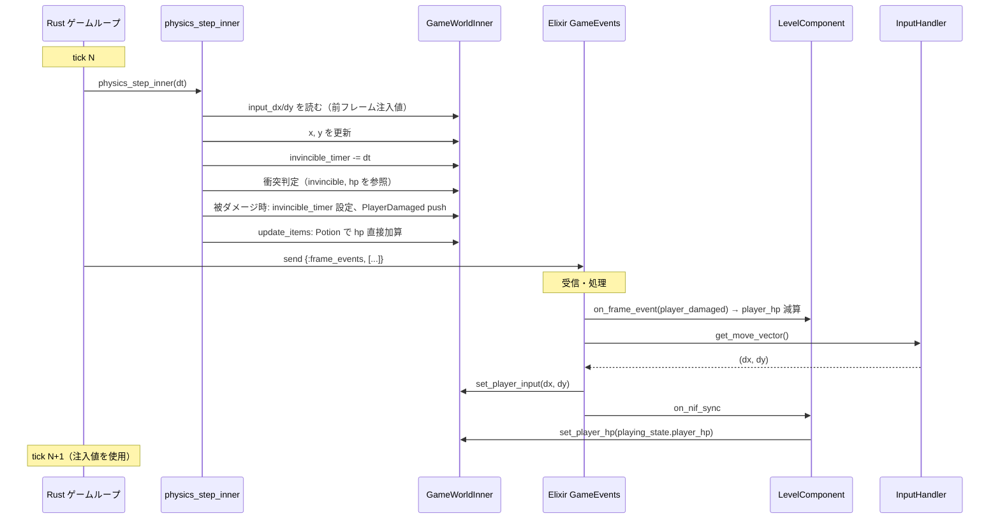
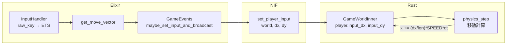
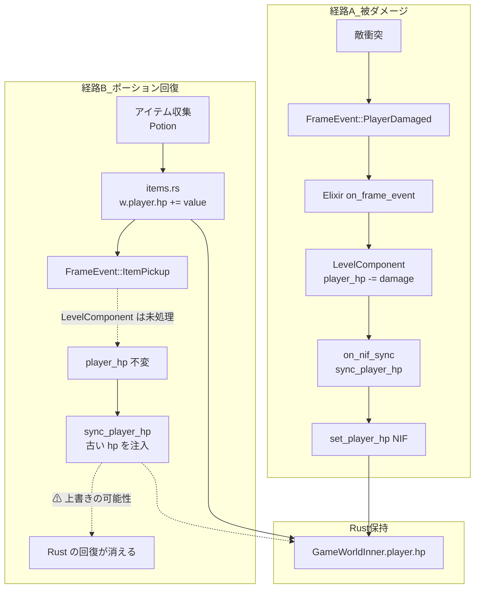
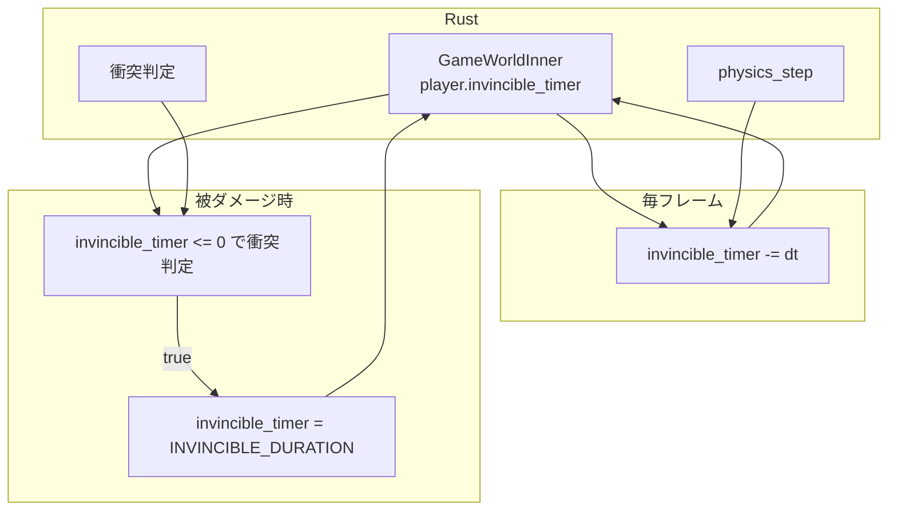
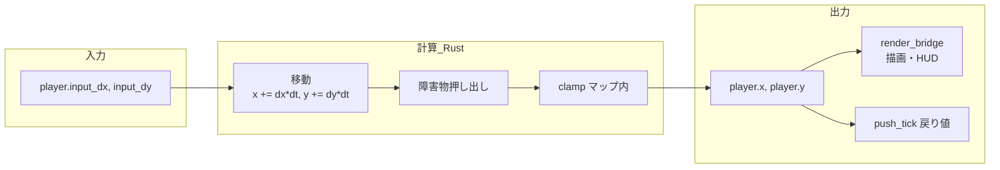

# PlayerState コンテンツ層移行計画

> 作成日: 2026-03-05  
> 目的: Rust 側に保持されている PlayerState（プレイヤー状態）の所有権を Elixir コンテンツ層に移行し、アーキテクチャ原則「Elixir = SSoT」「Rust = 演算層」に準拠する。

---

## 背景と方針

### 現状の問題

`PlayerState` は現在 `native/physics/src/world/player.rs` で定義され、`GameWorldInner` 内で Rust が保持している。

```rust
// native/physics/src/world/player.rs
pub struct PlayerState {
    pub x: f32,
    pub y: f32,
    pub input_dx: f32,
    pub input_dy: f32,
    pub hp: f32,
    pub invincible_timer: f32,
}
```

一方、`implementation.mdc` では以下が明記されている：

- **Elixir = SSoT**: ゲームロジックの制御フロー・パラメータは Elixir 側で持つ
- **contents 層**: シーンスタック・SceneBehaviour・GameEvents・World/Rule 実装・**エンティティパラメータ**を担当

プレイヤーの HP・無敵時間・位置はゲームルールに属する概念であり、コンテンツ固有のパラメータである。これらの所有権を contents 層に移すことで、Boss SSoT 移行・weapon_slots 移行と同様の一貫性を保つ。

### 設計方針

| 方針 | 説明 |
|:---|:---|
| **責務分離** | 状態の権威（SSoT）は contents、演算（物理・衝突）は physics |
| **NIF は注入のみ** | コンテンツが持つ状態を毎フレーム NIF で注入。Rust は永続状態を持たない |
| **既存パターン踏襲** | Boss SSoT 移行（SpecialEntitySnapshot 注入）、weapon_slots 移行と同様の流れ |

---

## フィールド別の分類

PlayerState の各フィールドを「誰が所有すべきか」で分類する。

| フィールド | 現状の保持場所 | 物理演算での役割 | 移行後の SSoT |
|:---|:---|:---|:---|
| `x`, `y` | Rust | 障害物押し出し・衝突判定の基準点・描画 | **Rust（物理出力）** |
| `input_dx`, `input_dy` | Rust（NIF で注入） | 移動ベクトル | **エンジン境界（注入）** |
| `hp` | Rust（一部 Elixir で管理） | 死亡判定・ damage 可否 | **contents** |
| `invincible_timer` | Rust | 被ダメージ可否 | **contents** |

### 位置（x, y）について

`x`, `y` は **物理演算の出力** である。障害物押し出し・マップクランプ・敵追従 AI の基準点として Rust 内で計算される。Elixir が位置を計算するには障害物・当たり判定の知識が必要になり、physics の責務が混入する。

**結論**: 位置は物理層の出力として Rust に残す。ただし、セーブ/ロードでは contents がセーブデータから復元し、`set_player_position` NIF で注入する形にする（load 時のみ）。

### 移行対象

本計画で contents に移すのは **hp** と **invincible_timer** とする。入力（input_dx/dy）は既に Elixir から毎フレーム注入されている。Rust 側の PlayerState は以下のように縮小する：

- **Rust に残す**: `x`, `y`（物理出力）、`input_dx`, `input_dy`（入力バッファ）
- **contents に移す**: `hp`, `invincible_timer`

---

## 現状の値の流れ（マーメイド図）

### 全体フロー：1フレームの時系列

メインルームでは Rust 60Hz ループが駆動し、Elixir は非同期で `frame_events` を受信する。



### input_dx, input_dy の流れ



### hp の流れ



### invincible_timer の流れ



### x, y（位置）の流れ



### フレームイベント受信〜NIF 注入の順序

```mermaid
flowchart TD
    FE[{:frame_events, events}]
    FE --> OFE[1. on_frame_event]
    OFE --> PD[player_damaged → player_hp 減算]
    OFE --> WC[weapon_cooldown_updated]
    OFE --> EK[enemy_killed]

    OFE --> UPD[2. mod.update シーン更新]
    UPD --> MSB[3. maybe_set_input_and_broadcast]
    MSB --> SI[set_player_input]
    MSB --> OPP[on_physics_process]
    MSB --> NS[4. on_nif_sync]
    NS --> SPH[sync_player_hp]
    NS --> SEL[sync_elapsed]
    NS --> SSW[sync_weapon_slots]
```

---

## 現状のデータフロー

### HP

| 経路 | 流れ | 備考 |
|:---|:---|:---|
| 被ダメージ | Rust: 衝突時 `FrameEvent::PlayerDamaged` を push。HP は**変更しない**（既に game_world.rs コメントで明記） | Elixir が apply して `sync_player_hp` で注入 |
| ポーション回復 | **Rust: `items.rs` で `w.player.hp += value` を直接変更** | contents に HP イベントが渡っていない。SSoT 違反かつ同期不整合の可能性 |
| 初期値・ロード | `create_world` / `load_snapshot` で Rust に設定 | 移行後は contents が SSoT |

### invincible_timer

| 経路 | 流れ | 備考 |
|:---|:---|:---|
| 被ダメージ時 | Rust: `w.player.invincible_timer = INVINCIBLE_DURATION` を設定 | Rust が状態を保持 |
| 毎フレーム | Rust: `invincible_timer -= dt` で減衰 | Rust が状態を保持 |
| 衝突判定 | Rust: `invincible_timer <= 0.0` で被ダメージ可否を判定 | 注入された値を使用する形に変更 |

### ポーション回復の不整合

`items.rs` では Potion 取得時に `w.player.hp` を直接加算しているが、LevelComponent は `ItemPickup` イベントで HP を更新していない。そのため `sync_player_hp` が次フレームで古い HP を注入し、Rust 側の回復が上書きされる可能性がある（タイミング依存）。本移行でこれを解消する。

---

## 移行フェーズ

### Phase 1: invincible_timer の contents 移行

1. **FrameEvent 拡張**  
   `PlayerDamaged` に `invincible_until: f32` を追加するか、あるいは Contents が被ダメージ時に無敵時間を決定し、`invincible_timer` を毎フレーム注入する方式を採用する。

2. **NIF 追加**  
   `set_player_snapshot(world, hp, invincible_timer)` を追加。毎フレーム contents から呼ぶ。

3. **Rust 側の変更**  
   - `physics_step`: 衝突時に `w.player.hp` を変更せず、`invincible_timer` も設定しない。`FrameEvent::PlayerDamaged` のみ push。
   - 衝突判定: `invincible_timer` は注入値を使用（毎フレーム `set_player_snapshot` で上書き）。
   - `invincible_timer` の減衰: Rust では行わず、Contents が経過時間から計算して注入。

4. **LevelComponent の変更**  
   - `player_damaged` 受信時: `player_hp` を減算し、`invincible_until_ms = now + INVINCIBLE_MS` を state に保持。
   - `on_nif_sync`: `invincible_timer = max(0, (invincible_until_ms - now) / 1000)` を計算し、`set_player_snapshot(hp, invincible_timer)` を呼ぶ。

### Phase 2: HP の完全 SSoT 化とポーション修正

1. **items.rs の変更**  
   - Potion 取得時: `w.player.hp` を直接変更しない。
   - `FrameEvent::ItemPickup` を拡張し、Potion の場合は `ItemPickupPotion { heal: f32 }` のような形で回復量を渡す（または既存 `ItemPickup { item_kind }` のまま、contents が item_kind から回復量を解決）。

2. **LevelComponent の変更**  
   - `ItemPickup` (item_kind == Potion) 受信時: `player_hp` に回復量を加算し、`player_max_hp` で clamp。
   - `sync_player_hp` を `set_player_snapshot` に統合。

### Phase 3: PlayerState の整理と NIF 統合

1. **Rust PlayerState の縮小**  
   - `hp`, `invincible_timer` を `PlayerState` から削除。
   - `GameWorldInner` に `player_hp: f32`, `player_invincible_timer: f32` を注入用フィールドとして持つか、あるいは `PlayerState` を `{ x, y, input_dx, input_dy }` のみにする。

2. **NIF 整理**  
   - `set_player_hp` を廃止し、`set_player_snapshot(hp, invincible_timer)` に統一。
   - `get_player_hp`, `is_player_dead` は Rust が注入された hp を返す形のまま（read 用）で維持するか、または Elixir が自前で持つ state から判定する形に変更可能（設計判断）。

### Phase 4: セーブ/ロードの委譲

1. **SaveSnapshot**  
   - `player_hp`, `player_x`, `player_y`, `invincible_timer` は既にスナップショットに含まれている。
   - ロード時: contents がスナップショットから `player_hp` を読み、Playing シーン state に反映。`set_player_snapshot` で HP を注入。`set_player_position` で x, y を注入（load 時のみ）。

2. **create_world の初期値**  
   - `hp`, `invincible_timer` は 0 等のダミー値で初期化。初回 `on_nif_sync` で contents が正しい値を注入。

---

## 影響ファイル一覧

| レイヤー | ファイル | 変更内容 |
|:---|:---|:---|
| physics | `native/physics/src/world/player.rs` | `hp`, `invincible_timer` 削除または注入用に分離 |
| physics | `native/physics/src/world/game_world.rs` | 注入用フィールドの整理 |
| physics | `native/physics/src/game_logic/physics_step.rs` | invincible 減衰削除、hp 変更削除（既に無し）、判定は注入値使用 |
| physics | `native/physics/src/game_logic/systems/items.rs` | Potion の hp 直接変更を廃止、FrameEvent で回復量を伝搬 |
| physics | `native/physics/src/game_logic/systems/boss.rs` | invincible_timer を注入値として参照 |
| physics | `native/physics/src/game_logic/systems/special_entity_collision.rs` | 同上 |
| nif | `native/nif/src/nif/world_nif.rs` | `set_player_snapshot`, `set_player_position` 追加、`set_player_hp` 廃止 |
| nif | `native/nif/src/nif/read_nif.rs` | 注入済み hp を返す形を維持 |
| nif | `native/nif/src/nif/save_nif.rs` | ロード時に `set_player_position` 呼び出しを追加 |
| nif | `native/physics/src/world/frame_event.rs` | `ItemPickup` の拡張（Potion 回復量）検討 |
| core | `apps/core/lib/core/nif_bridge.ex` | `set_player_snapshot`, `set_player_position` 追加 |
| core | `apps/core/lib/core.ex` | 公開 API の調整 |
| contents | `apps/contents/lib/contents/vampire_survivor/level_component.ex` | invincible 管理、ItemPickup Potion 処理、sync 統合 |

---

## リスクと対策

| リスク | 対策 |
|:---|:---|
| **1 tick 遅れ** | Boss SSoT と同様、`on_nif_sync` の注入が 1 tick 遅れる可能性あり。被ダメージ・無敵のタイミングが 1 フレームずれるが、ゲームプレイ上許容範囲と判断。 |
| **INVINCIBLE_DURATION の二重管理** | 現在 `physics` の constants に定義。Contents が無敵時間を持つ場合、コンテンツごとに変えられる利点がある。VampireSurvivor 用の定数を LevelComponent または EntityParams に持たせる。 |
| **他コンテンツの対応** | AsteroidArena, BulletHell3D 等が PlayerState を使用しているか確認。使用していなければ変更不要。 |

---

## 参考: 既存移行との対応

| 移行 | 類似点 |
|:---|:---|
| **Boss SSoT** | SpecialEntitySnapshot を毎フレーム注入。Rust は永続状態を持たず、衝突判定に注入値を使用。 |
| **weapon_slots** | 毎フレーム `set_weapon_slots` で注入。physics は入力バッファとしてのみ参照。 |
| **elapsed_seconds** | 毎フレーム `set_elapsed_seconds` で注入。Rust は加算せず、注入値のみ使用。 |

---

## 次のステップ

1. 本計画書のレビュー・合意
2. Phase 1 から順に実装
3. VampireSurvivor で動作確認
4. 他コンテンツ（AsteroidArena 等）の影響確認
5. ドキュメント（rust-layer.md, data-flow.md 等）の更新
