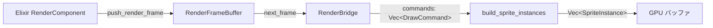

# Rust ECS 実装状況

> README.md の「Rust ECS for Physics & Rendering & Audio」について、
> どの部分が ECS を実装し、どの部分が実装していないかを整理したドキュメント。

## 背景

README のハイライトでは次のように謳っている：

> **Rust ECS for Physics & Rendering & Audio**
> Elixir から同期された状態をもとに、Rust の ECS が 60Hz 固定の物理演算・描画・オーディオ処理を行います。SoA（Structure of Arrays）と SIMD による CPU キャッシュ最適化で、高フレームレートを維持します。

しかし実際には、**Physics のみ**が ECS 的なアーキテクチャを採用しており、Render と Audio は別のパラダイムで実装されている。

---

## 実装している部分

### physics クレート（ECS・SoA・システムパターン）

| 項目 | 内容 | 実装箇所 |
|:---|:---|:---|
| **SoA 構造** | Structure of Arrays によるデータ配置 | `world/enemy.rs`, `world/bullet.rs`, `world/particle.rs`, `item.rs` |
| **エンティティ管理** | `free_list` による O(1) スポーン・キル | 各 `*World` の `spawn` / `kill` |
| **システムパターン** | 物理・AI・衝突などの分離された処理 | `game_logic/systems/` |
| **SIMD** | chase_ai の SSE2 並列処理（x86_64） | `game_logic/chase_ai.rs` |
| **並列処理** | rayon `par_iter_mut` によるフォールバック | `chase_ai.rs`（非 x86_64） |

#### SoA 実装例

```rust
// native/physics/src/world/enemy.rs
pub struct EnemyWorld {
    pub positions_x: Vec<f32>,
    pub positions_y: Vec<f32>,
    pub velocities_x: Vec<f32>,
    pub velocities_y: Vec<f32>,
    pub speeds: Vec<f32>,
    pub hp: Vec<f32>,
    pub alive: Vec<u8>,
    pub kind_ids: Vec<u8>,
    pub count: usize,
    free_list: Vec<usize>,
    // ...
}
```

#### システム一覧

| ファイル | 責務 |
|:---|:---|
| `weapons.rs` | 武器発射ロジック（FirePattern 対応） |
| `projectiles.rs` | 弾丸移動・衝突・ドロップ |
| `boss.rs` | ボス物理（AI は Elixir から NIF で注入） |
| `effects.rs` | パーティクル更新 |
| `items.rs` | アイテム収集 |
| `collision.rs` | 敵 vs 障害物押し出し |
| `spawn.rs` | スポーン位置生成 |
| `special_entity_collision.rs` | SpecialEntity 衝突・ダメージ |

#### 補足

- 一般的な ECS ライブラリ（Bevy, specs 等）は使用していない
- カスタム SoA + システム呼び出しの組み合わせで、ECS パターンを実現している
- `physics_step.rs` が各システムを順番に呼び出す制御フローを持つ

---

## 実装していない部分

### render クレート（コマンド駆動・命令型描画）

| 項目 | 実態 |
|:---|:---|
| **データ構造** | `DrawCommand` の `Vec`。Elixir の RenderComponent が `push_render_frame` NIF で書き込む |
| **処理フロー** | `update_instances(frame)` → `build_sprite_instances(commands)` → `SpriteInstance` 配列 → GPU バッファ更新 → 描画 |
| **ECS の有無** | なし。Entity / Component / System の概念はない |

#### フロー概要



- `DrawCommand` は `PlayerSprite`, `Sprite`, `Particle`, `Item`, `Obstacle` 等の enum
- 描画対象は Elixir 側が毎フレーム「描画すべきもののリスト」として構築し、Rust はそのリストをそのまま受け取って描画する
- `UiComponent` は UI ウィジェット種別を表す enum であり、ECS の Component ではない

#### 参照

- [docs/architecture/rust/desktop/render.md](../architecture/rust/desktop/render.md)

---

### audio クレート（コマンド駆動・スレッド分離）

| 項目 | 実態 |
|:---|:---|
| **データ構造** | `AudioCommand` enum（`PlayBgm`, `PlaySfx`, `StopBgm`, `SetVolume` 等） |
| **処理フロー** | Elixir → `AudioCommandSender` で送信 → オーディオスレッドがループで受信 → `AudioManager` が rodio で再生 |
| **ECS の有無** | なし。Entity / Component / System の概念は一切ない |

#### フロー概要


- SuperCollider 風の「指揮者（Elixir）→ プレイヤー（Rust スレッド）」モデル
- 空間オーディオ等のエンティティ単位の処理は、現状スコープ外

#### 参照

- [docs/architecture/rust/nif/audio.md](../architecture/rust/nif/audio.md)

---

## まとめ

| クレート | ECS 実装 | 実際のパラダイム |
|:---|:---|:---|
| **physics** | ✅ あり | SoA + システムパターン（カスタム ECS） |
| **render** | ❌ なし | コマンド駆動・命令型描画（DrawCommand リスト） |
| **audio** | ❌ なし | コマンド駆動・スレッド分離（AudioCommand） |

---

## 将来方針：Render ・ Audio への ECS 導入

### 基本方針

**Elixir SSoT を維持し、二重管理は許容しない。**

- Elixir が「描画すべきエンティティのリスト」「音源のリスト」を毎フレーム送り続ける
- Rust 側（Render / Audio）は受け取ったデータを SoA に変換し、**バッチング・カリング・最適化**を行うだけ
- 「何を描くか・何を鳴らすか」の決定は Elixir、「どう効率よく実行するか」は Rust の責務

---

### Render への ECS 導入

#### 導入する利点

ECS（SoA + システムパターン）を Render に導入することで、以下の恩恵が得られる。

| 利点 | 内容 | 恩恵 |
|:---|:---|:---|
| **バッチング** | 同じマテリアル・同じアトラス・同じテクスチャの DrawCommand をまとめて描画する | Draw Call 数を削減し、CPU のドライバーオーバーヘッドを軽減。1 フレームあたりの Draw Call が数百〜数千になるコンテンツで必須 |
| **空間インデックス** | 視錐台カリング・LOD を Render 側で行う場合、空間ハッシュや SoA によるクエリで「画面外」「遠すぎる」対象を高速に除外する | 不要な描画を省き、GPU 負荷を抑える。3D シーンや広大なマップで効果が大きい |
| **スケール** | 数千スプライト・パーティクルを SoA で保持する。`positions_x`, `positions_y`, `colors` などを配列として連続配置 | CPU キャッシュの局所性が向上し、ループ処理が高速化。大規模コンテンツ（Vampire Survivor 系、弾幕等）で 60Hz 維持に寄与 |
| **GPU インスタンシング** | 同一メッシュの大量描画で、位置・スケール・色を SoA としてまとめて GPU バッファに渡し、1 Draw Call で多数描画 | スプライト・パーティクル・障害物など同一形状の大量描画を、数 Draw Call に集約できる。GPU への転送と描画の効率が向上 |

#### 設計の境界

```
Elixir (SSoT)                    Rust (Render)
─────────────────────────────────────────────────────────────
描画すべきエンティティのリスト  →  受け取り
  （毎フレーム push_render_frame）
                                   ↓
                                SoA に変換
                                   ↓
                                バッチング（マテリアル/アトラス単位）
                                   ↓
                                視錐台カリング（任意）
                                   ↓
                                GPU バッファ更新・描画
```

- Render は独自のワールドを持たない
- 受け取ったリストを一時的に SoA に展開し、最適化して描画するだけ

---

### Audio への ECS 導入

#### 方針（Render と同様）

- Elixir が音源のリスト・再生コマンドを送る
- Rust Audio は受け取ったデータを SoA に変換し、空間オーディオ・ルーティングなどの最適化を行う
- 「何を鳴らすか」の権威は Elixir にあり、Audio はワールドの二重管理を行わない

#### 想定される導入理由

- 多数の同時音源を SoA で扱う
- 空間オーディオ（位置・減衰）の効率的な処理
- 動的ルーティング（BGM/SE/環境音バス）の整理

> 注: Audio は現状未設計のため、具体的な SoA 構造やシステムは今後の検討課題。

---

## README との整合性

現状の README 表現は「Rust ECS が Physics & Rendering & Audio の 3 つすべてを担う」と読めるが、ECS を採用しているのは **physics のみ** である。

### 表現の修正案（任意）

- **現状**: 「Rust ECS for Physics & Rendering & Audio」
- **案 A**: 「Rust ECS for Physics、コマンド駆動 for Rendering & Audio」
- **案 B**: 「Rust physics に SoA/ECS、Rendering/Audio はコマンド駆動」
- **案 C**: README はそのままにし、本ドキュメントへの参照を追加して詳細を委譲する

本ドキュメントで事実関係を整理したうえで、README の文言をどうするかは別途判断可能。

---

## 関連ドキュメント

- [docs/architecture/rust/nif/physics.md](../architecture/rust/nif/physics.md)
- [docs/architecture/rust/desktop/render.md](../architecture/rust/desktop/render.md)
- [docs/architecture/rust/nif/audio.md](../architecture/rust/nif/audio.md)
- [.cursor/rules/implementation.mdc](../../.cursor/rules/implementation.mdc) — SoA 維持の実装ルール
