# Rust レイヤー詳細

## 概要

Rust 側は **Cargo ワークスペース** として構成され、4 つのクレートに分割されています。60Hz 固定の物理演算・衝突判定・描画・オーディオを担当します。

---

## クレート構成と依存関係

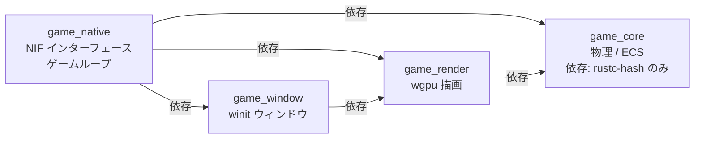

---

## `game_core` — 共通ロジック

依存クレートは `rustc-hash = "2"` のみ。no-std 互換を意識した設計。

### `constants.rs`

| 定数 | 値 | 説明 |
|:---|:---|:---|
| `SCREEN_WIDTH` | 1280 | 画面幅（px） |
| `SCREEN_HEIGHT` | 720 | 画面高さ（px） |
| `MAP_WIDTH` | 4096 | マップ幅（px） |
| `MAP_HEIGHT` | 4096 | マップ高さ（px） |
| `PLAYER_SPEED` | 200.0 | プレイヤー速度（px/s） |
| `BULLET_SPEED` | 400.0 | 弾速（px/s） |
| `CELL_SIZE` | 80 | 空間ハッシュセルサイズ（px） |
| `INVINCIBLE_DURATION` | 0.5 | 無敵時間（秒） |

### `entity_params.rs` — ID ベースパラメータテーブル

エンティティ ID（u8）からパラメータを引くテーブル。

**`EnemyParams`（5 種）:**

| ID | 種別 | HP | 速度 | ダメージ | EXP |
|:---|:---|:---|:---|:---|:---|
| 0 | Slime | 30 | 60 | 10 | 5 |
| 1 | Bat | 20 | 90 | 8 | 4 |
| 2 | Golem | 100 | 30 | 20 | 15 |
| 3 | Skeleton | 50 | 70 | 12 | 8 |
| 4 | Ghost | 40 | 80 | 15 | 10 |

**`WeaponParams`（7 種）:**

| ID | 種別 | ダメージ | クールダウン | 弾数 |
|:---|:---|:---|:---|:---|
| 0 | MagicWand | 20 | 0.8s | 1 |
| 1 | Axe | 40 | 1.5s | 1 |
| 2 | Cross | 15 | 0.5s | 4（方向） |
| 3 | Whip | 30 | 1.0s | 1（範囲） |
| 4 | Fireball | 35 | 1.2s | 1 |
| 5 | Lightning | 50 | 2.0s | 1 |
| 6 | Garlic | 10 | 0.3s | 1（近接） |

**`BossParams`（3 種）:**

| ID | 種別 | HP | 速度 |
|:---|:---|:---|:---|
| 0 | SlimeKing | 1000 | 40 |
| 1 | BatLord | 2000 | 120 |
| 2 | StoneGolem | 5000 | 20 |

### `weapon.rs` — WeaponSlot

```rust
fn effective_cooldown(&self) -> f32  // レベルごとに 7% 短縮（最大 50%）
fn effective_damage(&self) -> f32    // レベルごとに基礎ダメージの 25% 増加
fn weapon_upgrade_desc(&self) -> String  // HUD 用アップグレード説明文
```

### `physics/` — 物理演算ユーティリティ

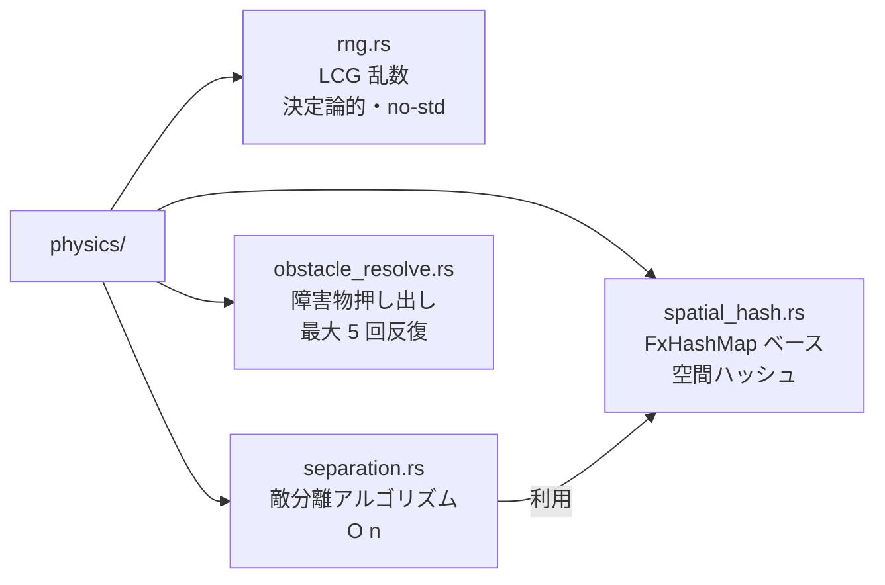

#### `spatial_hash.rs` — 空間ハッシュ

```rust
struct CollisionWorld {
    dynamic: SpatialHash,  // 毎フレーム更新（敵・弾）
    static_: SpatialHash,  // 障害物（変化なし）
}
```

セルサイズ 80px で `O(n)` の近傍検索を実現。

---

## `game_native` — NIF インターフェース

### `lib.rs` — エントリポイント

```rust
rustler::atoms! {
    ok, error, nil,
    enemy_killed, player_damaged, level_up, item_pickup, boss_defeated,
    // ... ゲームアトム
}

#[cfg(feature = "umbrella")]
rustler::init!("Elixir.GameEngine.NifBridge", load = nif::load::on_load);
```

### `nif/` — NIF 関数群

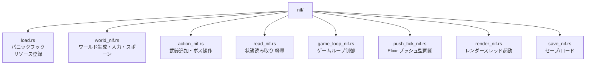

#### NIF 関数一覧

**`world_nif.rs`:**

| NIF 関数 | 説明 |
|:---|:---|
| `create_world()` | `GameWorld` リソースを生成して返す |
| `set_player_input(world, dx, dy)` | 移動ベクトルを設定 |
| `spawn_enemies(world, kind_id, count, hp_mult)` | 敵をスポーン |
| `set_map_obstacles(world, obstacles)` | 障害物リストを設定 |

**`action_nif.rs`:**

| NIF 関数 | 説明 |
|:---|:---|
| `add_weapon(world, weapon_id)` | 武器を追加/アップグレード |
| `skip_level_up(world)` | レベルアップをスキップ |
| `spawn_boss(world, boss_id)` | ボスをスポーン |
| `spawn_elite_enemy(world, kind_id, count, hp_mult)` | エリート敵をスポーン |

**`read_nif.rs`（軽量・毎フレーム利用可）:**

| NIF 関数 | 説明 |
|:---|:---|
| `get_player_pos(world)` | プレイヤー座標 `{x, y}` |
| `get_player_hp(world)` | プレイヤー HP |
| `get_enemy_count(world)` | 生存敵数 |
| `get_hud_data(world)` | HUD 表示データ全体 |
| `get_frame_metadata(world)` | フレームメタデータ |
| `get_level_up_data(world)` | レベルアップ選択肢 |
| `get_weapon_levels(world)` | 全武器レベル |
| `get_boss_info(world)` | ボス情報 |
| `is_player_dead(world)` | 死亡判定 |

**`game_loop_nif.rs`:**

| NIF 関数 | 説明 |
|:---|:---|
| `physics_step(world, dt)` | 1 フレーム物理ステップ（DirtyCpu） |
| `drain_frame_events(world)` | フレームイベントを取り出す |
| `create_game_loop_control()` | `GameLoopControl` リソース生成 |
| `start_rust_game_loop(world, control, pid)` | 別スレッドで 60Hz 固定ループ開始 |
| `pause_physics(control)` | 物理演算を一時停止 |
| `resume_physics(control)` | 物理演算を再開 |

---

### `world/` — ゲームワールド型

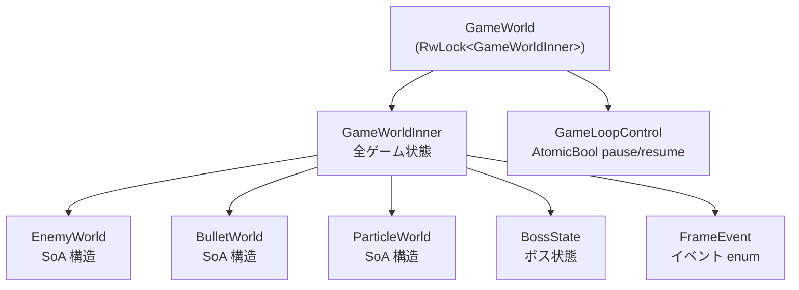

#### SoA（Structure of Arrays）構造

```rust
struct EnemyWorld {
    positions_x: Vec<f32>,    // 全敵の X 座標
    positions_y: Vec<f32>,    // 全敵の Y 座標
    velocities:  Vec<[f32; 2]>,
    hp:          Vec<f32>,
    alive:       Vec<bool>,
    kind_ids:    Vec<u8>,
    free_list:   Vec<usize>,  // O(1) スポーン/キル
}
```

#### `FrameEvent` — フレームイベント

```rust
enum FrameEvent {
    EnemyKilled  { kind_id: u8, exp: u32 },
    PlayerDamaged { damage: f32 },
    LevelUp      { new_level: u32 },
    ItemPickup   { kind: ItemKind },
    BossDefeated { kind_id: u8, score: u32 },
}
```

---

### `game_logic/` — 物理・AI・システム

#### `physics_step.rs` — 1 フレーム物理ステップ

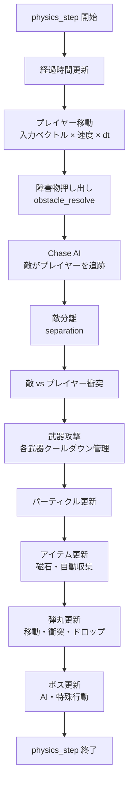

#### `chase_ai.rs` — 敵追跡 AI（プラットフォーム別最適化）

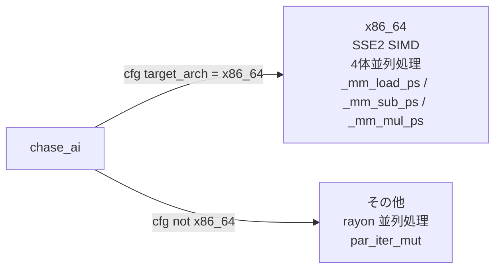

#### `systems/` — ゲームシステム群

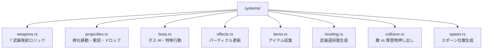

**7 武器の発射パターン:**

| 武器 | 発射パターン |
|:---|:---|
| MagicWand | 最近傍の敵に向けて 1 発 |
| Axe | 上方向に投げ、放物線軌道 |
| Cross | 上下左右 4 方向に同時発射 |
| Whip | 左右に範囲攻撃（即時判定） |
| Fireball | 最近傍の敵に向けて貫通弾 |
| Lightning | 最近傍の敵に即時ダメージ（弾なし） |
| Garlic | プレイヤー周囲に継続ダメージ |

**ボス AI パターン:**

| ボス | 移動 | 特殊行動 |
|:---|:---|:---|
| SlimeKing | 低速追跡 | 定期的にスライムを召喚 |
| BatLord | 高速追跡 | ダッシュ攻撃（phase_timer で制御） |
| StoneGolem | 超低速 | 岩弾を放射状に発射 |

---

### `render_bridge.rs` — RenderBridge 実装

ロック競合を最小化するため、ロック内でのデータコピーを最小限に抑えます。

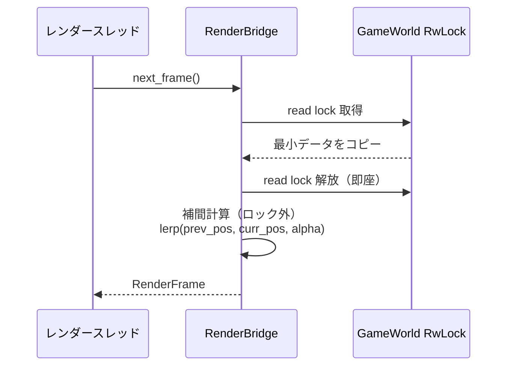

### `audio.rs` — rodio オーディオ管理

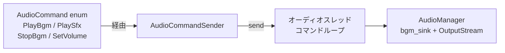

### `lock_metrics.rs` — RwLock 待機時間メトリクス

| 閾値 | アクション |
|:---|:---|
| read lock > 300μs | `log::warn!` |
| write lock > 500μs | `log::warn!` |
| 5 秒ごと | 平均待機時間をレポート |

### `asset/mod.rs` — アセット管理

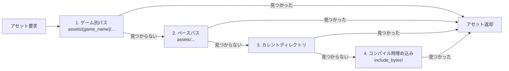

---

## `game_render` — wgpu 描画パイプライン

### `renderer/mod.rs` — 描画パス

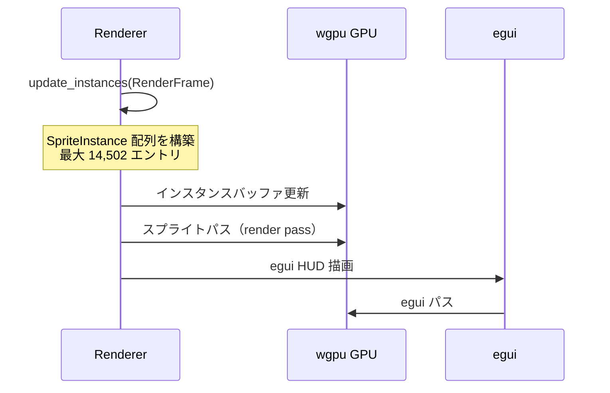

**スプライトアトラスレイアウト（1600×64px）:**

| オフセット | 内容 |
|:---|:---|
| 0〜255 | プレイヤー 4 フレームアニメ |
| 256〜511 | 敵アニメ（Slime/Bat/Golem） |
| 512〜767 | 静止スプライト（アイテム等） |
| 768〜1023 | ボス（SlimeKing/BatLord/StoneGolem） |

### `renderer/ui.rs` — egui HUD（708行）

| 画面 | 内容 |
|:---|:---|
| タイトル | START ボタン |
| ゲームオーバー | 生存時間・スコア・撃破数・RETRY ボタン |
| プレイ中 | HP バー・EXP バー・スコア・タイマー・武器スロット・Save/Load |
| ボス戦 | 画面上部中央にボス HP バー |
| レベルアップ | 武器カード×3、Esc/1/2/3 キー対応、3 秒自動選択 |

### `renderer/shaders/sprite.wgsl` — WGSL シェーダー

```wgsl
@vertex
fn vs_main(in: VertexInput) -> VertexOutput {
    // ワールド座標 → カメラオフセット → クリップ座標変換
}

@fragment
fn fs_main(in: VertexOutput) -> @location(0) vec4<f32> {
    // テクスチャサンプリング × カラーティント
}
```

---

## `game_window` — winit ウィンドウ管理

### キー入力マッピング

| キー | 動作 |
|:---|:---|
| W / ↑ | 上移動 |
| S / ↓ | 下移動 |
| A / ← | 左移動 |
| D / → | 右移動 |
| 斜め入力 | 正規化（速度一定） |

### フレームループ

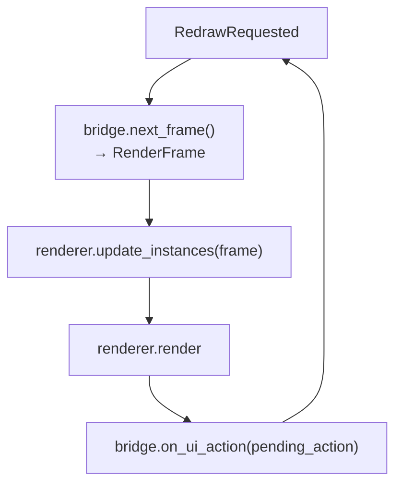

---

## ビルド設定（`Cargo.toml`）

```toml
[profile.dev]
opt-level = 1      # デバッグビルドでも最低限の最適化

[profile.release]
opt-level = 3
lto = true         # リンク時最適化
codegen-units = 1  # 最大最適化（ビルド時間増加）
```

---

## 関連ドキュメント

- [アーキテクチャ概要](./architecture-overview.md)
- [Elixir レイヤー詳細](./elixir-layer.md)
- [データフロー・通信](./data-flow.md)
- [ゲームコンテンツ詳細](./game-content.md)
