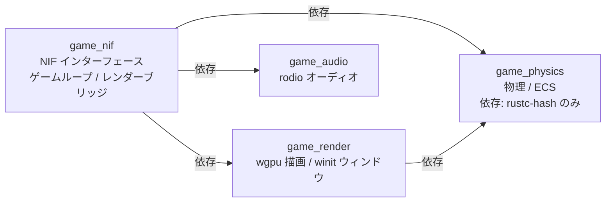
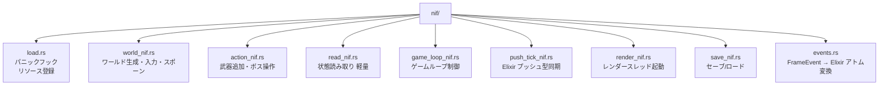

# Rust レイヤー詳細

## 概要

Rust 側は **Cargo ワークスペース** として構成され、4 つのクレートに分割されています。60Hz 固定の物理演算・衝突判定・描画・オーディオを担当します。

---

## クレート構成と依存関係



---

## `game_physics` — 物理演算・ECS

依存クレートは `rustc-hash = "2"` のみ。no-std 互換を意識した設計。

### `constants.rs`

| 定数 | 値 | 説明 |
|:---|:---|:---|
| `SCREEN_WIDTH` | 1280 | 画面幅（px） |
| `SCREEN_HEIGHT` | 720 | 画面高さ（px） |
| `MAP_WIDTH` | 4096 | マップ幅（px） |
| `MAP_HEIGHT` | 4096 | マップ高さ（px） |
| `PLAYER_SPEED` | 200.0 | プレイヤー速度（px/s） |
| `BULLET_SPEED` | 400.0 | 弾速（px/s） |
| `CELL_SIZE` | 80 | 空間ハッシュセルサイズ（px） |
| `INVINCIBLE_DURATION` | 0.5 | 無敵時間（秒） |

### `entity_params.rs` — 外部注入パラメータテーブル

`EntityParamTables` 構造体として定義され、`set_entity_params` NIF 経由で Elixir 側から注入される。
ハードコードされたパラメータは持たず、`default()` は空テーブルを返す。

```rust
pub struct EntityParamTables {
    pub enemies:  Vec<EnemyParams>,
    pub weapons:  Vec<WeaponParams>,
    pub bosses:   Vec<BossParams>,
}
```

**`EnemyParams`:**

```rust
pub struct EnemyParams {
    pub max_hp:           f32,
    pub speed:            f32,
    pub radius:           f32,
    pub damage_per_sec:   f32,
    pub render_kind:      u8,
    pub particle_color:   [f32; 4],
    pub passes_obstacles: bool,   // Ghost など障害物すり抜け
}
```

**`WeaponParams` と `FirePattern`:**

```rust
pub enum FirePattern {
    Aimed,     // 最近接敵に向けて扇状（magic_wand）
    FixedUp,   // 固定方向（axe: 上方向）
    Radial,    // 全方向（cross: 4/8方向）
    Whip,      // 扇形直接判定（弾丸なし）
    Aura,      // プレイヤー周囲オーラ（garlic）
    Piercing,  // 貫通弾（fireball）
    Chain,     // 連鎖電撃（lightning）
}

pub struct WeaponParams {
    pub cooldown:     f32,
    pub damage:       i32,
    pub as_u8:        u8,
    pub bullet_table: Option<Vec<usize>>,  // レベル別弾数テーブル
    pub fire_pattern: FirePattern,
    pub range:        f32,        // Whip/Aura の基本半径
    pub chain_count:  u8,         // Chain パターンの連鎖数
}
```

**`BossParams`:**

```rust
pub struct BossParams {
    pub max_hp:           f32,
    pub speed:            f32,
    pub radius:           f32,
    pub damage_per_sec:   f32,
    pub render_kind:      u8,
    pub special_interval: f32,  // 特殊行動インターバル（秒）
}
```

### `weapon.rs` — WeaponSlot

クールダウン管理のみを担当。ダメージ計算は `WeaponParams` を参照する。

```rust
pub struct WeaponSlot {
    pub kind_id:  u8,
    pub level:    u32,
    pub cooldown: f32,  // 残りクールダウン（秒）
}
```

### `physics/` — 物理演算ユーティリティ


#### `spatial_hash.rs` — 空間ハッシュ

```rust
struct CollisionWorld {
    dynamic: SpatialHash,  // 毎フレーム更新（敵・弾）
    static_: SpatialHash,  // 障害物（変化なし）
}
```

セルサイズ 80px で `O(n)` の近傍検索を実現。

### `world/` — ゲームワールド型


**`GameWorldInner` の主要フィールドと Elixir SSoT の対応:**

| フィールド | 権威 | 注入 NIF |
|:---|:---|:---|
| `player.hp` | Elixir | `set_player_hp` |
| `player.input_dx/dy` | Elixir | `set_player_input` |
| `elapsed_seconds` | Elixir | `set_elapsed_seconds` |
| `boss.hp` | Elixir | `set_boss_hp` |
| `score`, `kill_count` | Elixir | `set_hud_state` |
| `params` | Elixir | `set_entity_params`（Phase 3-A） |
| `map_width/height` | Elixir | `set_world_size`（Phase 3-A） |
| `hud_level/exp/exp_to_next` 等 | Elixir | `set_hud_level_state`（描画専用） |

#### SoA（Structure of Arrays）構造

```rust
struct EnemyWorld {
    positions_x: Vec<f32>,    // 全敵の X 座標
    positions_y: Vec<f32>,    // 全敵の Y 座標
    velocities:  Vec<[f32; 2]>,
    hp:          Vec<f32>,
    alive:       Vec<bool>,
    kind_ids:    Vec<u8>,
    free_list:   Vec<usize>,  // O(1) スポーン/キル
}
```

#### `FrameEvent` — フレームイベント

```rust
enum FrameEvent {
    EntityRemoved { kind_id: u8, x: f32, y: f32 },  // 敵撃破（アイテムドロップは Elixir 側）
    PlayerDamaged { damage: f32 },
    LevelUp       { new_level: u32 },
    ItemPickup    { kind: ItemKind },
    BossDefeated  { kind_id: u8, x: f32, y: f32 },  // ボス撃破（ドロップは Elixir 側）
}
```

### `game_logic/` — 物理・AI・システム

#### `physics_step.rs` — 1 フレーム物理ステップ


#### `chase_ai.rs` — 敵追跡 AI（プラットフォーム別最適化）


#### `systems/` — ゲームシステム群


> `leveling.rs`（武器選択肢生成）は廃止済み。武器選択肢の生成は Elixir 側 `RuleBehaviour.generate_weapon_choices/1` が担当する。

**武器発射パターン（`FirePattern` 対応）:**

| FirePattern | 武器例 | 発射パターン |
|:---|:---|:---|
| `Aimed` | MagicWand | 最近傍の敵に向けて扇状発射 |
| `FixedUp` | Axe | 上方向固定、放物線軌道 |
| `Radial` | Cross | 全方向（4/8方向）同時発射 |
| `Whip` | Whip | 扇形直接判定（弾丸なし） |
| `Piercing` | Fireball | 最近傍の敵に向けて貫通弾 |
| `Chain` | Lightning | 最近傍の敵に連鎖電撃 |
| `Aura` | Garlic | プレイヤー周囲継続ダメージ |

**ボス物理（`boss.rs`）:**

Rust はボスの物理的存在（位置・HP・当たり判定・弾丸 vs ボス衝突）のみ管理する。
- **移動**: Elixir が `set_boss_velocity` NIF で注入した速度ベクトルで移動
- **特殊行動**: Elixir の `update_boss_ai` コールバックが NIF 経由で制御
- **撃破判定**: Rust が判定し `BossDefeated` イベントを発行

---

## `game_nif` — NIF インターフェース・ゲームループ

### `lib.rs` — エントリポイント

```rust
rustler::atoms! {
    ok, error, nil,
    enemy_killed, player_damaged, level_up, item_pickup, boss_defeated,
    // ... ゲームアトム
}

#[cfg(feature = "umbrella")]
rustler::init!("Elixir.GameEngine.NifBridge", load = nif::load::on_load);
```

### `nif/` — NIF 関数群



#### NIF 関数一覧

**`world_nif.rs`（ワールド生成・入力・スポーン・パラメータ注入）:**

| NIF 関数 | 説明 |
|:---|:---|
| `create_world()` | `GameWorld` リソースを生成して返す |
| `set_player_input(world, dx, dy)` | 移動ベクトルを設定 |
| `spawn_enemies(world, kind_id, count)` | 敵をスポーン |
| `spawn_enemies_at(world, kind_id, positions)` | 指定座標リストに敵をスポーン（Phase 3-B） |
| `set_map_obstacles(world, obstacles)` | 障害物リストを設定 |
| `set_entity_params(world, enemies, weapons, bosses)` | エンティティパラメータを注入（Phase 3-A） |
| `set_world_size(world, width, height)` | マップサイズを設定（Phase 3-A） |
| `set_player_hp(world, hp)` | プレイヤー HP を注入（フェーズ2） |
| `set_elapsed_seconds(world, elapsed)` | 経過時間を注入（フェーズ3） |
| `set_boss_hp(world, hp)` | ボス HP を注入（フェーズ4） |
| `set_hud_state(world, score, kill_count)` | HUD スコア・キル数を注入（フェーズ1） |
| `set_hud_level_state(world, level, exp, ...)` | HUD レベル・EXP 状態を注入（Phase 3-B・描画専用） |

**`action_nif.rs`（武器・ボス操作）:**

| NIF 関数 | 説明 |
|:---|:---|
| `add_weapon(world, weapon_id)` | 武器を追加/アップグレード |
| `spawn_boss(world, boss_id)` | ボスをスポーン |
| `spawn_elite_enemy(world, kind_id, count, hp_mult)` | エリート敵をスポーン |
| `spawn_item(world, x, y, kind, value)` | アイテムをスポーン（Phase 3-B） |
| `set_boss_velocity(world, vx, vy)` | ボス速度を注入（Phase 3-B・AI） |
| `set_boss_invincible(world, invincible)` | ボス無敵状態を設定（Phase 3-B・AI） |
| `set_boss_phase_timer(world, timer)` | ボス特殊行動タイマーを設定（Phase 3-B・AI） |
| `fire_boss_projectile(world, dx, dy, speed, dmg, lifetime)` | ボス弾を発射（Phase 3-B・AI） |
| `get_boss_state(world)` | ボス状態を取得（Phase 3-B・AI 用） |

**`read_nif.rs`（軽量・毎フレーム利用可）:**

| NIF 関数 | 説明 |
|:---|:---|
| `get_player_pos(world)` | プレイヤー座標 `{x, y}` |
| `get_player_hp(world)` | プレイヤー HP |
| `get_enemy_count(world)` | 生存敵数 |
| `get_hud_data(world)` | HUD 表示データ全体 |
| `get_frame_metadata(world)` | フレームメタデータ |
| `get_weapon_levels(world)` | 全武器レベル（`%{kind_id => level}`） |
| `is_player_dead(world)` | 死亡判定 |

**`game_loop_nif.rs`:**

| NIF 関数 | 説明 |
|:---|:---|
| `physics_step(world, dt)` | 1 フレーム物理ステップ（DirtyCpu） |
| `drain_frame_events(world)` | フレームイベントを取り出す |
| `create_game_loop_control()` | `GameLoopControl` リソース生成 |
| `start_rust_game_loop(world, control, pid)` | 別スレッドで 60Hz 固定ループ開始 |
| `pause_physics(control)` | 物理演算を一時停止 |
| `resume_physics(control)` | 物理演算を再開 |

---

### `render_bridge.rs` — RenderBridge 実装

ロック競合を最小化するため、ロック内でのデータコピーを最小限に抑えます。


### `lock_metrics.rs` — RwLock 待機時間メトリクス

| 閾値 | アクション |
|:---|:---|
| read lock > 300μs | `log::warn!` |
| write lock > 500μs | `log::warn!` |
| 5 秒ごと | 平均待機時間をレポート |

---

## `game_audio` — rodio オーディオ管理

### `audio.rs`


### `asset/mod.rs` — アセット管理


---

## `game_render` — wgpu 描画パイプライン・ウィンドウ管理

### `window.rs` — winit ウィンドウ管理

winit ウィンドウのイベントループと `RenderBridge` トレイトを定義します（旧 `game_window` クレートから統合）。

#### キー入力マッピング

| キー | 動作 |
|:---|:---|
| W / ↑ | 上移動 |
| S / ↓ | 下移動 |
| A / ← | 左移動 |
| D / → | 右移動 |
| 斜め入力 | 正規化（速度一定） |

#### フレームループ


### `renderer/mod.rs` — 描画パス


**スプライトアトラスレイアウト（1600×64px）:**

| オフセット | 内容 |
|:---|:---|
| 0〜255 | プレイヤー 4 フレームアニメ |
| 256〜511 | 敵アニメ（Slime/Bat/Golem） |
| 512〜767 | 静止スプライト（アイテム等） |
| 768〜1023 | ボス（SlimeKing/BatLord/StoneGolem） |

### `renderer/ui.rs` — egui HUD

| 画面 | 内容 |
|:---|:---|
| タイトル | START ボタン |
| ゲームオーバー | 生存時間・スコア・撃破数・RETRY ボタン |
| プレイ中 | HP バー・EXP バー・スコア・タイマー・武器スロット・Save/Load |
| ボス戦 | 画面上部中央にボス HP バー |
| レベルアップ | 武器カード×3、Esc/1/2/3 キー対応、3 秒自動選択 |

### `renderer/shaders/sprite.wgsl` — WGSL シェーダー

```wgsl
@vertex
fn vs_main(in: VertexInput) -> VertexOutput {
    // ワールド座標 → カメラオフセット → クリップ座標変換
}

@fragment
fn fs_main(in: VertexOutput) -> @location(0) vec4<f32> {
    // テクスチャサンプリング × カラーティント
}
```

---

## ビルド設定（`Cargo.toml`）

```toml
[profile.dev]
opt-level = 1      # デバッグビルドでも最低限の最適化

[profile.release]
opt-level = 3
lto = true         # リンク時最適化
codegen-units = 1  # 最大最適化（ビルド時間増加）
```

---

## 関連ドキュメント

- [アーキテクチャ概要](./architecture-overview.md)
- [Elixir レイヤー詳細](./elixir-layer.md)
- [データフロー・通信](./data-flow.md)
- [ゲームコンテンツ詳細](./game-content.md)
