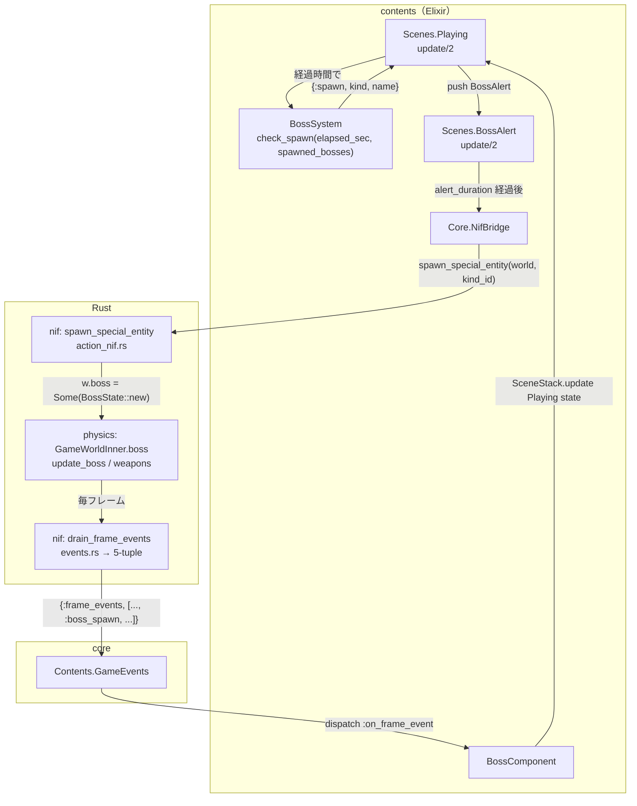
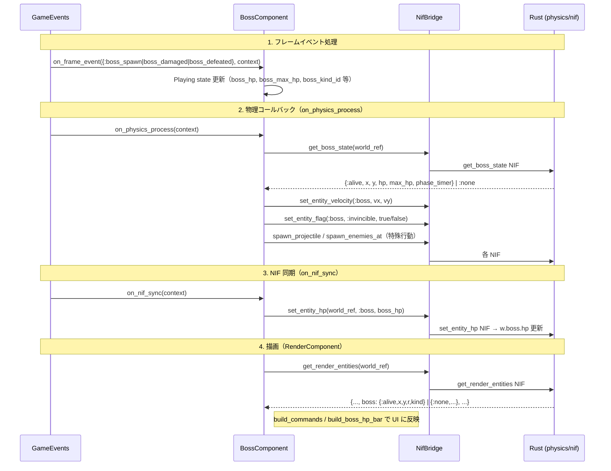
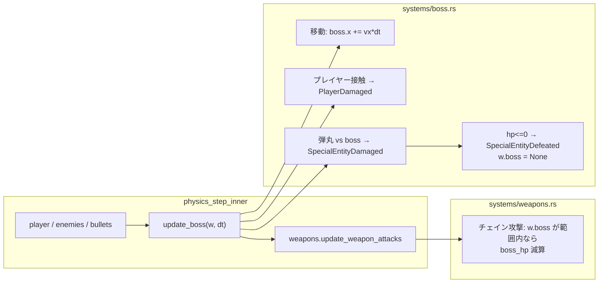
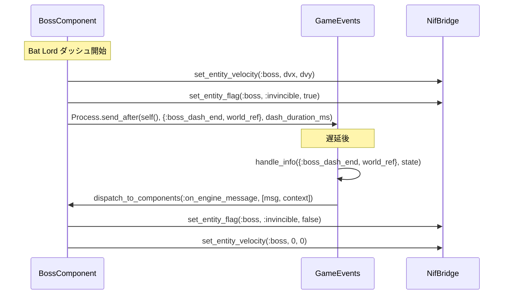
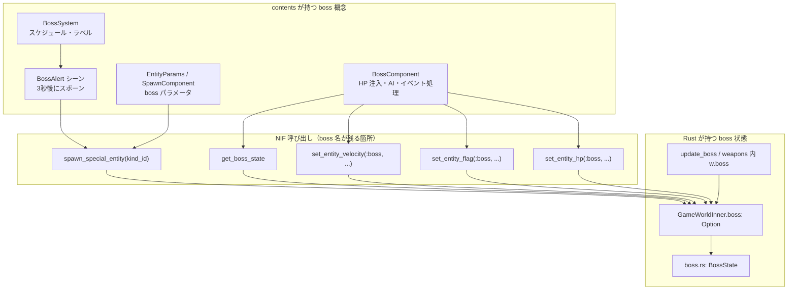
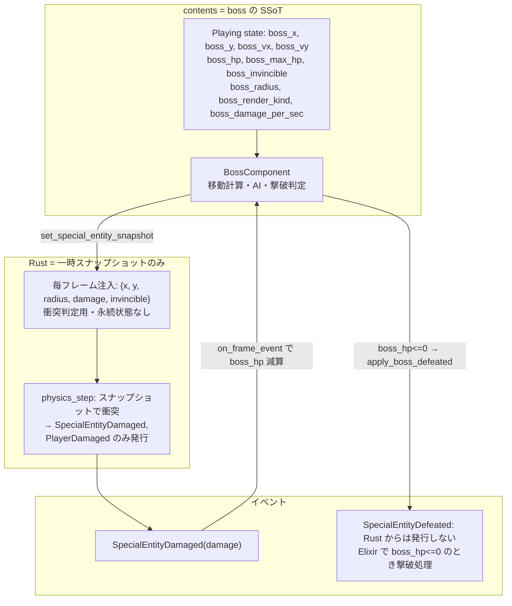

# Boss 処理のコンテンツ移行手順書

> 作成日: 2026-03-05  
> 更新: 2026-03-05（Rust 側 boss 状態の駆除に方向転換）  
> 目的: boss の**状態**を Rust から完全に除去し、Elixir（contents）を SSoT にする。  
> 現状の `GameWorldInner.boss` は Elixir SSoT を否定しており、**駆除**する。  
>  
> **関連**: [game-state-to-contents-migration.md](./game-state-to-contents-migration.md) で PlayerState ・weapon_slots と統合した効率的な実施手順を定義している。boss 単体移行よりも、そちらを優先することを推奨する。

---

## 0. 現状設計（boss 関連処理のマーメイド図）

### 0.1 全体フロー：ボス出現〜撃破まで



### 0.2 毎フレームのデータ流れ（Elixir ↔ Rust）



### 0.3 Rust 側の boss 関連処理



### 0.4 エンジンメッセージ（boss_dash_end）



### 0.5 コンポーネント・シーンと NIF の対応



### 0.6 目標設計（Elixir SSoT、Rust は状態を持たない）



---

## 1. 背景と目的

### 1.1 原則（実装ルール・ビジョン）

- **Elixir = SSoT**: ゲームロジックの制御フロー・パラメータは Elixir（contents）側が持つ。
- **Rust = 演算層**: 物理演算・描画は Rust 側で処理し、Elixir からパラメータを注入する。
- **層間インターフェース**: 固有の概念を NIF 名や型名に露出しない。

現状の **`GameWorldInner.boss: Option<BossState>`** は、boss の位置・HP・速度等を Rust 側で保持しており、  
**Elixir SSoT を否定している**。本手順書は、この状態を**駆除**し、boss の状態を contents に集約する。

### 1.2 目標状態（Rust は boss 状態を持たない）

| 層 | 目標 |
|:---|:---|
| **contents** | boss の **全状態**（x, y, vx, vy, hp, max_hp, invincible, radius, render_kind, damage_per_sec）を保持。移動・AI・撃破判定は Elixir で行う。 |
| **Rust physics** | boss の**永続状態を持たない**。毎フレーム、Elixir から衝突用スナップショット（x, y, radius, damage, invincible）を受け取り、弾丸/プレイヤーとの衝突のみ判定。SpecialEntityDamaged / PlayerDamaged を発行。SpecialEntityDefeated は **Rust からは発行しない**。 |
| **Rust nif** | `get_boss_state` / `set_entity_hp` / `set_entity_velocity` / `set_entity_flag` / `spawn_special_entity` を廃止。新規 `set_special_entity_snapshot` のみ。 |
| **描画** | `get_render_entities` から boss を削除。RenderComponent は Playing state の boss データから描画コマンドを組み立てる。 |

---

## 2. 現状サマリ

### 2.1 駆除対象（Rust が持つ boss 状態）

| 層 | 駆除対象 | 備考 |
|:---|:---|:---|
| **physics** | `GameWorldInner.boss: Option<BossState>` | 永続状態。**完全削除**。 |
| **physics** | `world/boss.rs`（BossState） | **削除**。衝突用スナップショットは軽量 struct で受け取るのみ。 |
| **physics** | `update_boss`（移動・HP 管理・撃破判定） | **削除**。衝突判定だけ残す。 |
| **nif** | `spawn_special_entity`, `get_boss_state`, `set_entity_hp`, `set_entity_velocity`, `set_entity_flag` | **廃止**。 |
| **nif** | `get_render_entities` の boss フィールド | **削除**。描画は Elixir の state から。 |
| **events** | `FrameEvent::SpecialEntityDefeated` を Rust から発行 | **廃止**。Elixir で boss_hp<=0 のときに撃破処理。 |

### 2.2 contents に移す責務

| 責務 | 現状 | 移行後 |
|:---|:---|:---|
| boss 位置 (x, y) | Rust | Playing state |
| boss 速度 (vx, vy) | Rust | BossComponent が計算、state 更新 |
| boss HP | Elixir と Rust の二重管理 | Elixir のみ |
| boss 移動 | Rust（vx,vy 注入） | Elixir が毎フレーム x,y を更新 |
| 撃破判定 | Rust（hp<=0） | Elixir（boss_hp<=0 のとき apply_boss_defeated） |
| 描画データ | get_render_entities | Playing state から RenderComponent が組み立て |

---

## 3. 移行手順（駆除の方針で再構成）

### Phase 1: Elixir に boss 状態を完全に移行

**目的:** contents が boss の全状態（x, y, vx, vy, hp, radius 等）を SSoT として持つ。

1. **Playing state の拡張**
   - 追加フィールド: `boss_x`, `boss_y`, `boss_vx`, `boss_vy`, `boss_hp`, `boss_max_hp`, `boss_invincible`, `boss_radius`, `boss_render_kind`, `boss_damage_per_sec`, `boss_kind_id`（既存の `boss_hp`, `boss_max_hp`, `boss_kind_id` を拡張）。
   - ファイル: `vampire_survivor/scenes/playing.ex`

2. **BossAlert の変更**
   - `spawn_special_entity` を呼ばない。代わりに BossAlert が pop するときに、Playing に transition で戻る際に `boss_x`, `boss_y`, `boss_hp` 等を初期化した state を渡す。
   - または BossComponent の `on_frame_event` で「BossAlert が pop した」ことを検知して state を初期化する仕組みを用意。  
   - **案**: BossAlert の `{:transition, :pop}` で戻るとき、Playing の `handle_no_death` 等で「直前の transition が BossAlert pop」であれば state に boss 初期値をセット。または、BossAlert が `{:transition, :pop, %{boss_just_spawned: {kind_id, x, y, ...}}}` のように戻り、Playing がそれを受けて state を更新。
   - シンプル案: **BossAlert が pop する直前に、BossComponent が「スポーン予約」フラグを立て、次のフレームで BossComponent が NIF を呼ばずに Playing state を直接更新する**。この場合、`spawn_special_entity` は廃止し、Elixir が state を更新するだけ。

3. **BossComponent の責務変更**
   - `on_physics_process`: `get_boss_state` を呼ばない。代わりに Playing state から boss_x, boss_y, boss_kind_id を取得。
   - 移動計算を Elixir で行い、`boss_x += vx*dt`, `boss_y += vy*dt` を SceneStack.update で反映。
   - `on_nif_sync`: `set_entity_hp` をやめる。代わりに `set_special_entity_snapshot(world, {:alive, x, y, radius, damage_per_sec, invincible})` を呼ぶ（Phase 2 で NIF を追加してから）。
   - ファイル: `boss_component.ex`

---

### Phase 2: Rust から boss 永続状態を駆除し、スナップショット注入に置換

**目的:** `GameWorldInner.boss` を削除。Rust は毎フレーム受け取るスナップショットで衝突判定のみ行う。

1. **新 NIF: `set_special_entity_snapshot`**
   - 引数: `world`, `{:alive, x, y, radius, damage_per_sec, invincible}` または `:none`。
   - Rust は `GameWorldInner` に `special_entity_snapshot: Option<SpecialEntitySnapshot>` を追加（軽量、永続移動・HP なし）。
   - 毎フレーム `on_nif_sync` 内で Elixir が呼ぶ。Rust ゲームループは非同期のため、**1 tick 遅れ**でスナップショットが反映される（Rust が tick N の physics_step を行う時点では、Elixir は tick N-1 の events を処理済みで tick N-1 のスナップショットを注入済み。 tick N の physics_step ではそのスナップショットを使用）。この遅れはボス衝突程度であれば許容範囲とし、必要に応じてループ構造の見直しを検討する。
   - ファイル: `native/nif/src/nif/action_nif.rs`（または新規）、`nif_bridge.ex`

2. **physics の変更**
   - `GameWorldInner.boss` を削除。
   - `special_entity_snapshot: Option<SpecialEntitySnapshot>` を追加。`SpecialEntitySnapshot { x, y, radius, damage_per_sec, invincible }` のみ。
   - `update_boss` を削除。代わりに `collide_special_entity_snapshot(w)` を呼び、スナップショットと弾丸・プレイヤーとの衝突を判定。SpecialEntityDamaged / PlayerDamaged を発行。 SpecialEntityDefeated は発行しない。
   - `boss.rs` / `BossState` を削除。
   - ファイル: `game_world.rs`, `physics_step.rs`, `game_logic/systems/` に `special_entity_collision.rs` 等を新設。

3. **weapons.rs のチェイン攻撃**
   - 現状 `w.boss` を参照。スナップショットがあれば `w.special_entity_snapshot` を使用。範囲内なら SpecialEntityDamaged を発行（HP 減算は Elixir が on_frame_event で行う）。
   - ファイル: `weapons.rs`

---

### Phase 3: 廃止 NIF の削除と FrameEvent の整理

**目的:** 不要になった NIF と Rust 発行イベントを削除する。

1. **廃止 NIF**
   - `spawn_special_entity`, `get_boss_state`, `set_entity_hp`, `set_entity_velocity`, `set_entity_flag`（boss 用）を削除。
   - `set_entity_*` は `{:enemy, index}` 用に残す場合あり。boss 用の分岐を削除。
   - ファイル: `action_nif.rs`, `read_nif.rs`, `nif_bridge.ex`, `lib.rs`

2. **FrameEvent**
   - `SpecialEntityDefeated`: Rust から発行しなくなる。Elixir の BossComponent が `on_frame_event(SpecialEntityDamaged)` で boss_hp を減算し、`boss_hp <= 0` のときに `apply_boss_defeated` / `drop_boss_gems` を直接実行。
   - `SpecialEntitySpawned`: Rust から発行しなくなる。BossAlert pop 時に Elixir が state を初期化するだけ。
   - `SpecialEntityDamaged`: Rust が引き続き発行。Elixir が HP 減算。
   - ファイル: `events.rs`, `frame_event.rs`（Defeated / Spawned は Rust 側で削除可能なら削除。他コンテンツで使わなければ。あるいは空でも保持して将来用に。）

---

### Phase 4: 描画を Elixir state から組み立て

**目的:** `get_render_entities` から boss を削除。RenderComponent が Playing state から描画する。

1. **get_render_entities**
   - 戻り値のタプルから `boss` フィールドを削除。シグネチャ変更に伴い Elixir 側のパターンマッチを修正。
   - ファイル: `read_nif.rs`, `render_component.ex`

2. **RenderComponent**
   - `get_render_entities` で boss を取得しない。代わりに Playing state（または context 経由）から `boss_x`, `boss_y`, `boss_radius`, `boss_render_kind` を取得し、描画コマンドに追加。
   - `build_boss_hp_bar` は `playing_state.boss_hp`, `boss_max_hp` をそのまま使用（既に Elixir にある）。
   - ファイル: `render_component.ex`

---

### Phase 5: GameEvents・エンジンメッセージの整理

**目的:** `boss_dash_end` を汎用化（任意）。BossComponent は state のみでダッシュ終了を扱える場合もある。

1. **boss_dash_end**
   - 現状: BossComponent が `Process.send_after(self(), {:boss_dash_end, world_ref}, ms)` で送信。GameEvents が `on_engine_message` に転送。BossComponent が `set_entity_flag(:boss, :invincible, false)` 等を呼ぶ。
   - 移行後: BossComponent は NIF を呼ばない。`playing_state.boss_invincible` を false にし、`boss_vx`, `boss_vy` を 0 にするだけ。SceneStack.update で反映。
   - `handle_info({:boss_dash_end, _})` は、BossComponent が「ダッシュ終了」を state 更新で表現するため、メッセージ受信時に SceneStack.update で `boss_invincible: false`, `boss_vx: 0`, `boss_vy: 0` を設定する。
   - ファイル: `game_events.ex`, `boss_component.ex`

2. **パラメータ SSoT の一本化**（任意）
   - `entity_params.ex` を唯一の SSoT とする。`spawn_component` の重複を除去。
   - ファイル: `entity_params.ex`, `spawn_component.ex`

---

## 4. 実施順序と依存関係

```
Phase 1 (Elixir に boss 状態移行) ──→ Phase 2 (Rust 駆除・スナップショット)
        │                                    │
        │                                    v
        │                            Phase 3 (廃止 NIF・FrameEvent)
        │                                    │
        v                                    v
Phase 5 (boss_dash_end 等) ←── Phase 4 (描画を state から)
```

推奨: **Phase 1 → Phase 2 → Phase 3 → Phase 4 → Phase 5**。  
Phase 1 で Elixir が boss 状態を完全に持つようにし、Phase 2 で Rust から削除。

---

## 5. 検証項目

- [ ] `mix compile` / `cargo build` が通る。
- [ ] **`GameWorldInner.boss` が存在しないこと。**（Rust に boss 永続状態が無いこと）
- [ ] VampireSurvivor でボス出現〜撃破まで通常どおり動作する（スポーン、AI、HP バー、チェイン武器、撃破時 EXP）。
- [ ] boss の HP・位置・速度が Elixir（Playing state）の SSoT から計算・描画されていること。
- [ ] `bin/ci.bat` が通過する。

---

## 6. 影響ファイル一覧（参照用）

| 層 | ファイル |
|:---|:---|
| contents | `playing.ex`, `boss_component.ex`, `render_component.ex`, `boss_alert.ex`, `entity_params.ex`, `spawn_component.ex`, `game_events.ex` |
| core | `nif_bridge.ex`, `nif_bridge_behaviour.ex` |
| nif | `lib.rs`, `action_nif.rs`, `read_nif.rs`, `events.rs`, `game_loop_nif.rs`（スナップショット注入タイミング） |
| physics | `game_world.rs`, `world/mod.rs`, `physics_step.rs`, `game_logic/systems/boss.rs`（削除）, `game_logic/systems/special_entity_collision.rs`（新規）, `weapons.rs` |
| docs | `vision.md`, `game-content.md`, `rust-layer.md`, `pending-issues.md` |

---

*この手順書は、Elixir SSoT の原則に従い、Rust 側の boss 状態を駆除するためのものである。*
