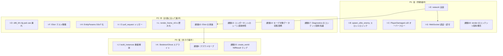
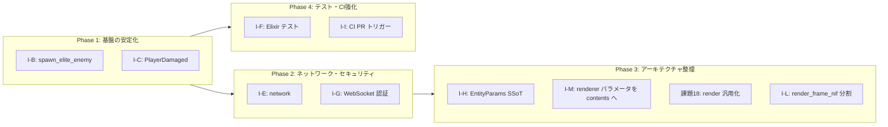
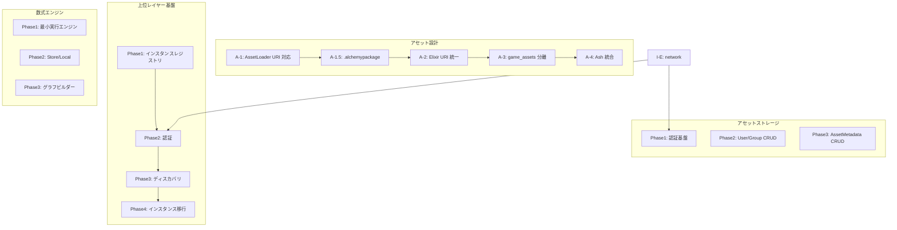

# 実装優先度 — Mermaid 図

> 最終更新: 2026-03-05  
> 参照: [docs/plan/](../plan/)、[improvement-plan.md](./improvement-plan.md)

---

## 全体優先度マップ（改善課題・設計タスク）

---

## 依存関係と推奨実施順序

---

## 計画ドキュメント別の優先度整理

### improvement-plan.md の課題

| ID | 課題 | 優先度 | Phase |
|:---|:---|:---:|:---:|
| I-D | x86_64 cfg pub use 漏れ | 中 | 4 |
| I-E | network 実装 | 高 | 2 |
| I-F | Elixir テスト整備 | 中 | 4 |
| I-G | WebSocket 認証・認可 | 高 | 2 |
| I-H | EntityParams SSoT 化 | 中 | 3 |
| I-I | CI pull_request トリガー | 中 | 4 |
| I-L | render_frame_nif.rs 肥大化 | 中 | 3 |
| I-M | renderer のゲーム固有パラメータを contents へ移行 | 中 | 3 |

### docs/plan 設計タスクの依存関係

---

## 実施順序サマリ（推奨）

1. **I-B, I-C** → バグ・安全性の即時対応
2. **I-E, I-G** → network と認証（Elixir の価値証明）
3. **I-F, I-I** → テスト・CI の強化
4. **I-H, I-L, 課題18** → アーキテクチャの汎用化・保守性向上
5. **A-1〜A-3** → アセット配信基盤（並行検討可）
6. **Upper Phase 1〜2** → インスタンスレジストリ・認証（network 後）
