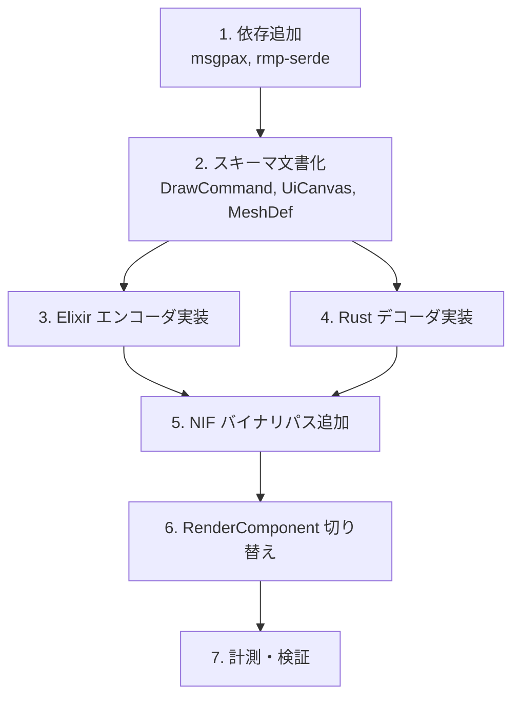

# P5-2 MessagePack バイナリ形式 — 実行計画書

> 作成日: 2026-03-07  
> 出典: [p5-transfer-optimization-design.md](../architecture/p5-transfer-optimization-design.md)

---

## 概要

Elixir ↔ Rust 間のデータ転送を MessagePack バイナリ形式に移行し、デコードオーバーヘッドを削減する。

| 項目 | 内容 |
|:---|:---|
| 形式 | MessagePack |
| Elixir ライブラリ | msgpax |
| Rust ライブラリ | rmp-serde / rmp |
| 主な適用対象 | push_render_frame（DrawCommand・UiCanvas・Camera・MeshDef） |

---

## 実施タスク

### Phase 1: 基盤整備

| # | タスク | 担当 | 成果物 |
|:---:|:---|:---|:---|
| 1 | msgpax を mix.exs に追加 | Elixir | `{:msgpax, "~> 2.4"}` |
| 2 | rmp-serde を Cargo.toml（nif）に追加 | Rust | `rmp-serde = "1.3"` |
| 3 | DrawCommand の MessagePack スキーマ文書化 | docs | DrawCommand ↔ MessagePack 型マッピング表 |
| 4 | UiCanvas・MeshDef の MessagePack スキーマ文書化 | docs | 同上 |

### Phase 2: push_render_frame MessagePack パス

| # | タスク | 担当 | 成果物 |
|:---:|:---|:---|:---|
| 5 | Elixir: DrawCommand リストを msgpax でバイナリ化する関数 | contents | `MessagePackEncoder.encode_commands/1` 等 |
| 6 | Elixir: UiCanvas を msgpax でバイナリ化する関数 | contents | `MessagePackEncoder.encode_ui/1` 等 |
| 7 | Elixir: CameraParams・MeshDef を msgpax でバイナリ化 | contents | 同上 |
| 8 | NIF: push_render_frame のバイナリ引数オーバーロード追加 | nif | `push_render_frame_binary/3` 等（タプル版は残す） |
| 9 | Rust: rmp-serde でバイナリをデコードし DrawCommand 等に変換 | nif | `decode_commands_from_msgpack` 等 |
| 10 | RenderComponent: MessagePack パスを呼び出すよう切り替え | contents | VampireSurvivor 等の RenderComponent |
| 11 | 動作確認・パフォーマンス計測 | - | ベンチマーク結果 |

### Phase 3: 後方互換・段階移行（オプション）

| # | タスク | 担当 | 成果物 |
|:---:|:---|:---|:---|
| 12 | コンテンツごとの MessagePack 有効化フラグ | core | Config または ContentBehaviour で切り替え |
| 13 | set_frame_injection の MessagePack 化（将来） | - | 別タスク |

---

## 実施順序

1. **Step 1**: 依存関係の追加（msgpax, rmp-serde）
2. **Step 2**: 型マッピングの文書化（DrawCommand 仕様に基づく）
3. **Step 3–4**: Elixir エンコーダ・Rust デコーダの並行実装
4. **Step 5**: push_render_frame のバイナリパス NIF 追加
5. **Step 6**: RenderComponent から MessagePack パスを呼び出し
6. **Step 7**: パフォーマンス計測・回帰テスト

---

## 完了条件

- [ ] push_render_frame を MessagePack バイナリで呼び出せる
- [ ] VampireSurvivor が MessagePack パスで正常に描画される
- [ ] タプル形式パスは残存し、必要に応じてフォールバック可能
- [ ] スキーマ変更時の Elixir/Rust 両方更新手順が文書化されている
