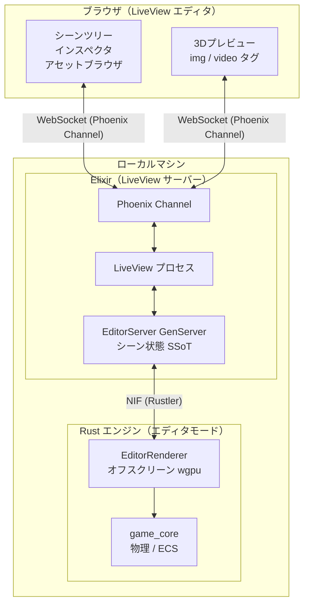
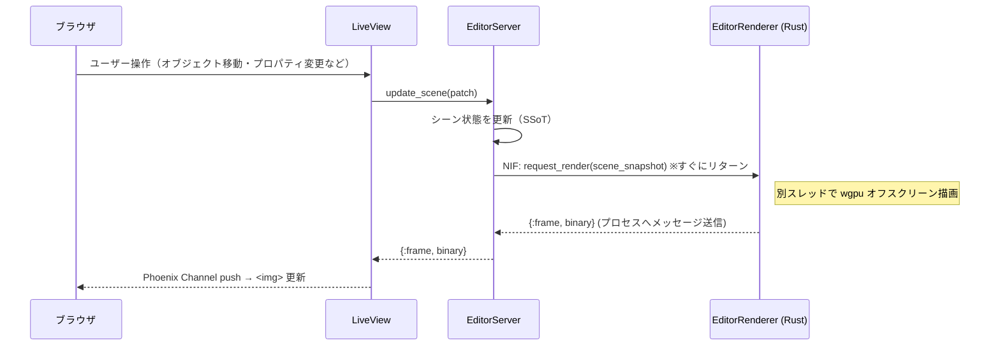
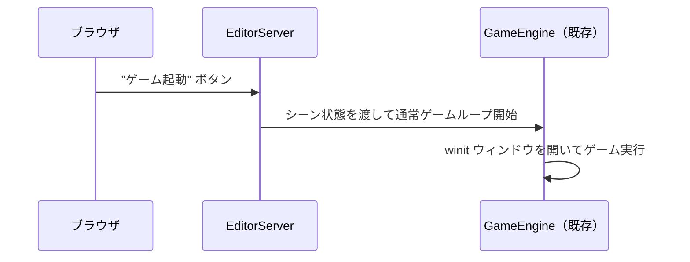

# ビジュアルエディタ — アーキテクチャ設計

## 設計思想

AlchemyEngine のビジュアルエディタは **「エンジン本体がエディタのプレビューサーバーになる」** という原則に基づく。

エディタの3Dビューは three.js 等の別レンダラーではなく、**wgpu によるオフスクリーンレンダリング結果をブラウザへストリーミングする**方式を採用する。これにより：

- シェーダー・ライティング・パーティクルの見た目が本番と**完全に一致**する（WYSIWYG）
- エディタで配置したシーンを**そのままゲームとして起動できる**
- Rust 側のレンダリングコードを**二重管理しない**

UnrealEngine・Unity が採用する「エディタ = エンジン本体をエディタモードで動かす」構造と同じ発想を、Elixir + Rust のハイブリッド構成で自然に実現する。

---

## 全体構成



---

## データフロー

### 1. エディタ操作 → プレビュー更新

`render_frame` を同期 NIF で呼び出すと、レンダリング中に `EditorServer` がブロックされ、ドラッグ操作などの高頻度更新時にエディタ全体の応答性が低下する。そのため **非同期 NIF** を採用し、レンダリング完了後に Rust 側から Elixir プロセスへメッセージを送信する方式とする。



### 2. プレビューからゲーム起動



---

## コンポーネント詳細

### Elixir 側：EditorServer

`EditorServer` は `GenServer` として実装し、**シーン状態の SSoT** を担う。

```
責務：
- シーンツリー（オブジェクト・コンポーネント・階層）の管理
- インスペクタのプロパティ変更の受付
- アセット一覧の管理
- フレームレート制御（エディタは 30fps 程度で十分）
- ゲーム起動時の GameEngine へのシーン受け渡し
```

```elixir
# 概念的なインターフェース
EditorServer.update_scene(patch)        # シーン状態を更新
EditorServer.request_frame()            # フレームを要求
EditorServer.export_scene()             # ゲーム起動用にシーンをエクスポート
EditorServer.list_assets()              # アセット一覧取得
```

### Rust 側：EditorRenderer

`game_render` クレートに **オフスクリーンモード** を追加する形で実装する。既存の `Renderer` 構造体を流用し、`winit` ウィンドウを持たない派生モードとして切り出す。

```
責務：
- wgpu Surface の代わりに Texture をレンダーターゲットとして使用
- 描画結果を Vec<u8>（RGBA ピクセル列）として返す
- レンダリング完了後、Elixir プロセスへ非同期メッセージを送信する
```

```rust
// 概念的なインターフェース（非同期 NIF）
impl EditorRenderer {
    // すぐにリターンし、完了時に pid へ {:frame, binary} を送信する
    pub fn request_render(&mut self, scene: &SceneSnapshot, pid: LocalPid);
}
```

---

## オフスクリーンレンダリングの実装方針

wgpu でオフスクリーン描画を行い、ピクセルデータを CPU 側へ読み戻す。

```
wgpu::Texture（RENDER_ATTACHMENT | COPY_SRC）
    ↓ render pass
wgpu::Buffer（MAP_READ | COPY_DST）
    ↓ buffer.map_async()
Vec<u8>（RGBA ピクセル列）
    ↓ Rustler NIF
Elixir binary
    ↓ Phoenix Channel
ブラウザ 
```

### フレームレート戦略

| モード | fps | 転送方式 | 用途 |
|---|---|---|---|
| 静止プレビュー | オンデマンド | PNG（Base64） | オブジェクト選択・プロパティ編集 |
| アニメーションプレビュー | 30fps | JPEG（Motion JPEG）または WebCodecs | パーティクル・アニメーション確認 |
| ゲーム起動後 | 60fps | winit ウィンドウ（既存） | 本番プレイ |

エディタ使用中は **静止プレビューが主体** のため、操作のたびにオンデマンドで1フレーム描画する方式が最もシンプルで効率的。

アニメーションプレビューで生ピクセル（RGBA）をそのまま転送すると、1280×720 解像度では 1フレームあたり約 3.7MB・30fps で 110MB/s を超える。ローカル環境でもボトルネックになりうるため、**JPEG 圧縮（Motion JPEG）を第一候補**とし、ブラウザの対応状況に応じて WebCodecs への移行を検討する。

---

## ディレクトリ構造（追加分）

```
alchemy-engine/
├── apps/
│   ├── game_editor/                     # ← 新規追加
│   │   ├── mix.exs
│   │   └── lib/game_editor/
│   │       ├── application.ex           # Supervisor
│   │       ├── editor_server.ex         # シーン状態 SSoT GenServer
│   │       ├── editor_live.ex           # Phoenix LiveView ルート
│   │       ├── components/
│   │       │   ├── scene_tree.ex        # シーンツリー LiveComponent
│   │       │   ├── inspector.ex         # インスペクタ LiveComponent
│   │       │   ├── preview_canvas.ex    # 3Dプレビュー LiveComponent
│   │       │   └── asset_browser.ex     # アセットブラウザ LiveComponent
│   │       └── channels/
│   │           └── editor_channel.ex    # Phoenix Channel（フレームストリーミング）
│   └── ...（既存）
│
└── native/
    ├── game_render/
    │   └── src/
    │       ├── renderer/
    │       │   ├── mod.rs               # 既存 Renderer（winit あり）
    │       │   └── offscreen.rs         # ← 新規追加（オフスクリーンモード）
    │       └── ...
    └── ...（既存）
```

---

## 対象プラットフォーム

ビジュアルエディタはゲームと同じく **Windows / Linux / macOS** のみを対象とする。

| プラットフォーム | 対応 | 備考 |
|---|---|---|
| Windows | ✅ | wgpu DX12/Vulkan |
| Linux | ✅ | wgpu Vulkan |
| macOS | ✅ | wgpu Metal |
| WebAssembly | ❌ | 対象外 |

エディタ自体の UI はブラウザ（LiveView）だが、**バックエンドのエンジンはローカルで動くネイティブプロセス**であるため、WASM 化は不要。

---

## 実装フェーズ

### フェーズ 1：オフスクリーンレンダリング基盤

- `game_render` に `offscreen.rs` を追加
- 固定シーン（スプライト数枚）をオフスクリーン描画して PNG として出力する PoC
- NIF 経由で Elixir から呼び出せることを確認

### フェーズ 2：EditorServer と LiveView の骨格

- `game_editor` アプリを Umbrella に追加
- `EditorServer` GenServer の実装（シーン状態の CRUD）
- Phoenix LiveView でシーンツリーとプレビューの最小構成を表示

### フェーズ 3：インタラクティブ編集

- オブジェクトの追加・削除・移動
- インスペクタでのプロパティ編集
- 操作のたびにプレビューを更新

### フェーズ 4：アセットブラウザ・アニメーションプレビュー

- アセット一覧の表示・ドラッグ配置
- 30fps アニメーションプレビューモード

### フェーズ 5：ゲーム起動統合

- エディタからゲームを直接起動
- `EditorServer` のシーン状態を `GameEngine` へ受け渡し

---

## 関連ドキュメント

- [アーキテクチャ概要](./architecture-overview.md)
- [Rust レイヤー詳細](./rust-layer.md)
- [データフロー・通信](./data-flow.md)