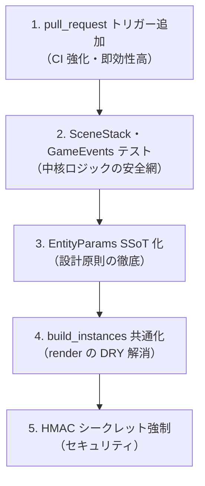

# AlchemyEngine — マイナス点に基づく改善提案書

> 評価日: 2026-03-23  
> 出典: [evaluation-2026-03-23.md](../../docs/evaluation/archive/evaluation-2026-03-23.md)  
> 参照: [specific-weaknesses.md](../evaluation/specific-weaknesses.md)

---

## 優先度別 改善項目一覧

### 🔴 最優先（設計上の明確な欠陥・-3点）

| # | 項目 | 影響 | 改善方針 |
|:---:|:---|:---|:---|
| 1 | Contents.SceneStack・GameEvents のテストがゼロ | リファクタリングの安全網がない。シーン遷移・フレームループの回帰リスク | `ExUnit` で SceneStack の push/pop 遷移、GameEvents の frame_events 受信→dispatch をテスト。StubRoom 同様に NIF 依存を排除したテスト設計 |
| 2 | EntityParams と SpawnComponent のパラメータ二重管理 | 3箇所（entity_params / spawn_component / Rust）に同期漏れリスク | entity_params.ex を唯一の SSoT とし、spawn_component は EntityParams を呼ぶだけに。Rust は set_entity_params NIF で受け取るのみ |
| 3 | build_instances 関数の重複（render/headless） | スプライト種別追加時に両方修正が必要。同期漏れ | `pub(crate)` の共通関数（例: `sprite_uv_and_size`）を抽出し、renderer/mod.rs と headless.rs の両方から利用 |
| 4 | 分散ノード間フェイルオーバーが未実装 | 「なぜ Elixir + Rust か」の分散面の証明が不足 | libcluster によるクラスタリング・ルームのノード間移動のシナリオを実装。[improvement-plan.md](./improvement-plan.md) I-E と連携 |
| 5 | プロパティベーステスト・ファジングがゼロ | 境界条件・不変条件の自動検証が未整備 | StreamData で LevelSystem / BossSystem / SpawnSystem の不変条件を検証。cargo-fuzz で decode 関数にファズターゲット追加 |
| 6 | nif・render・audio・network・shared の Rust テストがゼロ | デコードロジック・ヘッドレス描画の回帰リスク | decode ロジック・headless 描画パスのテスト。shared の interp ユニットテスト |
| 7 | xr の OpenXR 統合が未実装 | VR 入力が動作しない | run_openxr_loop に OpenXR インスタンス・ヘッドレスセッション・xrLocateSpace 実装 |

---

### 🟠 高優先（重要な機能・設計の欠如・-2点）

| # | 項目 | 影響 | 改善方針 |
|:---:|:---|:---|:---|
| 8 | SaveManager の HMAC シークレットがデフォルト値でハードコード | 本番環境でセーブ改ざん検証が実質無効化 | `runtime.exs` で `System.fetch_env!("SAVE_HMAC_SECRET")` を使うか、未設定時に起動を拒否する強制機構を追加 |
| 9 | LevelComponent のアイテムドロップロジックの重複 | 同一撃破で二重ドロップの可能性 | enemy_killed と entity_removed の対応関係を明確化。単一のドロップ判定パスに集約 |
| 10 | AsteroidArena のテストがゼロ | SplitComponent・SpawnSystem の動作が未検証 | VampireSurvivor と同様に純粋関数・ロジック部分の ExUnit テストを追加 |
| 11 | Skeleton/Ghost の UV がプレースホルダー | 視覚的に区別不可。ゲーム完成度を損なう | アトラスに専用スプライトを追加し、UV マッピングを更新 |
| 12 | Vertex/VERTICES 等の重複定義 | 構造体・定数の二重管理 | `pub(crate)` で共通モジュールに集約 |
| 13 | [:game, :session_end] が metrics/0 に未登録 | セッション終了統計が可観測性ツールに流れない | telemetry.ex の metrics/0 に `[:game, :session_end]` 用の summary/counter を追加 |
| 14 | :telemetry.attach がゼロ | 外部監視ツール（Prometheus 等）への接続口なし | phoenix_live_dashboard や Prometheus 用の attach を追加（提案として specific-proposals に記載済み） |
| 15 | CI の pull_request トリガーが未設定 | PR マージ前の品質保証が機能しない | `.github/workflows/ci.yml` に `pull_request: branches: ["**"]` を追加 |
| 16 | E2E テストがゼロ | ゲームループ完結性（開始→終了→リトライ）が未検証 | headless.rs を活用した E2E テストを追加 |
| 17 | 視覚的完成度（Skeleton/Ghost） | 同上 #10 | 同上 |
| 18 | mix audit / cargo audit の CI 組み込みなし | 脆弱性検出が手動依存 | CI に mix_audit と cargo audit ジョブを追加 |
| 19 | ビルド成果物の配布手順が未整備 | エンドユーザー向け配布形態が未定義 | Windows/macOS/Linux 向けのパッケージング手順を docs に記載 |

---

### 🟡 中優先（改善余地あり・-1点）

| # | 項目 | 改善方針 |
|:---:|:---|:---|
| 20 | boss_dash_end の専用 handle_info 節 | 汎用ディスパッチ `{:engine_message, tag, payload}` に統一。新規メッセージ追加時に GameEvents の変更が不要に |
| 21 | Enum.find_last/2 回避コメントが不正確 | Elixir 1.19 で使える旨にコメントを修正。または実際に Enum.find_last/2 を使用してコードを簡潔化 |
| 22 | Stats GenServer の二重集計リスク | EventBus 経由か record_* API のどちらか一方に統一。または「record_* は内部用、EventBus が外部用」と役割を明記 |
| 23 | lock_metrics 閾値が constants.rs に未集約 | lock_metrics.rs の定数を physics/constants.rs または nif 内の constants モジュールに移す |
| 24 | bench-regression のローカル実行スクリプトなし | `bin/bench.bat` 等を追加し、ローカルで `cargo bench -p physics` を実行可能に |
| 25 | README Contributing がプレースホルダー | コントリビューションの流れ（PR 作成→レビュー→マージ）を簡潔に記載 |
| 26 | shared の predict/store がスケルトン | predict_input に予測ロジック、Store に過去・現在ペア管理を実装 |
| 27 | nif が shared に非依存 | nif の Cargo.toml に shared を追加。BG_R/G/B 等を shared へ移行 |
| 28 | app が nif 経由で SCREEN_WIDTH/HEIGHT 取得 | shared に画面定数を定義し、app は shared 経由で取得 |
| 29 | window/common が未実装 | マウス座標・DPI スケール変換を common に実装 |

---

## 関連タスク

| タスク | 説明 | 計画書 |
|:---|:---|:---|
| P5-2 Protobuf フレーム | 転送効率化（`proto/render_frame.proto`・`FrameEncoder`） | [p5-transfer-protobuf-implementation-plan.md](../7_done/p5-transfer-protobuf-implementation-plan.md) |
| クライアント・サーバー分離 | render + input を別 exe 化、Elixir/Rust 状態・定義の切り分け | [client-server-separation-procedure.md](../7_done/client-server-separation-procedure.md)（未実施は [client-server-separation-future.md](./client-server-separation-future.md)） |
| fix_contents: Elixir–Rust 境界 | 新アーキテクチャ（Node/Component/Object）における NIF・shared・レンダーとの境界が未定義。既存 `on_nif_sync` 相当の役割をどこで担うか、Node/Component の状態がいつ Rust に渡るかを文書化する | [fix_contents.md](../../docs/architecture/fix_contents.md) |

---

## 推奨実施順序

1. **即時**: pull_request トリガー追加（1行変更で効果大）
2. **短期**: SceneStack・GameEvents テスト、EntityParams SSoT 化
3. **中期**: build_instances 共通化、HMAC 強制、AsteroidArena テスト
4. **長期**: 分散フェイルオーバー、プロパティ/E2E テスト、mix/cargo audit
