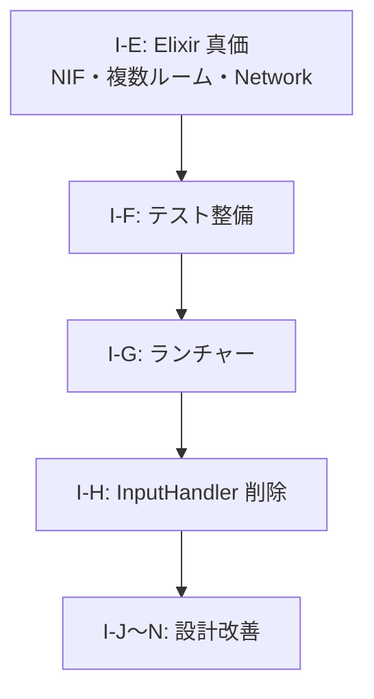

# AlchemyEngine — 改善計画

> このドキュメントは現在の弱点を整理し、各課題に対する具体的な改善方針を定義する。
> 優先度・影響範囲・作業ステップを明記することで、改善作業を体系的に進めることを目的とする。
>
> 最新の評価: [evaluation-2026-03-08.md](../../evaluation/evaluation-2026-03-08.md)  
> プラス点: [specific-strengths.md](../../evaluation/specific-strengths.md) / マイナス点: [specific-weaknesses.md](../../evaluation/specific-weaknesses.md) / 提案: [specific-proposals.md](../../evaluation/specific-proposals.md)

---

## スコアカード（現状評価）

| カテゴリ | 点数 | 主な減点理由 |
|:---|:---:|:---|
| Rust 物理演算・SoA 設計 | 9/10 | — |
| Rust SIMD 最適化 | 9/10 | — |
| Rust 並行性設計 | 8/10 | — |
| Rust 安全性（unsafe 管理） | 8/10 | — |
| Elixir OTP 設計 | 8/10 | — |
| Elixir 耐障害性 | 6/10 | NIF エラーは捕捉済みだが、ゲームループ再起動などの完全な回復ロジックが未実装 |
| Elixir 並行性・分散 | 3/10 | WebSocket 認証は実装済み。分散ノード間フェイルオーバーは未実装 |
| Elixir ビヘイビア活用 | 7/10 | — |
| アーキテクチャ（ビジョン一致度） | 7/10 | — |
| テスト | 6/10 | SceneStack・GameEvents のテストがゼロ。プロパティ/E2E もゼロ |
| **総合** | **7/10** | |

---

## 課題一覧

### I-E: Elixir の真価（OTP・並行性・分散）の証明不足

**優先度**: 🟡 高

**問題**

Elixir を選んだ最大の根拠である「OTP による耐障害性」「軽量プロセスによる大規模並行性」「分散ノード間通信」が、現状のコードでは十分に証明されていない。

- **NIF 安全性**: NIF がパニックすると BEAM VM ごと落ちる。`NifResult<T>` への統一、Elixir 側での NIF エラー回復ロジックが未整備
- **複数ルーム**: `RoomSupervisor` は複数ルーム想定だが、実際には `:main` 1 つのみ。複数ルーム同時稼働の検証が不足
- **Network**: `Network.Local`・`Network.Distributed`・`Network.Channel`・`Network.UDP` は実装済み。分散ノード間フェイルオーバー、`Contents.Events.Game` から Network へのブロードキャスト統合が残課題

**改善方針**

1. NIF の全関数戻り値を `NifResult<T>` に統一（`create_world` 含む）
2. 複数ルーム同時稼働の統合テストを追加
3. GameEvents → Network のブロードキャスト統合、分散フェイルオーバー対応

---

### I-F: Elixir 側のテストがほぼ未整備（テスト 5/10 の原因）

**優先度**: 🟢 中

**問題**

Rust 側には `chase_ai.rs`・`spatial_hash.rs` 等に単体テストが存在するが、Elixir 側（`GameEvents`・`Contents.SceneStack`・各シーン・コンポーネント）のテストがほぼ存在しない。

**改善方針**

- `Contents.SceneStack` のシーン遷移ロジックを `ExUnit` でテストする
- `GameContent.VampireSurvivor.Scenes.Playing.update/2` の純粋関数部分（EXP 計算・レベルアップ判定）を単体テストする
- `GameEngine.EventBus` のサブスクライバー配信をテストする

**影響ファイル**

- `apps/core/test/` — 新規テストファイル群
- `apps/contents/test/` — 新規テストファイル群

---

### I-G: ランチャー（launcher）の課題

**優先度**: 🟢 中

**出典**: `launcher-design.md`（統合により削除済み）

**現状起こっている問題（2026-03-08 時点）**

| # | 問題 | 内容 | 影響 |
|:---|:---|:---|:---|
| 1 | **ポート確認の誤検知** | zenohd は実際に起動・待ち受けしているのに、「zenohd が 10 秒以内に起動しませんでした」と表示される | zenohd Run が失敗扱いになり、ユーザーが誤認する |
| 2 | **一気に作りすぎた** | トレイ・メニュー・zenohd・HL-Server・Client・アイコン・非同期化・メニュー再構築をまとめて実装 | 問題の切り分けが難しく、どこで壊れているか特定しづらい |
| 3 | **動くことの検証不足** | 各フェーズごとに「起動する」「操作できる」を確認せずに次へ進んだ | 土台が固まる前に上に積み重ねてしまった |
| 4 | **zenohd 起動方式の本番不適** | Windows で `bin/start_zenohd.bat` 経由でしか安定起動できない | 本番環境ではバッチに依存せず直接起動したい |
| 5 | **メニュー状態の更新** | `set_enabled` がトレイ表示に反映されない問題があり、メニュー再構築で回避した | tray-icon のメニュー参照の扱いを理解しきれていない |

**背景の問題**

| 課題 | 内容 |
|:---|:---|
| 固定待機 | play.bat はポート確認を行うが、起動完了の可視化がない |
| プロセス管理 | zenohd / mix run が残り続け、ユーザーが気づきにくい |
| ログ参照 | コンソール出力を確認しづらい |
| 更新・謝辞 | 専用 UI がなく、手動で確認するしかない |

**将来対応課題**

| 課題 | 内容 | 現状 |
|:---|:---|:---|
| **zenohd の起動方式（Windows）** | Windows では `cmd /c start zenohd` で直接起動するとポート 7447 が応答しない場合があり、`bin/start_zenohd.bat` を経由して起動している | 開発環境では動作する。本番環境では zenohd を直接 spawn する方式への移行が望ましい |
| **mix run のみでサーバー起動** | サーバー（HL-Server）を起動するとウィンドウが立ち上がる。責務が分かれていない証拠。`mix run` のみでヘッドレスにサーバーが動くようにする | 現状は mix run に UI/描画が含まれており、ランチャーから起動時にウィンドウが表示される |

**リリース後の単体動作**

現状の実装ではランチャー単体では動作しない。インストール構成・zenohd 同梱・HL-Server の Elixir release 化・client_desktop のパス指定などが必要。`config/launcher.toml` でパス上書き可能にすればリリース構成に対応可能。

**改善方針**

変更を一度なかったことにし、フェーズ 0 から「動くこと」を確認しながら組み立て直す。実施計画は [launcher-design_do.md](./launcher-design_do.md) を参照。

**関連**

- [client-server-separation-procedure.md](../7_done/client-server-separation-procedure.md) — クライアント・サーバー分離（zenohd トレイ統合、未実施項目は [client-server-separation-future.md](client-server-separation-future.md)）

---

### I-H: LocalUserComponent 移行後の残課題

**優先度**: 🟢 低

**出典**: `local-user-component-design.md`（統合により削除済み）

LocalUserComponent への移行は完了済み（Contents.LocalUserComponent、Content.VampireSurvivor.LocalUserComponent、ComponentList の local_user_input_module、GameEvents の dispatch/get_move_vector を実装済み）。

| 課題 | 内容 |
|:---|:---|
| **Core.InputHandler の削除** | Application の子プロセスからは削除済みだが、モジュールファイル（`apps/core/lib/core/input_handler.ex`）が残存。LocalUserComponent 移行完了に伴いデッドコードとなっているため削除する |

**関連**: ContentBehaviour の `key_mapping/0` 追加、split-screen 時の `{room_id, user_id}` 拡張などは将来の拡張候補（現時点では課題として優先しない）。

---

### I-I: クラウドセーブ（独自サーバーによるセーブデータ同期）

**優先度**: 🟢 低（network の実装が前提）

**背景**

`SaveManager` は OS 標準ディレクトリへの JSON 保存 + HMAC 署名に移行済み。フェーズ2として、ユーザーアカウントに紐付いたクラウドセーブにより複数端末間の同期を実現する。

**方針**

`SaveStorage` behaviour を定義し、`Core.SaveStorage.Local`（File ベース）と `Network.SaveStorage.Cloud` を差し替え可能にする。`config :core, :save_storage` で切り替え。競合は `saved_at` タイムスタンプで解決。

**前提**: JWT 認証、Phoenix Channel/HTTP クライアント、サーバー側 DB

---

### I-J: コンポーネントがシーンモジュールを直接参照している

**優先度**: 🟢 中

**問題**

`BossComponent.on_physics_process/1` が `Content.VampireSurvivor.Scenes.Playing` をハードコードしている（他は `content.playing_scene()` を使用）。コンポーネントの再利用・`core` 層への移動の障壁になる。

**方針**

- 案B: ContentBehaviour に `get_playing_state/0` コールバックを追加し、content 経由で取得
- 案C: `Contents.SceneStack.playing_state/0` が ContentBehaviour 経由でモジュールを解決する汎用 API を追加

---

### I-K: セーブ対象データの収集責務が未定義

**優先度**: 🟢 中

**問題**

`SaveManager.save_session/1` は Rust スナップショットのみ保存。`score`, `kill_count`, `level`, `exp`, `weapon_levels`, `boss_state` など Elixir 側 Playing state がセーブに含まれない。

**方針**

コンポーネントに `on_save/1`・`on_load/2` コールバックを追加し、各コンポーネントが自分の管理データを返す方式を検討。バージョン管理・戻り値型の定義が未解決。

---

### I-L: `create_world()` NIF が `NifResult` でラップされていない

**優先度**: 🟢 低

**問題**

`native/nif/src/nif/world_nif.rs` の `create_world()` のみ `ResourceArc<GameWorld>` を直接返している。他 NIF は `NifResult<T>` で統一されている。将来的に `create_world` に失敗しうる処理が追加された場合、パニックが BEAM VM クラッシュに直結する。

**方針**

戻り値を `NifResult<ResourceArc<GameWorld>>` に変更し、呼び出し側で `{:ok, world}` のパターンマッチに対応する。

---

### I-M: `Diagnostics` がコンテンツ固有の知識を持っている

**優先度**: 🟢 中

**問題**

`Contents.Events.Game.Diagnostics.do_log_and_cache/3` が `playing_state` の `:enemies` / `:bullets` キーを直接参照している。Rust ECS を使わないコンテンツ向けの補完コードだが、エンジン層がコンテンツ固有の知識を持つ構造になっている。

**方針**

コンテンツが「敵数・弾数」を報告する `diagnostics/0` コールバックを ContentBehaviour に追加するか、`FrameCache` への書き込みをコンテンツ側に委譲する。

---

### I-N: `render` がコンテンツ固有の概念を知っている

**優先度**: 🟡 高

**問題**

`GamePhase` に `StageClear` / `Ending` が追加され、`ui.rs` にコンテンツ固有の `build_stage_clear_ui` / `build_ending_ui` が存在。`build_title_ui` の説明文・操作説明も VampireSurvivor 固有をハードコードしている。

**方針**

- `HudData` にオーバーレイテキスト・ボタン定義を追加し、Elixir 側が渡した汎用データを描画
- `GamePhase` を廃止し `:overlay` / `:playing` / `:game_over` のような汎用識別子にする

---

### I-O: GameWorldInner → ContentsInner と計算式・アルゴリズムの Rust 実行（将来）

**優先度**: 🟢 低（長期）

**方針**

状態の所有権を contents 層に寄せ、コンテンツが計算式・アルゴリズムを**定義**し Rust が**実行**する役割分担。命令列（バイトコード的な表現）を Elixir から Rust に送り結果を受け取る形を想定。現時点では追跡用。

---

### I-P: render_interpolation（3D 補間のクライアント移行）

**優先度**: 🟢 中

**出典**: `nif-desktop-zenoh-only-plan.md`（統合により削除済み）

**背景**

NIF と desktop の Zenoh 専用化は完了。残課題として、3D 位置・姿勢の補間ロジックをサーバー（nif/physics）からクライアント側に移行する。

**方針**

- **2D 補間**: 廃止（分散型 VRSNS は基本 3D のため不要）
- **3D 補間**: クライアント側で `render_interpolation` クレートを新規作成。nif/physics にある補間ロジックを移す
- **プロトコル拡張**: フレームに `player_interp`（prev/curr pose, prev_tick_ms, curr_tick_ms）を追加。サーバーが生成して Zenoh で publish
- **desktop_render / NetworkRenderBridge** が `render_interpolation` を呼び出し、補間後の座標で描画

**実装ステップ**

| ステップ | 内容 | 工数目安 |
|:---|:---|:---|
| 5a | `render_interpolation` クレート新規作成。3D 位置・姿勢の線形補間 API | 2〜3 日 |
| 5b | フレームペイロードに `player_interp` を追加。Elixir 側でサーバーフレームに含める | 1 週間 |
| 5c | `NetworkRenderBridge` または `desktop_render` で `render_interpolation` を呼び出し | 1 週間 |
| 5d | physics / nif から補間用フィールド（prev_player_x/y 等）と render_bridge の補間ロジックを削除 | 数日 |

**補間ロジックの現状所在**

- `physics/world/game_world.rs`: prev_player_x, prev_player_y, prev_tick_ms, curr_tick_ms
- `nif/push_tick_nif.rs`: physics_step 前に prev_player_x/y を更新
- （render_bridge は削除済み。補間ロジックは別途移行先を特定）

**関連**

- [zenoh-protocol-spec.md](../../docs/architecture/zenoh-protocol-spec.md)
- [client-server-separation-procedure.md](../7_done/client-server-separation-procedure.md)（未実施項目は [client-server-separation-future.md](client-server-separation-future.md)）

---

### I-Q: VR（desktop_input_openxr）の nif xr フィーチャー扱い

**優先度**: 🟢 低

**出典**: `nif-desktop-zenoh-only-plan.md`（統合により削除済み）

**問題**

nif の `xr` フィーチャーは `desktop_input_openxr` に依存。NIF から desktop 依存を削除した結果、VR 入力の扱いが未決定。

**方針**

VR 入力は将来的にクライアント側で扱うか、別設計とする。現時点では別途検討。

---

## 改善の優先順位と推奨実施順序

### フェーズ2（中期）

1. **I-E**: NIF `NifResult` 統一・複数ルーム検証・GameEvents→Network ブロードキャスト
2. **I-F**: Elixir 側テスト整備
3. **I-G**: ランチャー（zenohd ポート確認・メニュー状態・リリース構成対応）
4. **I-H**: Core.InputHandler のデッドコード削除
5. **I-J**: BossComponent のシーン直接参照解消
6. **I-K**: セーブ対象データのコンポーネント収集（`on_save` / `on_load`）
7. **I-L**: `create_world` の `NifResult` ラップ
8. **I-M**: Diagnostics のコンテンツ固有知識除去
9. **I-N**: render のコンテンツ固有概念除去
10. **I-P**: render_interpolation（3D 補間のクライアント移行）

---

## 残課題

### NIF・desktop Zenoh 専用化 より

| 項目 | 内容 |
|:---|:---|
| **zenohd + mix run + client_desktop の動作確認** | 手動で 3 プロセス起動し、ゲームがプレイ可能であることを確認する（ランチャーの Client Run で実施可能） |

### 完了済み移行の懸念点（優先度低）

| 出典 | 項目 | 内容 |
|:---|:---|:---|
| Boss SSoT | 1 tick 遅れ | `on_nif_sync` の注入が 1 tick 遅れる。許容範囲 |
| Boss SSoT | パラメータ重複 | `EntityParams.boss_spawn_params` と `SpawnComponent.boss_params` で radius, render_kind, damage_per_sec が二重管理 |
| Boss SSoT | FrameEvent 整理 | `SpecialEntitySpawned` / `SpecialEntityDefeated` は Rust から発行しなくなった。`events.rs` のマッピングは削除可能 |
| Boss SSoT | テスト不足 | `apply_boss_spawn_full` やボス撃破フローのテスト追加を検討 |
| weapon_slots | B案への移行 | `physics_step` の引数に `weapon_slots` を追加し `GameWorldInner.weapon_slots_input` を削除 |
| weapon_slots | 毎フレーム push | 全スロット分の `WeaponCooldownUpdated` を毎フレーム push。スロット数増加時に再検討 |
| weapon_slots | kind_id の u8 範囲 | Elixir から渡す kind_id が u8 を超えると不正値。範囲チェックの検討 |
| weapon_slots | フレームイベント順序 | イベント処理が `on_nif_sync` より前の同一フレーム内で完了する前提 |
| PlayerState | 1 tick 遅れ | 被ダメージ・無敵のタイミングが 1 フレームずれる可能性。許容範囲 |
| PlayerState | INVINCIBLE_DURATION | 各コンテンツで定義が必要 |
| PlayerState | 他コンテンツ対応 | AsteroidArena 等が PlayerState を使用しているか未確認 |
| P5-1 | 非 physics シーン | `mod not in physics_scenes` のとき `player_input` を注入せず、`input_dx/dy` は前フレームのまま。意図通りか検討 |

### シーン管理 → contents 移行タスクより

| 項目 | 内容 |
|:---|:---|
| **SceneStack の起動タイミング** | ルーム起動時に RoomSupervisor が content の `scene_stack_spec(room_id)` を起動するか、GameEvents の子プロセスとして起動するか要検討 |
| **既存 ContentBehaviour コールバック** | `initial_scenes`, `playing_scene` 等を完全に削除するか、SceneStack 初期化用に content 経由で渡す形に留めるか |
| **後方互換性** | 段階的移行のため、一時的に core と contents の両方に SceneManager/SceneStack が存在する期間を設けるか |

### SceneStack 移行後の改善候補

| 項目 | 内容 | 出典 |
|:---|:---|:---|
| **セキュリティ: update_current / update_by_module の fun 引数** | `handle_call` で受け取った匿名関数 `fun` をそのまま実行しており、GenServer が非信頼呼び出し元に晒された場合の RCE リスクがある。現状は内部呼び出しのみで実質リスクは低いが、API を「コマンド atoms + データ」形式に変更する検討余地あり。 | gemini-code-assist 指摘 |
| **効率: update_by_module のリスト操作** | `Enum.find_index` → `Enum.at` → `List.replace_at` による複数回走査を、`List.update_at/3` で簡潔化できる。 | gemini-code-assist 指摘 |
| **flow_runner の共通化** | 全コンテンツで `Process.whereis(Core.SceneManager)` を返す同一実装。scene_stack_spec/1 導入で差が付くならそのままでよい。共通化する場合は ContentBehaviour のデフォルト実装やヘルパーを検討。 | レビュー |
| **flow_runner の optional_callbacks** | Phase 3 で GameEvents が参照するまでは実質未使用。フェーズ分離を厳密にするなら現時点で `@optional_callbacks` に入れ、Phase 3 に合わせて必須化する選択肢あり（現状は必須のまま）。 | レビュー |
| **flow_runner の重複呼び出し** | 各 `handle_info` で `flow_runner(state)` を個別に呼んでいる。イベントハンドラごとに同一値が返る想定であれば、変数にまとめる等で重複を減らす余地あり。 | レビュー |

---

## 参考

### 新しいコンテンツを追加する際の手順

1. `Core.Component` を実装した `SpawnComponent` を作成し、`on_ready/1` で `set_entity_params` NIF に新コンテンツのエンティティパラメータを注入する
2. コンテンツのメインモジュールを作成し、`components/0`・`initial_scenes/0`・`physics_scenes/0`・`playing_scene/0`・`game_over_scene/0`・`entity_registry/0`・`enemy_exp_reward/1`・`score_from_exp/1`・`wave_label/1` を実装する
3. 武器・ボスの概念を持つ場合のみ `level_up_scene/0`・`boss_alert_scene/0`・`pause_on_push?/1`・`apply_level_up_skipped/1`・`apply_weapon_selected/2`・`boss_exp_reward/1` を追加する
4. `config :server, :current, NewContent` を設定する

（参考: `Content.AsteroidArena` が 2 つ目のコンテンツとして実装済み）

---

*このドキュメントは `vision.md` の思想に基づいて管理すること。課題が解消されたら該当セクションを削除すること。*
