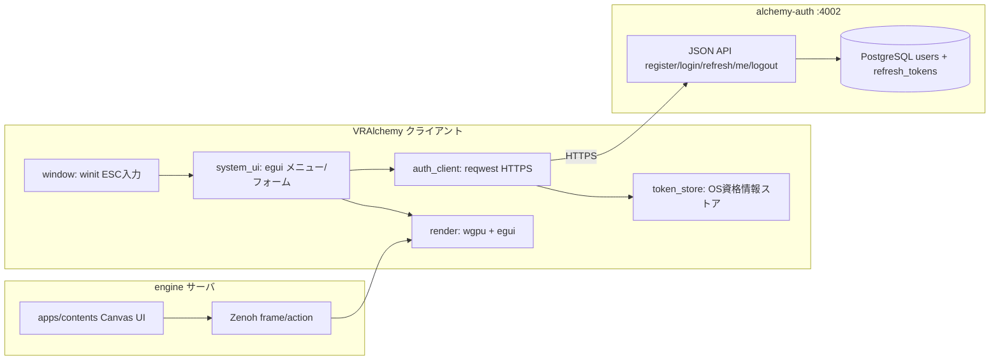
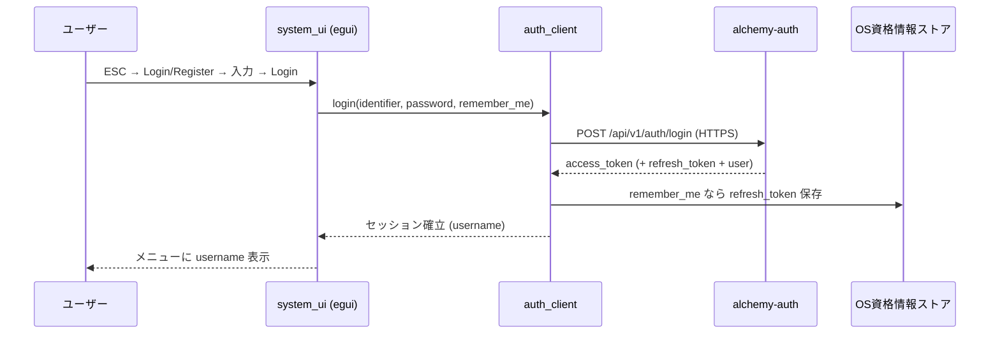
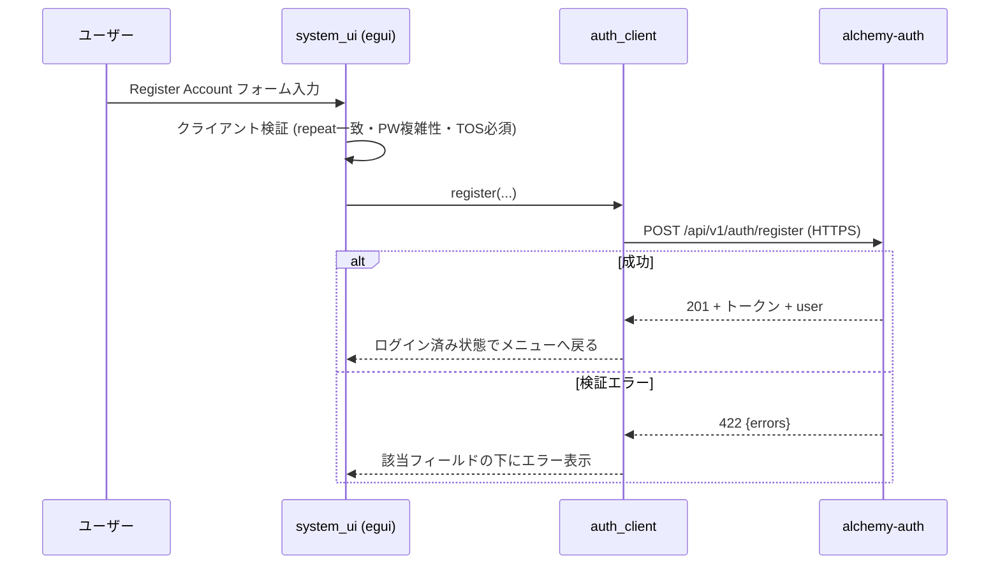

# ログイン/登録 UI 実施計画書(クライアントネイティブ システムメニュー + auth 拡張)

> 作成日: 2026-07-03
> 目的: VRAlchemy クライアント(rust/client)に ESC で開くシステムメニューを実装し、その中でログイン/アカウント登録を可能にする。合わせて alchemy-auth を登録フォームの要件に合わせて拡張する。
> 前提: auth と engine は未連携。本計画は「クライアント ↔ auth」の直接連携までをスコープとし、「engine サーバでの JWT 検証」は将来計画とする。

---

## 1. 概要

### 1.1 達成したいこと

| 項目 | 内容 |
|:---|:---|
| **システムメニュー** | ESC キーでクライアントネイティブ(egui)のメニューを開閉。Quit・ログイン状態表示・Login/Register ボタンを配置 |
| **ログイン** | Username or Email + Password + Remember Me で auth にログインし、JWT を取得・保管 |
| **アカウント登録** | Username / Email / Password / Birthday / Promo Code / 利用規約同意 を入力して auth にアカウント作成 |
| **auth 拡張** | username・birthday・promo code・TOS 同意・パスワード複雑性・Remember Me(7日非アクティブ失効)を auth API/DB に追加 |
| **トークン保管** | Remember Me 有効時は OS 資格情報ストアに保管し、次回起動時に自動ログイン |

### 1.2 スコープ外(将来計画)

| 項目 | 理由 |
|:---|:---|
| **パスワードリセット実装** | メール送信基盤(Swoosh 設定・SMTP)が必要で単体スコープが大きい。UI にはボタンのみ設置し「未実装」表示。別計画書で扱う |
| **メール確認(verification)** | 同上 |
| **engine サーバでの JWT 検証** | `/api/room_token` の JWT 必須化、JWKS 検証(Joken)。auth-engine 連携計画で扱う |
| **パーソナルエリア実装** | 下記 1.4 参照。概念のみ記録 |
| **Web(Hub)側ログイン UI** | `vision-goal.md` の `/` Hub は別レイヤー |

### 1.3 責務境界の決定(重要)

本計画で **「Contents defines, Rust executes」原則に対する例外境界** を確定する。

| UI の種類 | 所有者 | 実装 |
|:---|:---|:---|
| **ゲーム内 UI**(HUD、スコア、ゲームオーバー等) | Contents(Elixir) | 従来どおり Canvas DSL → protobuf → egui 描画 |
| **システム UI**(ログイン、Quit、将来の設定・グラフィック設定等) | クライアント(Rust) | egui ネイティブ実装。サーバを経由しない |

理由:

1. **セキュリティ**: パスワード等の資格情報を Zenoh(ゲームプロトコル)に一切流さない。入力値は egui ローカル保持 → reqwest で auth へ直接 HTTPS 送信。
2. **可用性**: ログインはサーバ接続前に必要な機能であり、サーバ定義 UI では原理的に実現できない。システムメニューは未接続時・サーバ無応答時も動作しなければならない。
3. **既知ギャップの解消**: `raw_key` は Zenoh に送信されない(`zenoh-protocol-spec.md` で将来拡張扱い)ため、リモート接続時にサーバ側 ESC トグルは機能しない。クライアントが winit で直接 ESC を処理すればこの問題自体が消える。
4. **実装コスト**: Canvas DSL に text input を追加する場合、protobuf 拡張 + フォーカス/カーソル/IME 状態の同期が必要になり過大。egui は `TextEdit`(パスワードマスク対応)・`Checkbox`・`Hyperlink` をネイティブで持つ。

### 1.4 パーソナルエリア構想(将来概念・記録のみ)

- ワールド内は基本的にグローバル同期(全員が同じものを見る)を原則とする。
- ただしパーティクル等の演出処理はグローバル同期せずローカル処理とする。
- **パーソナルエリアは外部の人間が一切触れない(観測・干渉できない)エリア**とする。ローカルエリアよりも厳重な分離。
- システムメニューはクライアント所有のため技術的にはどこでも開けるが、将来パーソナルエリア概念が実装された際に「ログイン等の機微な操作はパーソナルエリアでのみ許可する」表示条件フックを追加できる構造にしておく(メニュー項目ごとの可視性判定を一箇所に集約)。

---

## 2. アーキテクチャ

### 2.1 全体構成



- 資格情報(パスワード・JWT)は **クライアント ↔ auth の HTTPS のみ** を通る。Zenoh・engine サーバには一切流れない。
- システムメニューの egui 描画は、既存の Canvas UI 描画(`render/src/renderer/ui.rs`)と同一の egui コンテキスト上で、Canvas UI の後(最前面)に描画する。

### 2.2 新規クレート

```
rust/client/
├── auth_client/          # 新規: auth API クライアント
│   └── src/
│       ├── lib.rs
│       ├── api.rs         # register/login/refresh/logout/me (reqwest + rustls)
│       ├── models.rs      # リクエスト/レスポンス struct (serde)
│       └── token_store.rs # keyring による JWT/refresh token 保管
└── system_ui/            # 新規: システムメニュー UI
    └── src/
        ├── lib.rs
        ├── state.rs       # メニュー開閉・画面遷移・セッション状態
        ├── menu.rs        # ESC メニュー本体(ログイン状態表示 + Quit)
        ├── login_form.rs  # ログインフォーム
        ├── register_form.rs # 登録フォーム
        └── validation.rs  # クライアント側バリデーション(repeat一致・PW複雑性等)
```

依存追加(クライアントのみ。サーバ Rust には追加しない):

| crate | 用途 |
|:---|:---|
| `reqwest`(rustls-tls, json) | auth API 呼び出し。ブロッキング回避のため専用スレッド or 既存 tokio ランタイムで実行 |
| `keyring` | OS 資格情報ストア(Windows Credential Manager / macOS Keychain / Secret Service)への refresh token 保管 |
| `open` | 利用規約・プライバシーポリシーのリンクを既定ブラウザで開く |

auth のベース URL は設定(環境変数 `ALCHEMY_AUTH_URL`、既定 `http://localhost:4002`)。本番は HTTPS 必須とし、http は localhost のみ許可する。

### 2.3 入力・カーソルの一元化

現状の課題: ESC は `Device.Keyboard`(Elixir)が `hud_visible` をトグルし、カーソル grab もサーバがフレーム経由で指示している。システムメニュー導入後は競合するため、以下に整理する。

| 入力 | メニュー閉時 | メニュー開時 |
|:---|:---|:---|
| ESC | クライアントが消費しメニューを開く(サーバへ送らない) | メニューを閉じる(フォーム表示中はフォームを閉じる) |
| WASD 等の移動 | 従来どおり movement publish | publish 停止(ゼロベクトル送信) |
| マウス | 従来どおり | egui のみに供給。カーソルはローカルで release し、閉じたらサーバ指示の grab 状態に復帰 |
| キー入力 | 従来どおり | egui の TextEdit へ(IME は winit 経由でそのまま動作) |

既存 contents 側の ESC トグル(`Device.Keyboard` の `hud_visible`)は、CanvasTest 等のデバッグ用途として残すが、**ESC がサーバに届かなくなる**ため実質無効化される。各 contents の HUD を常時表示 or ui_action トリガーへ移行するかは contents 側の別課題として切り出す(本計画では既存動作を壊さないことのみ確認する)。

---

## 3. UI 仕様

ラベルは英語。egui のデフォルトフォントで表示(日本語入力は TextEdit の値としてサポートされるが、ラベルは英語固定)。

### 3.1 システムメニュー(ESC)

```
-------------------------------------
 [icon]  Not logged in user          <- ログイン済みなら username を表示
 [ Login/Register ]                  <- ログイン済みなら [ Logout ] に変化
-------------------------------------
 [ Quit ]
-------------------------------------
```

- 未接続(パーソナルエリア相当)・接続中どちらでも ESC で開ける。
- ログイン済み表示は `GET /api/v1/auth/me` の結果(username)を使用。

### 3.2 ログインフォーム

```
-------------------------------------------------
 Login                          [x close]

 Username or Email: [________________]
 Password:          [****************]
 [v] Remember Me            [ Login ]
 [ Lost Password? ]  [ Register Account ]
-------------------------------------------------
```

- Password は egui `TextEdit::password(true)` でマスク。
- Login 押下 → `POST /api/v1/auth/login`。成功でフォームを閉じメニューへ戻る。失敗は "Invalid username/email or password" をフォーム内に赤字表示。
- Lost Password? → 「Password reset is not available yet.」のツールチップ/メッセージのみ(実装は別計画)。
- Register Account → 登録フォームへ遷移。

### 3.3 登録フォーム

```
-------------------------------------------------
 Register Account               [x close]

 Username:        [________________]
 Email:           [________________]
 Repeat Email:    [________________]
 Password:        [****************]
   (at least 8 characters, 1 digit, 1 lowercase, 1 uppercase)
 Repeat Password: [****************]
 [v] Remember Me (logs out after 7 days of inactivity)
 Birth Day:  [month v] [day v] [year v]
 Promo Code: [________________]   (optional)
 [v] I agree to the [Terms of Service] and [Privacy Policy]
 [ Register Account ]
-------------------------------------------------
```

- Terms of Service / Privacy Policy は `Hyperlink` で既定ブラウザを開く(URL はクライアント設定。ページ自体の作成は本計画のスコープ外、暫定 URL を設定可能にする)。
- Register Account ボタンはクライアント側バリデーションが全て通るまで disabled。
- 成功時: そのままログイン済み状態にする(auth がトークンを返す。5.2 参照)。

### 3.4 クライアント側バリデーション(validation.rs)

| 項目 | ルール |
|:---|:---|
| Username | 3〜20 文字、英数字とアンダースコアのみ |
| Email | `@` を含む簡易形式チェック |
| Repeat Email | Email と一致 |
| Password | 8 文字以上、数字 1 以上、小文字 1 以上、大文字 1 以上 |
| Repeat Password | Password と一致 |
| Birth Day | 実在日付。年は現在年から遡って選択式 |
| TOS 同意 | チェック必須 |

同じルールを auth 側でもサーバサイド検証する(クライアント検証は UX 用、正は auth)。

---

## 4. auth 拡張仕様

### 4.1 DB 変更

**users テーブル追加カラム:**

| カラム | 型 | 制約 |
|:---|:---|:---|
| `username` | citext | unique, not null |
| `birthday` | date | not null |
| `promo_code` | text | nullable |
| `tos_agreed_at` | utc_datetime | not null |
| `tos_version` | text | not null(設定値からスタンプ。規約改定時の再同意判定用) |

既存ユーザーが存在する場合の埋め方は開発 DB リセットで対応(本番未運用のため migration での後方互換は不要)。

**refresh_tokens テーブル(新規):**

| カラム | 型 | 説明 |
|:---|:---|:---|
| `id` | uuid | PK |
| `user_id` | uuid | FK users |
| `token_hash` | text | opaque トークンのハッシュ(平文は保存しない) |
| `last_used_at` | utc_datetime | スライディング失効の基準 |
| `revoked_at` | utc_datetime | nullable |

### 4.2 API 変更

**`POST /api/v1/auth/register`** — リクエスト拡張:

```json
{
  "username": "frick",
  "email": "user@example.com",
  "password": "Secret123",
  "birthday": "2000-01-31",
  "promo_code": "ABC123",
  "tos_agreed": true,
  "remember_me": true
}
```

- サーバ側バリデーション: username 形式・一意性、email 形式・一意性、パスワード複雑性(8+ 文字、数字/小文字/大文字 各 1 以上を Ash validate match で追加)、birthday 実在日付、`tos_agreed: true` 必須。
- `repeat_email` / `repeat_password` は API には送らない(クライアント検証のみ)。
- 成功レスポンスを **login と同形式(トークン付き)** に変更し、登録後すぐログイン済みにする。

**`POST /api/v1/auth/login`** — リクエスト変更:

```json
{"identifier": "frick または user@example.com", "password": "Secret123", "remember_me": true}
```

- `identifier` に `@` が含まれれば email、なければ username として検索(citext なので大文字小文字非区別)。
- 失敗メッセージは従来どおり単一メッセージ(ユーザー列挙防止)を維持。

**成功レスポンス(register / login / refresh 共通):**

```json
{
  "access_token": "eyJ...",
  "token_type": "Bearer",
  "expires_in": 86400,
  "refresh_token": "opaque...",   // remember_me: true のときのみ
  "user": {"user_id": "...", "username": "frick", "email": "..."}
}
```

**`POST /api/v1/auth/refresh`(新規):**

- リクエスト: `{"refresh_token": "opaque..."}`
- `last_used_at` が 7 日以内なら新しい access token を発行し `last_used_at` を更新(スライディング)。7 日超過・revoked は 401。

**`GET /api/v1/auth/me`** — レスポンスに `username` を追加。

**`POST /api/v1/auth/logout`** — access token の jti 失効(既存)に加え、リクエストに refresh_token があれば revoke。

### 4.3 Remember Me の意味論

| Remember Me | クライアント挙動 | auth 挙動 |
|:---|:---|:---|
| ON | refresh token を OS 資格情報ストアに保管。次回起動時に `POST /refresh` で自動ログイン | refresh token 発行。7 日間未使用で失効(スライディング) |
| OFF | access token をメモリのみ保持。クライアント終了でログアウト状態 | refresh token を発行しない。access token 24h(既存 TTL) |

### 4.4 設定追加(config)

| キー | 用途 |
|:---|:---|
| `refresh_token_inactivity_days` | 既定 7 |
| `tos_version` / `tos_url` / `privacy_policy_url` | 規約バージョンと URL |

---

## 5. 処理フロー

### 5.1 ログイン



### 5.2 登録



### 5.3 起動時自動ログイン(Remember Me)

1. クライアント起動 → `token_store` から refresh token を読む。
2. あれば `POST /refresh` → 成功で access token をメモリ保持し、メニューに username 表示。
3. 401(7 日超過等)なら token を破棄し未ログイン状態。

---

## 6. 実装フェーズ

### Phase 1: auth 拡張

| # | タスク | 対象 |
|:---|:---|:---|
| 1-1 | users への username/birthday/promo_code/tos カラム追加 migration | `auth/priv/repo/migrations/` |
| 1-2 | refresh_tokens テーブル migration + Ash リソース | 同上 + `auth/lib/auth/accounts/refresh_token.ex` |
| 1-3 | User リソースのバリデーション追加(username 形式/一意、PW 複雑性、birthday、tos_agreed) | `auth/lib/auth/accounts/user.ex` |
| 1-4 | register/login/refresh/logout/me のロジック更新(identifier 検索、remember_me、トークン返却) | `auth/lib/auth/accounts.ex`, `auth/lib/auth/token.ex` |
| 1-5 | コントローラ・ルータ更新(`POST /refresh` 追加) | `auth/lib/auth_web/` |
| 1-6 | 設定追加(inactivity days, tos_version/url) | `auth/config/config.exs` |
| 1-7 | テスト(登録バリデーション・identifier ログイン・refresh スライディング・7 日失効) | `auth/test/` |
| 1-8 | デバッグ用シードアカウント整備: `Auth.Accounts.register/2` 経由で作成(Argon2/バリデーションを本番同経路で通す)、重複時スキップで冪等化、docker-compose の起動コマンド(`ecto.migrate` の後)に `mix run priv/repo/seeds.exs` を追加。dev 環境専用とし、フィールドは 1-3/1-4 の拡張後仕様(username/birthday/TOS/PW 複雑性)に合わせる | `auth/priv/repo/seeds.exs`, `auth/docker-compose.yml` |

### Phase 2: クライアント システムメニュー基盤

| # | タスク | 対象 |
|:---|:---|:---|
| 2-1 | `system_ui` クレート作成。ESC 開閉ステートマシン(閉/メニュー/ログイン/登録) | `rust/client/system_ui/` |
| 2-2 | winit ループ統合: ESC 消費、メニュー開時の movement 停止・カーソル release/復帰 | `rust/client/window/` |
| 2-3 | egui 描画統合: Canvas UI の後にシステムメニューを最前面描画 | `rust/client/render/src/renderer/ui.rs` 近傍 |
| 2-4 | メニュー画面(icon + "Not logged in user" + Login/Register + Quit) | `system_ui/src/menu.rs` |
| 2-5 | メニュー項目可視性の一元判定関数(パーソナルエリア条件の将来フック) | `system_ui/src/state.rs` |

### Phase 3: ログイン/登録フォーム + auth 連携

| # | タスク | 対象 |
|:---|:---|:---|
| 3-1 | `auth_client` クレート作成(reqwest + rustls、models、エラー型) | `rust/client/auth_client/` |
| 3-2 | ログインフォーム(マスク入力、Remember Me、エラー表示、Lost Password? プレースホルダ) | `system_ui/src/login_form.rs` |
| 3-3 | 登録フォーム(全フィールド、Birth Day セレクタ、TOS リンク=ブラウザ起動、送信ボタン disabled 制御) | `system_ui/src/register_form.rs` |
| 3-4 | クライアント側バリデーション | `system_ui/src/validation.rs` |
| 3-5 | auth URL 設定(`ALCHEMY_AUTH_URL`、localhost 以外は https 必須) | `rust/client/app/` |

### Phase 4: トークン保管・自動ログイン・ログアウト

| # | タスク | 対象 |
|:---|:---|:---|
| 4-1 | `token_store`(keyring)実装。Remember Me OFF 時はメモリのみ | `auth_client/src/token_store.rs` |
| 4-2 | 起動時 refresh による自動ログイン | `rust/client/app/` |
| 4-3 | Logout ボタン(POST /logout + ローカルトークン破棄) | `system_ui/src/menu.rs` |
| 4-4 | 手動 E2E 確認(登録→ログイン→再起動自動ログイン→7 日失効相当→ログアウト) | — |

---

## 7. 受け入れ条件

- [ ] ESC でメニューが開閉し、メニュー開時はゲーム入力が遮断されカーソルが解放される(閉時に復帰)
- [ ] 未ログイン時に "Not logged in user" + Login/Register が表示される
- [ ] ログインフォームから username または email でログインでき、失敗時は単一エラーメッセージが出る
- [ ] 登録フォームの全バリデーション(repeat 一致・PW 複雑性・TOS 必須・実在日付)がクライアント/サーバ両方で機能する
- [ ] 登録成功で即ログイン状態になり、メニューに username が表示される
- [ ] パスワード・トークンが Zenoh / engine サーバを一切経由しない(コードレビューで確認)
- [ ] Remember Me ON: クライアント再起動で自動ログイン。refresh token が 7 日未使用なら失効し未ログインに戻る
- [ ] Remember Me OFF: クライアント終了でログアウト状態
- [ ] Lost Password? は「未実装」の案内のみ表示する
- [ ] 既存 contents(CanvasTest 等)のゲーム内 Canvas UI 描画が壊れない
- [ ] `docker compose up` でシードアカウントが自動作成され(再実行時は重複スキップ)、そのアカウントでクライアントからログインできる

---

## 8. 設計判断の記録

| 判断 | 採用 | 理由 |
|:---|:---|:---|
| UI の実装場所 | クライアントネイティブ(egui)。**当初案の apps/contents Canvas は不採用** | 資格情報が Zenoh を平文で流れる問題、text input の protobuf/同期実装コスト、未接続時にサーバ定義 UI が使えない点。1.3 参照 |
| 資格情報の経路 | クライアント → auth 直接 HTTPS | 同上 |
| ESC メニューの所有 | 全面的にクライアント(Quit・ログイン・将来の設定) | 二重実装回避。raw_key が Zenoh 未対応の既知ギャップも解消 |
| Remember Me 実現方式 | opaque refresh token + last_used_at スライディング(7 日) | JWT 単体ではスライディング失効を表現できない。access token TTL(24h)は既存を維持 |
| パスワードリセット | ボタンのみ設置、実装は別計画 | メール基盤が未整備 |
| auth 拡張 | 本計画に含める(username/birthday/promo/TOS/PW 複雑性/remember me) | 登録 UI の要件と auth MVP の乖離が大きく、UI だけ先行しても結線できないため |
| birthday の用途 | 保存のみ(年齢検証ロジックは将来) | `vision-goal.md` のコンテンツステータス(Mature/Sexual 等)の年齢ゲートに将来利用 |
| promo_code | 文字列をそのまま保存 | キャンペーン基盤が存在しないため検証なし |

---

## 9. 参照ドキュメント

- `auth/README.md` — auth のアーキテクチャ・現行 API 仕様
- `engine/docs/architecture/zenoh-protocol-spec.md` — raw_key 未対応の記載
- `engine/docs/architecture/rust/desktop_client.md` — クライアント構成
- `engine/rust/client/render/src/renderer/ui.rs` — 既存 egui 描画(Canvas UI)
- `engine/apps/contents/lib/components/category/device/keyboard.ex` — 既存 ESC トグル(残置対象)
- `engine/workspace/1_backlog/upper-layer-infrastructure-plan.md` — 認証レイヤー計画(apps/game_auth 想定は本計画で外部 auth サービス方式に更新)
- `engine/docs/vision-goal.md` — Hub/ログイン・コンテンツステータスの将来像
