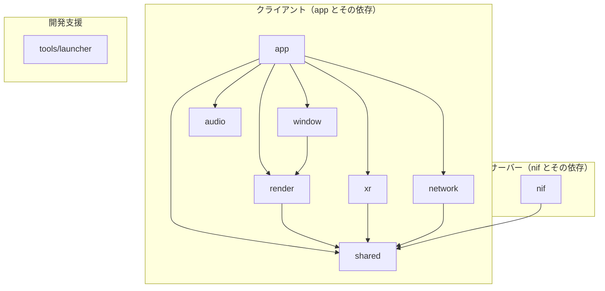

# native 構成移行実施プラン

> **2026-04 追記**: リポジトリ直下の Rust ワークスペースは **`rust/`** に移行済み（[rust-workspace-directory-restructure-plan.md](../7_done/rust-workspace-directory-restructure-plan.md)）。本書の `native/` は **2026-04 以前のクレート再編計画**として参照する。

> 基準: [fix_rust_architecture.md](../../docs/architecture/fix_rust_architecture.md) L12-85  
> 更新対象: [overview.md](../../docs/architecture/overview.md) L182-193 及び関連記述（パスは現行 `rust/` に読み替え）

---

## 1. 現行 → 新構成マッピング

| 現行 | 新構成 | アクション |
|:---|:---|:---|
| `client` (Zenoh, info) | `network/` + `shared/` | Zenoh ロジック → network、ClientInfo 等 → shared |
| `physics` | `nif/src/physics/` | physics クレートを廃止し、nif のサブモジュールへ移行 |
| `audio` | `audio/` | 既存を維持、platform/ 追加。**デバイス音声出力用**（クライアント側、nif は依存しない） |
| `desktop_render` | `render/` | リネーム + platform/ 追加（desktop 先行） |
| `desktop_input` | `window/` | リネーム、窓層として再定義 |
| `desktop_input_openxr` | `xr/` | リネーム + platform/ 追加。**クライアント側**（app が使用、window と同様） |
| `client_desktop` | `app/` | 統合層として app に集約（main.rs 等） |
| `client_web`, `client_android`, `client_ios` | `app/` | app の lib.rs / android.rs / ios.rs へ統合 |
| `nif` | `nif/` | physics を内部に取り込み、shared を参照。**XR は依存しない**。内部に `physics/`, `ai`, `audio_sync` 等を配置 |
| `launcher` | `tools/launcher/` | tools 配下へ移動 |
| （新規） | `shared/` | Elixir 契約・型・補間・予測を新規作成 |

---

## 2. 依存関係（目標）

XR は VR デバイス入力のため**クライアント側**の層。window と同様に app が使用し、サーバー側の nif には依存させない。

- **app（クライアント）**: window と xr の両方に依存。VR 入力は app → xr → network → Elixir へ送信
- **nif（サーバー）**: SHARED のみ。**XR にも AUDIO にも依存しない**（audio はデバイス音声出力用でクライアント側）

---

## 3. 移行フェーズ

### フェーズ 0: shared クレート作成（前提）

- `native/shared/` を新規作成
- `lib.rs`, `types.rs`, `store.rs`, `interp.rs`, `predict.rs` のスケルトンを配置
- `#[repr(C)]` 構造体と bytemuck によるゼロコピー基盤を定義

### フェーズ 1: network クレート作成

- `native/client` の `zenoh` モジュールを `network/` へ移行
- `client/info.rs` は `shared` の型として扱う
- `network/src/common.rs`、`platform/mod.rs`, `platform/desktop.rs` を追加

### フェーズ 2: render クレートへの移行

- `desktop_render` → `render` へリネーム
- `render/src/common.rs` を設け、`platform/desktop.rs` に既存描画ロジックを移行

### フェーズ 3: window クレートへの移行

- `desktop_input` → `window` へリネーム
- `desktop_loop.rs` を `window` に移行

### フェーズ 4: xr クレートへの移行

- `desktop_input_openxr` → `xr` へリネーム
- **app の依存に変更**（nif からの依存を削除）
- VR 入力は app → xr で取得し、network 経由で Elixir へ送信するフローに移行

### フェーズ 5: physics を nif へ統合

- `native/physics/src/` 以下を `native/nif/src/physics/` へ移行
- `nif` の `physics` への path 依存を削除
- nif 内部の音同期モジュールは `nif/src/audio_sync.rs` とする（`audio.rs` ではない）

### フェーズ 6: app クレート統合

- `app/` を新規作成
- `client_desktop` の main.rs を `app/src/main.rs` へ移行
- `app` が `window` と `xr` の両方に依存するよう構成

### フェーズ 7: tools/launcher への移行

- `launcher` を `native/tools/launcher/` へ移動

### フェーズ 8: audio クレートの platform 化（軽量）

- `audio/src/platform/` を追加

### フェーズ 9: Cargo.toml とビルドの更新

- workspace members を新構成に更新

### フェーズ 10: overview.md の更新

- ディレクトリ構造・レイヤー責務表・図を新構成に合わせて更新

---

## 4. リスクと注意点

- **nif の XR 依存削除**: 現行の `nif/xr_bridge` は umbrella モードで VR 入力を Elixir へ送っている。移行後は app が xr で入力取得 → network で Zenoh publish → Elixir が subscribe する形に変更する必要あり
- **physics 移行**: クレート境界変更に伴い、`physics` 参照をすべて `nif::physics` へ変更
- **既存 doc 参照**: `docs/architecture/rust/` 以下は移行後に別タスクでパス・モジュール名を修正

---

## 5. 重大な課題（未解消）

### network クレートの render 依存違反

**重大度**: 重大（アーキテクチャ違反）

**概要**

`native/network` クレートが `native/render` クレートに依存しており、本プラン §2 で定義した目標依存関係（`NETWORK --> SHARED` のみ）に違反している。network 層は描画層から独立すべきである。

**原因**

- `NetworkRenderBridge` と `msgpack_decode` が render クレートの型（`RenderFrame`、`RenderBridge`、`KeyCode`、`KeyState`、`DrawCommand`、`CameraParams`、`UiCanvas` 等）を使用しているため、network が render に依存している
- これらは本質的に「Zenoh バイト列 ↔ 描画フレーム」のブリッジであり、network と render の**両方**に依存する責務を持つ

**影響**

- network を render なしで利用できない（ヘッドレスサーバー・非グラフィカルクライアントの妨げ）
- レイヤー境界の不明確化・保守性低下
- fix_rust_architecture.md の「network (The Pipe) は transport agnostic」という設計方針との矛盾

**解決方針**

`NetworkRenderBridge` と `msgpack_decode` を `native/network` から `native/app` へ移動する。app はすでに network と render の両方に依存しており、両レイヤーを結合する責務を担う。

**作業内容**

1. `network/src/network_render_bridge.rs` → `app/src/network_render_bridge.rs` へ移動
2. `network/src/msgpack_decode.rs` → `app/src/msgpack_decode.rs` へ移動
3. `network/Cargo.toml` から `render` 依存を削除
4. `network/src/lib.rs` から該当モジュール・再エクスポートを削除
5. `app` で `network::ClientSession`・`network::common`（トピック名等）を参照するよう修正
6. `app/Cargo.toml` に `rmp-serde` を追加

**参照**

- 本ドキュメント §2 依存関係（目標）の Mermaid 図
- [fix_rust_architecture.md](../../architecture/fix_rust_architecture.md) §2 network (The Pipe)

---

### render クレートの nif 依存違反

**重大度**: 重大（アーキテクチャ違反）

**概要**

`native/render` クレートが `native/nif` クレートに依存しており、本プラン §2 で定義した目標依存関係（`RENDER --> SHARED` のみ）に違反している。描画層はサーバー側の NIF 実装から独立すべきである。

**原因**

- `render` が `nif::physics::constants` の背景色定数（`BG_R`、`BG_G`、`BG_B`）を参照している
- これにより render が nif（サーバー層）に依存し、クライアント・サーバー境界が不明確になる

**影響**

- クライアント（render）とサーバー（nif）の責務分離が損なわれる
- 描画層が NIF の内部実装に紐づき、保守性低下
- fix_rust_architecture.md の「render (The Eye) は描画に専念」という設計方針との矛盾

**解決方針**

背景色等の共通定数を `native/shared` クレートへ移動する。shared は render と nif の両方から参照されるため、依存関係がクリーンになる。

**作業内容**

1. `nif::physics::constants` の共有すべき定数（`BG_R`、`BG_G`、`BG_B` 等）を `shared` に定義または再エクスポート
2. `render` の `headless.rs`・`renderer/mod.rs` で `shared` の定数を参照するよう変更
3. `nif::physics::constants` では `shared` の定数を re-export するか、shared を参照
4. `render/Cargo.toml` から `nif`・`physics` 依存を削除

**参照**

- 本ドキュメント §2 依存関係（目標）の Mermaid 図
- 対象: `native/render/src/headless.rs`, `native/render/src/renderer/mod.rs`
