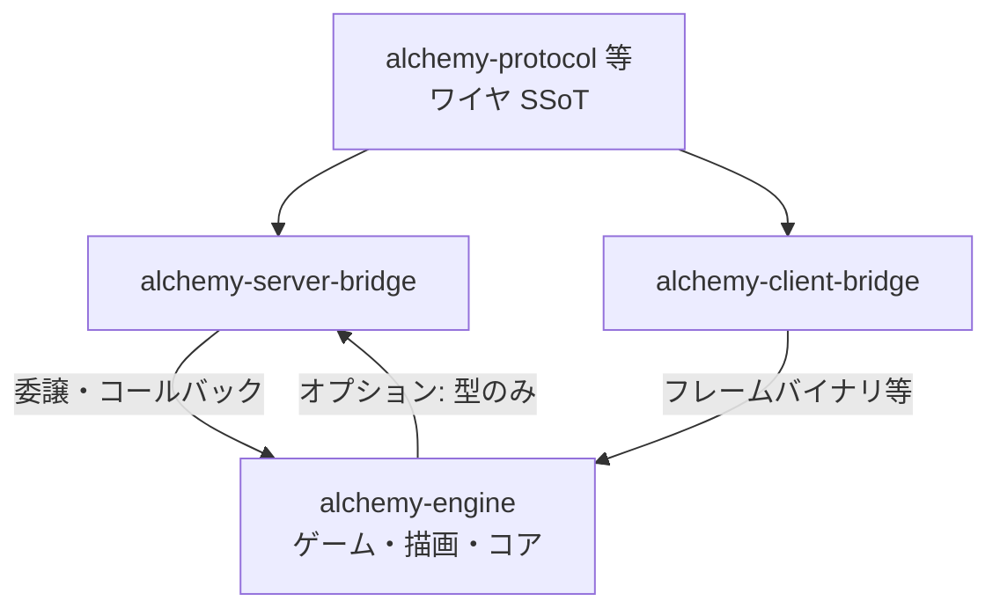

# 実施計画: `alchemy-server-bridge` / `alchemy-client-bridge` リポジトリ分割

> **置き場**: `workspace/2_todo`（着手前。Definition of Ready を満たしたら `3_Inprogress` へ）  
> **作成日**: 2026-04-22  
> **目的**: ワイヤと BEAM／ネイティブ内部表現の **変換・Zenoh セッション・購読ルーティング**など、**Elixir と Rust の両方に通じたレビューが必要な層**を `alchemy-engine` から分離し、**サーバー側**と**クライアント側**で責務とオーナーシップをはっきりさせる。  
> **関連**: プロト契約の SSoT は [protocol-repo-extraction-procedure.md](./protocol-repo-extraction-procedure.md) と**別リポ**とし、ブリッジは **その契約を消費する実装**として依存する（順序は §6）。

---

## 1. リポジトリ名と役割

| リポジトリ名 | 主な言語・ランタイム | 役割（目標境界） |
|:---|:---|:---|
| **`alchemy-server-bridge`** | Elixir（OTP 上で動かす想定） | Zenoh（Zenohex）の **publish / subscribe**、**protobuf バイト列 ↔ エンジンが期待する内部メッセージ**（例: 入力転送、client_info）、**キー表式・QoS 方針**の集約。`Core` / `Contents` への **委譲 API**（Behaviour または明示的なコールバック登録）に留める。 |
| **`alchemy-client-bridge`** | Rust | クライアント exe 内での **Zenoh 受信・入力送信・フレームバイナリの受け渡し**（例: `NetworkRenderBridge` 周辺、`protobuf_codec`）、**`decode_pb_render_frame` 呼び出しまで**またはその手前までをパッケージ化。`wgpu` / `winit` には依存しない。 |

### 1.1 命名の意図

- **`server` / `client`** は **実行プロセスの陣営**（BEAM 上 vs ネイティブクライアント）を表す。  
- **`bridge`** は **プロトコルリポの契約**と **エンジン固有の意味**の間をつなぐ層であることを表す（「ネットワーク全体」ではなく **境界アダプタ**）。

---

## 2. 前提・非目標

### 2.1 前提

- 現行のサーバー側の中心は `apps/network/lib/network/zenoh_bridge.ex`（`Network.ZenohBridge`）および、フレーム配信経路の `Contents.FrameBroadcaster` と `Contents.Events.Game` からの `publish_frame` 呼び出し等。  
- 現行のクライアント側の中心は `rust/client/network`（`NetworkRenderBridge`、`protobuf_codec` 等）および `rust/client/render_frame_proto`（フレーム protobuf のデコード）。  
- ワイヤの `.proto` 定義の移管方針は [protocol-repo-extraction-procedure.md](./protocol-repo-extraction-procedure.md) に従う（本計画では **スキーマの SSoT は持たない**）。

### 2.2 非目標（この計画の初版スコープ外）

- **ゲームロジック・シーン・描画**そのものの移管（`apps/contents`、`rust/client/render` 等は `alchemy-engine` に残す）。  
- **Cap’n Proto 導入**（将来、クライアントブリッジまたは別クレートで差し替え可能な **ポートtrait** まで設計メモに留めてよい）。  
- **Phoenix Channel の JSON 契約**の全面移管（必要なら別 ToDo）。

---

## 3. 依存関係（推奨の向き）

- **プロトコルリポ** → 両ブリッジ（生成コードまたは `prost` ビルドの入力）。  
- **server-bridge** → エンジン（`core` / `contents` の **安定した小さな表面**のみに依存させるのが理想。逆方向の循環を避ける。  
- **client-bridge** → `render_frame_proto` 等への依存を **client-bridge 内に吸収**し、エンジンの `app` は「ブリッジのファサード」だけを見る。

---

## 4. 現行コードの棚卸し候補（フェーズ 0）

実施時にチェックリストとして使う。**最終の移管先はレビューで確定**する。

### 4.1 `alchemy-server-bridge` 候補（Elixir）

| 候補 | 現状パス（例） | メモ |
|:---|:---|:---|
| Zenoh セッションと購読 | `apps/network/lib/network/zenoh_bridge.ex` | GenServer・Zenohex・protobuf デコードが密集。 |
| トピック／セレクタ定数 | 同上＋関連設定 | プロトコルドキュメントと二重管理にならないよう、**文字列の SSoT**はプロトリポの docs と揃える。 |
| UDP ラッパ（継続利用する場合） | `apps/network/lib/network/udp/**` | Zenoh 一本化後は縮小・削除の可能性あり。 |

**エンジンに残す（初期案）**: `Content.FrameEncoder`、ルーム監督、`Game` 内のルール。ブリッジからは **「バイナリを渡す」「room_id + 内部イベントを渡す」** APIのみ呼ぶ。

### 4.2 `alchemy-client-bridge` 候補（Rust）

| 候補 | 現状パス（例） | メモ |
|:---|:---|:---|
| ネットワークブリッジ | `rust/client/network/src/**`（`NetworkRenderBridge` 等） | `app` のエントリから依存を差し替えやすいようクレート境界を切る。 |
| Zenoh ペイロード codec | `protobuf_codec.rs` 等 | プロトリポの `.proto` と同期。 |
| フレームデコード | `rust/client/render_frame_proto` | **ブリッジに含めるか**、プロトリポ＋共有クレートに寄せるかはコスト見合いで選択（§8）。 |

---

## 5. フェーズ構成（推奨順）

### フェーズ 0: 境界合意と棚卸し（着手前）

- [ ] §3 の依存グラフで **循環が出ない**ことを合意する。  
- [ ] §4 の表を埋め、**「移す／残す／ラップだけ」**を各モジュール単位で色分けする。  
- [ ] **必須レビュア**（Elixir＋Rust＋プロトのうちどれを server / client で必須にするか）を CONTRIBUTING 案として書く。

### フェーズ 1: モノレポ内での境界整理（任意だが推奨）

- [ ] `apps/server_bridge`（仮）や `rust/crates/server_bridge` への **ファイル移動なし**で、**Behaviour または明示インターフェース**だけ先に切る（リスク低）。  
- [ ] `mix test` / `cargo test -p network` が通ることを維持する。

### フェーズ 2: `alchemy-server-bridge` 新設

- [ ] 新 GitHub リポジトリ作成（LICENSE、README、CHANGELOG、CONTRIBUTING）。  
- [ ] Umbrella の **path / git 依存**で `alchemy-engine` から取り込み、`Network` アプリから段階的に呼び出しを移す。  
- [ ] 設定（Zenoh 接続文字列等）は **`runtime.exs` / 環境変数**の受け渡し契約を README に固定する。

### フェーズ 3: `alchemy-client-bridge` 新設

- [ ] 新 GitHub リポジトリ作成。  
- [ ] `rust/client/app` の依存を **`alchemy-client-bridge` クレート**（git または path）に差し替え。  
- [ ] CI で `cargo build` ワークスペースに新クレートを組み込む。

### フェーズ 4: エンジンからの重複削除とドキュメント

- [ ] `workspace/7_done/client-server-separation-procedure.md` 等の **アーキ図**を新リポ名に更新。  
- [ ] `development.md` に **clone / submodule / バージョン固定**手順を追記。

---

## 6. `protocol-repo-extraction-procedure` との順序

| 順序案 | 内容 |
|:---|:---|
| **A. プロト先行** | 先にプロトリポを切り、ブリッジは **git 依存で proto を参照**する形にすると、ブリッジ分割時の **参照パスが単純**。 |
| **B. ブリッジ先行** | プロトはまだルート `proto/` のまま、ブリッジだけ別リポにすると、一時的に **proto を二重参照**しやすい（避けるなら A 推奨）。 |

**推奨**: **A（プロト契約の分離 → サーバー／クライアントブリッジ）**。  
例外: チーム分割が急務なら、ブリッジ新リポの初版は **`alchemy-engine` を git submodule 同梱**する等の妥協案を README に明記する。

---

## 7. 完了条件（Definition of Done）

- [ ] GitHub に **`alchemy-server-bridge`** と **`alchemy-client-bridge`** が存在し、それぞれ README・ライセンス・変更履歴がある。  
- [ ] `alchemy-engine` は両リポを **バージョン固定（tag / SHA）**で取り込み、既存の起動・プレイフロー（Zenoh 経路）が通る。  
- [ ] ブリッジ変更の PR に **必須レビュア**（両言語またはプロト＋片言語）が設定されている、または CONTRIBUTING で定義されている。  
- [ ] 「ブリッジに書いてよいこと／エンジンに残すこと」が **1 枚の境界図または表**でドキュメント化されている。

---

## 8. リスク・未決事項（別イシュー化可）

| 項目 | 内容 |
|:---|:---|
| **API 安定化** | エンジン側の `forward_move_input` 等の **内部イベント形式**がブリッジの前提になる。公開 API 化するまでモノレポ内フェーズ 1 を長めに取る。 |
| **`render_frame_proto` の所在** | クライアントブリッジに含めるとリポが太る。**プロトリポ＋生成 Rust クレート**へ寄せる案は [protocol-repo-extraction-procedure.md](./protocol-repo-extraction-procedure.md) と統合検討。 |
| **Hex / crates.io** | 初回は **非公開 git 依存**で十分なことが多い。OSS 公開時にパッケージ名の衝突を確認する。 |
| **CI 二重化** | ブリッジ単体 CI とエンジン統合 CI の役割分担を決める（契約テストの置き場）。 |

---

## 9. 関連ドキュメント

| ドキュメント | 内容 |
|:---|:---|
| [protocol-repo-extraction-procedure.md](./protocol-repo-extraction-procedure.md) | `.proto` とワイヤ仕様の別リポ化 |
| [client-server-separation-procedure.md](../7_done/client-server-separation-procedure.md) | 既存のクライアント／サーバー分離の実施済み手順 |
| [client-server-separation-future.md](../0_reference/client-server-separation-future.md) | 未実施・将来項目 |

---

## 10. 改訂履歴

| 日付 | 内容 |
|:---|:---|
| 2026-04-22 | 初版（`alchemy-server-bridge` / `alchemy-client-bridge` 構成として `workspace/2_todo` に追加） |
